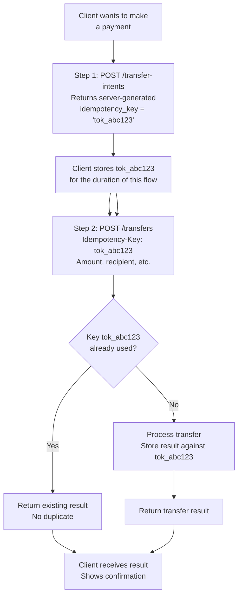
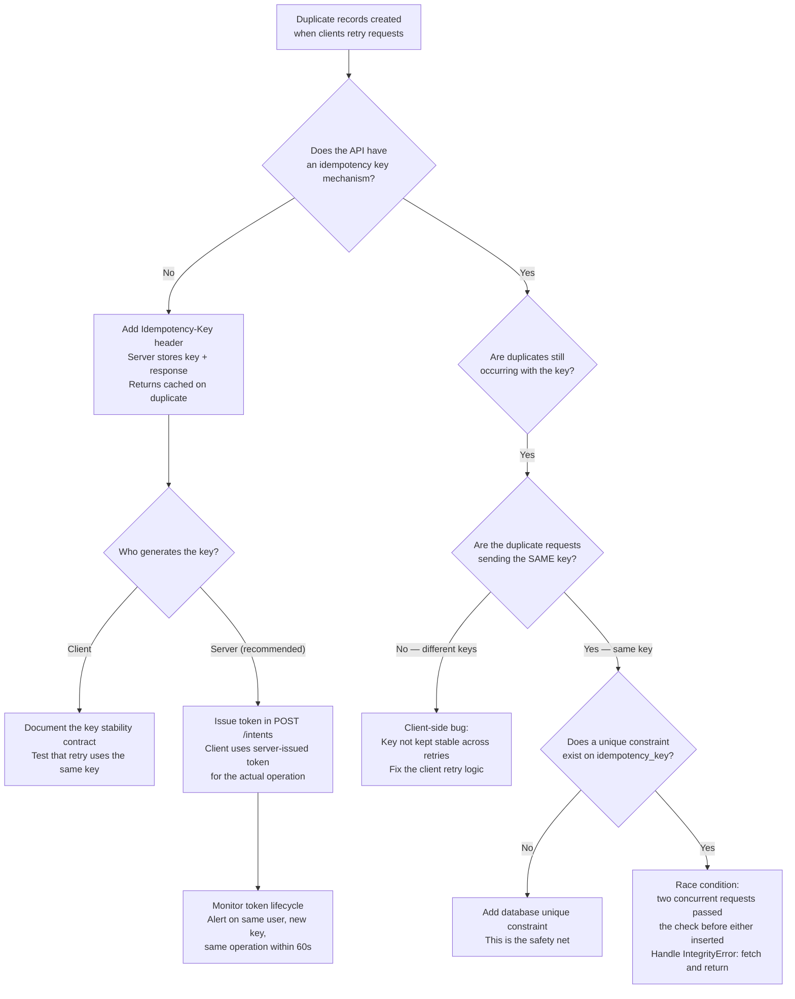

# Making APIs Idempotent

<!-- meta
level: junior
domain: architecture-patterns
prereqs: []
readtime: 13
incident-type: data corruption
-->

## The Incident

> **Flowpay (remittance startup) · Q2 2023 · ~$5M daily transaction volume, ~40k daily transfers**

Our mobile app had a retry mechanism for network failures: if a payment request timed out after 30 seconds, the SDK automatically retried once. The retry rate was about 0.3% of transactions — thousands per day, all handled correctly.

Until March 14th. At 14:30, a mobile engineer pushed a fix for an unrelated UI bug. The build also contained a one-line change she hadn't noticed: a merge conflict resolution had accidentally reset the idempotency key logic. Instead of reusing the same key on retry, the app was generating a new UUID for each retry attempt.

By 17:00, our fraud detection flagged 127 customers who had been charged twice. Total: $14,240 in duplicate charges. One customer had been charged $1,200 twice — a transfer to a family member abroad.

We pulled the logs. The pattern was identical every time: original request → network timeout → retry with a different `idempotency_key` → both requests processed → duplicate charge. Our backend had mutex locks on the database and a unique constraint on `(user_id, amount, recipient_id, timestamp)`. But each retry had a new `idempotency_key`, a fresh `timestamp`, and was treated as a completely separate transfer.

The realization: the idempotency key was being generated client-side, on each request object creation. The retry code created a new request object instead of cloning the original. The backend had correct deduplication logic, but it was based on a key that the client wasn't keeping stable across retries.

## Why Smart Engineers Get This Wrong

The mistake is splitting idempotency into two separate responsibilities: "the client sends a key" and "the server deduplicates on the key" — and not specifying which party owns key stability across retries.

Engineers who implement the server-side deduplication correctly (unique constraint on idempotency_key, mutex lock, ON CONFLICT handling) feel the system is safe. They've built the deduplication logic. But if the client generates a new key on each retry, the server correctly processes each "different" request — and creates duplicates.

The second mistake is treating network timeouts as edge cases and testing only the happy path. "The request either succeeds or fails." But in distributed systems, a third outcome exists: the request may have succeeded on the server while the client received a timeout. The client doesn't know if the request succeeded. If it retries with a different key, and the original succeeded, you have a duplicate.

| What engineers assume | What actually happens |
|---|---|
| A database unique constraint on idempotency_key prevents duplicates | It does — but only if the client sends the same key on retry. A new key bypasses the constraint |
| Network timeouts mean the request failed | The server may have processed the request successfully; the timeout was in the response, not the processing |
| Retry logic is the client's responsibility, deduplication is the server's | Both sides must coordinate: the server owns deduplication, but the client must own key stability |

## The Investigation Playbook

### 1. Find duplicate charges in the last hour

```sql
-- Find transfers that appear to be duplicates (same user, amount, recipient, close in time)
SELECT
  user_id,
  recipient_id,
  amount,
  COUNT(*) AS transfer_count,
  MIN(created_at) AS first_at,
  MAX(created_at) AS last_at,
  MAX(created_at) - MIN(created_at) AS time_between,
  array_agg(idempotency_key ORDER BY created_at) AS keys_used
FROM transfers
WHERE created_at > NOW() - INTERVAL '1 hour'
GROUP BY user_id, recipient_id, amount
HAVING COUNT(*) > 1
  AND MAX(created_at) - MIN(created_at) < INTERVAL '5 minutes'
ORDER BY transfer_count DESC;
```

> **What you're looking for:** Transfers with COUNT > 1 and `time_between` of 30–90 seconds (the retry window). If `keys_used` shows different idempotency keys, the client isn't keeping the key stable across retries.

### 2. Check if the idempotency key is the same across retries

```bash
# Search request logs for the same user_id within the retry window
grep "user_id=42789" /var/log/app/requests.log \
  | awk -F' ' '{print $1, $NF}' \
  | grep -E "(idempotency_key|timestamp)" \
  | head -20
```

> **What you're looking for:** Two requests for the same user with different `idempotency_key` values within 30–90 seconds — this is the retry-with-new-key pattern.

### 3. Verify server-side idempotency check

```sql
-- Confirm the unique constraint exists
SELECT constraint_name, constraint_type
FROM information_schema.table_constraints
WHERE table_name = 'transfers' AND constraint_type = 'UNIQUE';

-- Check that idempotency_key is in it
SELECT
  tc.constraint_name, kcu.column_name
FROM information_schema.key_column_usage kcu
JOIN information_schema.table_constraints tc USING (constraint_name)
WHERE tc.table_name = 'transfers'
  AND tc.constraint_type = 'UNIQUE';
```

> **What you're looking for:** A unique constraint on `idempotency_key`. If it exists and duplicates still occurred, the client sent different keys. If it's missing, the server never had deduplication at all.

### 4. Quantify blast radius

```sql
-- Count affected customers and total duplicate amount
SELECT
  COUNT(DISTINCT user_id) AS affected_customers,
  SUM(amount) AS total_duplicate_amount,
  MIN(created_at) AS incident_start,
  MAX(created_at) AS incident_end
FROM transfers t1
WHERE EXISTS (
  SELECT 1 FROM transfers t2
  WHERE t2.user_id = t1.user_id
    AND t2.recipient_id = t1.recipient_id
    AND t2.amount = t1.amount
    AND t2.id <> t1.id
    AND ABS(EXTRACT(EPOCH FROM (t2.created_at - t1.created_at))) < 300
);
```

> **What you're looking for:** Total unique customers affected and total amount — needed for customer communications and refund processing.

## The Fix at Three Altitudes

<!-- level:junior -->

### Junior: Understand It and Apply the Standard Fix

An API is **idempotent** if calling it multiple times with the same inputs produces the same result as calling it once. HTTP GET is naturally idempotent — asking "what's the balance?" twice doesn't change the balance. HTTP POST (creating a transfer) is not naturally idempotent — submitting the same transfer twice creates two transfers.

The fix: make POST idempotent by adding an **idempotency key** — a client-generated UUID that the client keeps stable across retries, and the server uses to deduplicate.

**The correct retry flow:**

```
1. Client generates idempotency_key = UUID4()  ← ONCE, before first attempt
2. Client sends: POST /transfers {amount: $240, key: "abc-123"}
3. Server processes → returns 200 OK

If network timeout at step 3:
4. Client retries: POST /transfers {amount: $240, key: "abc-123"}  ← SAME key
5. Server checks: key "abc-123" already exists → returns the existing transfer
6. No duplicate created
```

**Client-side: generate key once, persist across retries**

```typescript
// WRONG: new key per attempt
async function createTransfer(amount: number, recipientId: string): Promise<Transfer> {
  const response = await retry(async () => {
    return fetch('/api/transfers', {
      method: 'POST',
      body: JSON.stringify({
        amount,
        recipient_id: recipientId,
        idempotency_key: crypto.randomUUID(), // ← BUG: new UUID each retry
      }),
    });
  });
  return response.json();
}

// CORRECT: generate key before retry loop, reuse it
async function createTransfer(amount: number, recipientId: string): Promise<Transfer> {
  const idempotencyKey = crypto.randomUUID(); // ← Generated once, outside retry loop

  const response = await retry(async () => {
    return fetch('/api/transfers', {
      method: 'POST',
      headers: { 'Idempotency-Key': idempotencyKey }, // Standard header
      body: JSON.stringify({ amount, recipient_id: recipientId }),
    });
  });

  return response.json();
}
```

**Server-side: check key, return existing result if found**

```python
from fastapi import FastAPI, Header
from sqlalchemy.exc import IntegrityError

@app.post("/transfers")
async def create_transfer(
    body: TransferRequest,
    idempotency_key: str = Header(alias="Idempotency-Key")
):
    # Check if we've seen this key before
    existing = await db.transfers.find_one(idempotency_key=idempotency_key)
    if existing:
        return existing  # Return the original result — same as success

    try:
        transfer = await db.transfers.insert(
            idempotency_key=idempotency_key,
            amount=body.amount,
            recipient_id=body.recipient_id,
            user_id=current_user.id,
        )
        return transfer
    except IntegrityError:
        # Race condition: two concurrent requests with same key
        # The unique constraint caught it — fetch and return the winner
        return await db.transfers.find_one(idempotency_key=idempotency_key)
```

**The database constraint is your safety net:**

```sql
-- This is required — the application logic alone is not enough
ALTER TABLE transfers
  ADD CONSTRAINT transfers_idempotency_key_unique UNIQUE (idempotency_key);
```

Even with correct application-level deduplication, the constraint prevents duplicates in race conditions (two requests arriving simultaneously, both passing the "does it exist?" check before either inserts).

<!-- /level:junior -->

<!-- level:senior -->

### Senior: Tune It, Operate It, Know When It Fails

The naive idempotency key check has a race condition: two concurrent requests with the same key both pass the `find_one` check before either inserts. The database unique constraint catches this, but your application must handle the `IntegrityError` gracefully (as shown above).

**Idempotency key storage and expiry:**

```python
# Store idempotency keys with TTL — don't keep them forever
CREATE TABLE idempotency_keys (
    key         VARCHAR(255) PRIMARY KEY,
    user_id     VARCHAR(255) NOT NULL,
    request_hash VARCHAR(255) NOT NULL,  -- Hash of the request body
    response    JSONB,                   -- Store the full response
    created_at  TIMESTAMPTZ NOT NULL DEFAULT NOW(),
    expires_at  TIMESTAMPTZ NOT NULL     -- Clean up after 24 hours
);

CREATE INDEX idx_idempotency_keys_expires ON idempotency_keys (expires_at);
```

**Request body validation — same key, different body = 422:**

```python
import hashlib, json

def create_idempotency_check(key: str, request_body: dict, user_id: str):
    request_hash = hashlib.sha256(
        json.dumps(request_body, sort_keys=True).encode()
    ).hexdigest()

    existing = db.idempotency_keys.find_one(key=key, user_id=user_id)

    if existing:
        if existing.request_hash != request_hash:
            # Same key, different body — client bug or security issue
            raise HTTPException(422, "Idempotency key reused with different request")
        if existing.response:
            return existing.response  # Return cached response
        # Key exists but no response yet — request is still in flight
        raise HTTPException(409, "Request with this idempotency key is in progress")

    # New key — proceed with processing
    db.idempotency_keys.insert(key=key, user_id=user_id,
                                request_hash=request_hash, expires_at=now() + 24h)
```

**The three failure modes to monitor:**

1. **Idempotency key not propagated through async workflows** — if your transfer goes through a queue (Kafka → worker → payment processor), the idempotency key must be passed through every step. A worker that retries a failed job without the idempotency key will re-submit to the payment processor.

```python
# Pass idempotency key through the entire async chain
class TransferJob:
    transfer_id: str
    idempotency_key: str  # Must travel with the job through the queue
    amount: Decimal
    recipient_id: str

def process_transfer(job: TransferJob):
    payment_processor.charge(
        amount=job.amount,
        idempotency_key=job.idempotency_key,  # Forward to downstream
    )
```

2. **Stripe-style: different key for each operation vs one key for the whole flow** — a payment flow has multiple steps (authorize, capture, notify). Each step needs its own idempotency key. Derive sub-keys from the parent key:

```python
parent_key = "transfer-abc-123"
auth_key = f"{parent_key}:authorize"
capture_key = f"{parent_key}:capture"
notify_key = f"{parent_key}:notify"
```

3. **Idempotency key exhaustion** — if keys are 8 characters, you have ~2^32 unique keys, which sounds like a lot until you have millions of requests per day. Use UUID4 (122 bits of randomness) to make collision probability negligible.

<!-- /level:senior -->

<!-- level:staff -->

### Staff: Design Systems That Don't Need This Fix

Client-side idempotency key generation is a contract between the client and server. Contracts break when one party changes without notifying the other. The Flowpay incident was a contract violation: the mobile app's retry logic was changed in a way that broke the key stability guarantee, silently.

**The systemic fix: server-side idempotency tokens with server-generated keys**

Instead of trusting the client to generate and maintain a stable key, issue the key from the server:



With this pattern:
- The server generates the key in response to an explicit "I want to start a payment" request
- The client stores the server-issued key and uses it for the actual payment
- The client can retry step 2 as many times as needed with the same server-issued key
- A client bug that generates a new key can only affect the "start" step, not the "charge" step — and the start step is idempotent by design (no money moves)

**The audit trail that catches contract violations early:**

```python
# Log idempotency key lifecycle events — detects client-side key instability
@app.middleware("http")
async def idempotency_audit_middleware(request, call_next):
    key = request.headers.get("Idempotency-Key")
    if key:
        await audit_log.write(
            event="idempotency_key_used",
            key=key,
            user_id=extract_user_id(request),
            path=request.url.path,
            request_body_hash=hash_body(await request.body()),
        )
    response = await call_next(request)
    return response

# Alert: same user making POST /transfers with different keys within 60 seconds
# This is the pattern of client-side key instability
```

> "Before we added the idempotency key, we were trusting the client not to retry. After we added it, we were trusting the client to keep the key stable. Both are trust relationships we shouldn't need. The server-issued token pattern removes that trust: the key comes from the server, the client can't accidentally generate a different one, and we can monitor exactly how each token is used."

**Prerequisites for the architectural alternative:** Requires a "start intent" API endpoint (POST /payment-intents before POST /payments) and client SDK changes to call it before the charge. This is the Stripe model — expensive to retrofit but eliminates a class of client-side bugs. Worth implementing for new high-value flows; use client-side key guidance and monitoring for existing flows.

<!-- /level:staff -->

## The Decision Tree



## Interview Gauntlet

### Junior questions

**Q: What does "idempotent API" mean and why does it matter?**  
Expected: An idempotent API operation produces the same result whether called once or multiple times with the same input. It matters because clients in distributed systems cannot tell if a request succeeded when they receive a timeout or network error — they must retry, and the retry may process a second time if the server already handled the first. Without idempotency, retries cause duplicate charges, duplicate records, or duplicate side effects.  
Follow-up that separates junior from senior: *"Which HTTP methods are inherently idempotent and which aren't?"*  
30-second one-liner: "Idempotent means retry-safe — calling it N times is the same as calling it once. GET is naturally idempotent; POST (create) is not unless you design it to be."

**Q: How does an idempotency key work?**  
Expected: The client generates a unique key (UUID) before the first attempt and includes it as a request header (`Idempotency-Key`). The server checks if it has seen this key before: if yes, return the stored response without processing again; if no, process and store the response keyed by the idempotency key. On retry, the client sends the same key. The server recognizes it and returns the original response. The key must be stable across retries — the same UUID for the original request and all retries.  
The trap: generating a new UUID per request attempt. This bypasses deduplication.

### Senior questions

**Q: You've added an idempotency key to your POST /payments endpoint. Walk me through what happens when two requests with the same key arrive simultaneously (race condition).**  
Expected: Both requests pass the initial "does this key exist?" check before either inserts, because neither has committed yet. Both attempt to insert. One succeeds; the other hits the unique constraint and throws an IntegrityError (Postgres) or equivalent. The application catches the IntegrityError, queries the database for the record that won the race, and returns it as the response to the losing request. The client receives the same result for both requests — correct behavior. The key requirements: (1) the database unique constraint must exist as the actual safety net, (2) the application must catch IntegrityError and return the existing record, not a 500 error.

**Q: Idempotency keys need to expire. How do you implement expiry without losing deduplication for in-flight requests?**  
Expected: Store the key with a `created_at` timestamp and enforce expiry in a background job or at lookup time. A reasonable TTL is 24 hours — long enough to cover any reasonable retry window. Don't delete keys that have no response yet (in-flight requests) — the worker that's currently processing them needs to store the response against the key. The lookup at expiry should be: `WHERE key = $1 AND expires_at > NOW()` — expired keys are treated as "never seen before," which allows clients to use the same key after 24 hours for a genuinely different operation (though clients should generate fresh keys for new operations anyway).  
The subtle case: if a request fails after the key is stored but before the response is written, and the key expires before the client retries, the client will retry with the same key and the server will treat it as a new request — which is correct, because the original didn't complete.

### Staff questions

**Q: You're designing a payment API for third-party developers to integrate. How do you design idempotency to be bulletproof even when developer clients have bugs?**  
Expected: Server-issued idempotency tokens: (1) Developer calls POST /payment-intents, receives a server-generated `payment_token`. This is a cheap, reversible operation — no money moves. (2) Developer uses `payment_token` as the idempotency key for POST /payments. (3) Each `payment_token` is single-use: it can be used to create at most one payment. A second attempt with the same token returns the existing payment, not a new one. This way: even if the developer's retry logic is buggy, they can't create a new token accidentally (the server generates it); they can only retry the actual charge step with the existing token. Add monitoring: alert if the same developer makes POST /payments twice with different tokens for the same amount and recipient within 60 seconds — likely a client bug.  
The tradeoff: requires two API calls instead of one. Worth it for high-value operations where duplicate charges are catastrophic.

## Connections

**Before this:** [mutex-lock](/mutex-lock) — understanding database-level deduplication and the race condition that requires a unique constraint  
**After this:** [thundering-herd](/thundering-herd) (what happens when many clients retry simultaneously), distributed-sagas (idempotency across multi-step distributed workflows)  
**Related incidents:**
- *Flowpay (this incident)* — client retry logic generated new idempotency key per attempt; 127 duplicate charges, $14,240 refunded
- *Stripe (2015 blog post)* — published their idempotency key design, which became the industry standard; cited concurrent retry handling and key expiry as the two hardest cases
- *AWS S3 (2021)* — strong consistency change enabled by careful idempotency guarantees at the storage layer; shows the principle applies beyond payments
