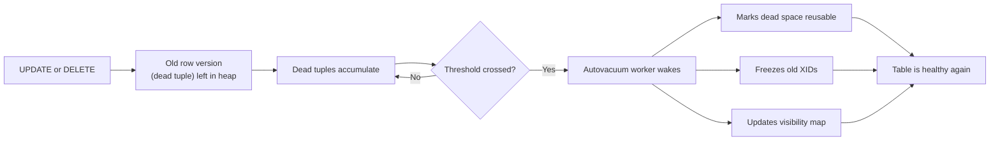
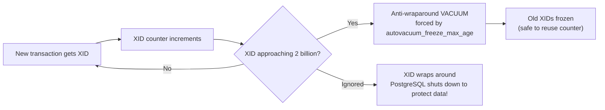

# Autovacuum in PostgreSQL

## The core idea in plain English

Think of PostgreSQL as an office where every document update means **printing a new copy** and leaving the old copy in the drawer — never throwing it away immediately. The old copies (called *dead tuples*) pile up over time, wasting space and slowing down searches. **Autovacuum is the automatic janitor** that periodically comes through, discards the old copies, and reorganizes the filing system.

## Problem statement

PostgreSQL uses **MVCC** (Multi-Version Concurrency Control). When a row is updated or deleted, the old version stays in the table so concurrent transactions with an older snapshot can still read it. This causes two problems:

1. **Table bloat** — dead tuples inflate storage and slow down full scans.
2. **Transaction ID (XID) wraparound** — XIDs are 32-bit counters that cycle. If old XIDs are never "frozen", the database will eventually **forcibly shut down** to protect data integrity.



## Solution / approach

`autovacuum` is a background daemon (launcher + worker processes) that automatically runs `VACUUM` and `ANALYZE` on tables when they accumulate enough dead tuples.

### What VACUUM actually does

- **Marks dead tuples reusable** in the free space map so new rows can use that space. (Note: plain `VACUUM` does *not* return space to the OS. That requires `VACUUM FULL`, which rewrites the whole table and takes an exclusive lock.)
- **Freezes old tuples** so their XID no longer counts toward wraparound, advancing `relfrozenxid`.
- **Updates the visibility map**, which enables faster index-only scans.
- `ANALYZE` (often run alongside) refreshes the query planner's statistics.

### When does autovacuum trigger?

A table gets vacuumed when:

```
dead_tuples > autovacuum_vacuum_threshold
            + autovacuum_vacuum_scale_factor × total_rows
```

Defaults: `threshold = 50`, `scale_factor = 0.2` (20%). For a 1M-row table, that's ~200,000 dead tuples before autovacuum fires — way too lenient for large, heavily-written tables.

### Key tuning levers

| Parameter | What it controls |
|---|---|
| `autovacuum_vacuum_scale_factor` | Lower (e.g. `0.01`) for large tables so vacuum runs more often |
| `autovacuum_vacuum_cost_limit` | Raise to let vacuum work faster on busy systems |
| `autovacuum_vacuum_cost_delay` | Lower to reduce throttle between vacuum I/O bursts |
| `autovacuum_max_workers` | Number of concurrent autovacuum workers |
| `autovacuum_freeze_max_age` | Forces an anti-wraparound vacuum regardless of dead tuple count |

Override per table:

```sql
ALTER TABLE events SET (
  autovacuum_vacuum_scale_factor = 0.02,
  autovacuum_vacuum_cost_limit  = 2000
);
```

### The XID wraparound risk



## Interview gotchas

- **Long-running transactions block cleanup.** An old open transaction holds back the *xmin horizon* — autovacuum cannot remove dead tuples newer than that transaction. Even if autovacuum is running, bloat grows. Check `pg_stat_activity` for old `xact_start`.
- **Replication slots** and abandoned prepared transactions have the same effect.
- `VACUUM FULL` reclaims disk space but locks the whole table. For online bloat removal, use `pg_repack` instead.
- Monitor `pg_stat_user_tables.n_dead_tup` and `last_autovacuum` to confirm autovacuum is keeping up.
