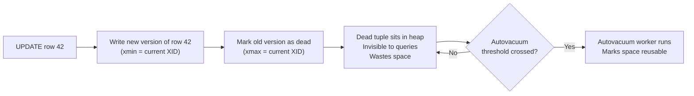
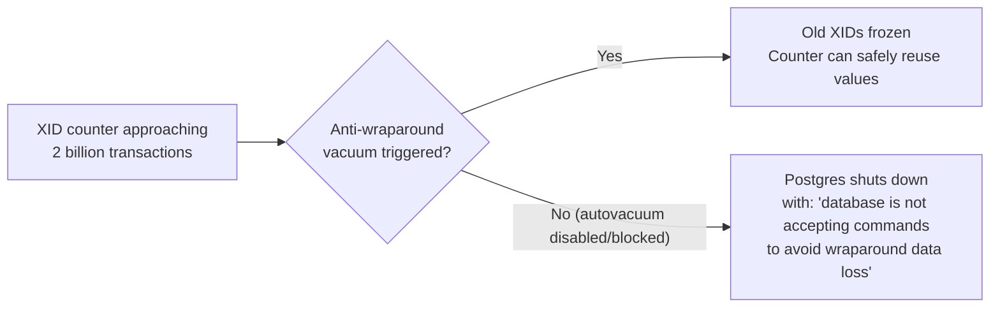
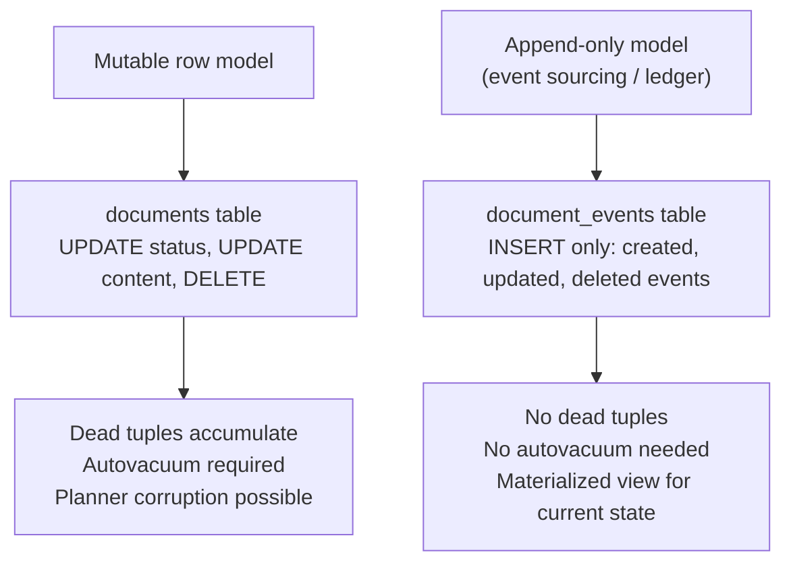
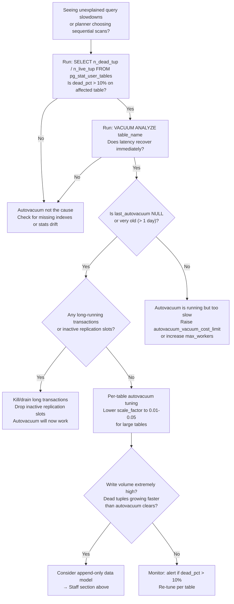

# Autovacuum in PostgreSQL

<!-- meta
level: senior
domain: data-storage
prereqs: []
readtime: 15
incident-type: silent performance degradation
-->

## The Incident

> **Vaultly (legal document management SaaS) · Month 7 post-launch · ~12k active users, 3M documents**

Nobody paged us. That was the problem.

Six months after launch, our customers started emailing support: "Document search feels slower than it used to." Not broken — slower. The kind of thing that's easy to dismiss as perception. Our P50 search latency was still reasonable. P99 was not: it had climbed from 180ms at launch to 1.4s, silently, over six months.

We ran `EXPLAIN ANALYZE` on our main search query. The output stopped us cold. Six months ago, this query used an index scan on `documents_owner_idx`. Now it was doing a sequential scan on a 3.1 million row table. The planner had decided the index was too expensive and switched strategies — by itself, with no code changes, no schema changes, and no deployment from us.

The culprit: `pg_stat_user_tables` showed `n_dead_tup = 8,200,000` on the `documents` table. 8.2 million dead tuples against 3.1 million live rows — a 2.6:1 dead-to-live ratio. The table had ballooned to 14GB for what should have been a 5.4GB dataset. The query planner, seeing a 14GB table with stale statistics, decided a sequential scan was cheaper than an index scan on what it believed was a sparsely populated index.

`last_autovacuum` on the documents table: **never**. Autovacuum had never run on this table. The default trigger threshold — 20% of rows — was set for small tables. With 3 million rows, that's 600,000 dead tuples before autovacuum fires. We had 8.2 million.

We ran manual `VACUUM ANALYZE` at 11:48 PM. By 11:52 PM, P99 latency was back to 185ms. Four minutes of maintenance work fixed six months of degradation.

## Why Smart Engineers Get This Wrong

Postgres's MVCC (Multi-Version Concurrency Control) model is elegant but has a cost engineers don't feel immediately. Every `UPDATE` or `DELETE` doesn't modify the row in place — it writes a new row version and leaves the old version in the heap, marked as "dead." The dead tuple takes space. It confuses the query planner. But it doesn't throw an error. It just... accumulates.

The second mistake: engineers treat autovacuum as a "set and forget" system setting. The defaults are conservative — designed to cause minimal disruption on small tables. They are **not** designed for tables with millions of rows and frequent writes. The formula that calculates when autovacuum fires means a 10M-row table needs 2 million dead tuples before cleanup runs. By then, the planner has already been making bad decisions for months.

The third mistake: monitoring `pg_stat_user_tables` is not part of standard monitoring setups. Teams monitor CPU, memory, disk, query latency — but rarely `n_dead_tup` or `last_autovacuum`. The degradation stays invisible until customers notice.

| What engineers assume | What actually happens |
|---|---|
| `UPDATE` modifies the row in place | Postgres writes a new version and leaves the old one as a "dead tuple" |
| Autovacuum is always running and keeping tables clean | Default thresholds only work for small tables; large tables accumulate millions of dead tuples |
| Query plan choices are stable unless we change the schema | Stale planner statistics cause the planner to switch strategies silently over time |

## The Investigation Playbook

### 1. Find tables with dangerous dead tuple ratios

```sql
SELECT
    schemaname,
    tablename,
    n_live_tup,
    n_dead_tup,
    ROUND(n_dead_tup::numeric / NULLIF(n_live_tup + n_dead_tup, 0) * 100, 1) AS dead_pct,
    pg_size_pretty(pg_total_relation_size(schemaname || '.' || tablename)) AS total_size,
    last_autovacuum,
    last_autoanalyze
FROM pg_stat_user_tables
WHERE n_dead_tup > 10000
ORDER BY dead_pct DESC
LIMIT 20;
```

> **What you're looking for:** `dead_pct` above 10% is a concern. Above 20% is causing planner degradation. `last_autovacuum = NULL` means it has *never* been vacuumed — critical on any large, write-heavy table.

### 2. Check if the planner has already switched to sequential scan

```sql
-- Force EXPLAIN to show what plan the planner is choosing
EXPLAIN (ANALYZE, BUFFERS, FORMAT TEXT)
SELECT * FROM documents WHERE owner_id = 42 AND status = 'active';
```

> **What you're looking for:** `Seq Scan` on a table that should be using an index. If you see this on a write-heavy table with high `dead_pct`, dead tuples have corrupted the planner's cost estimates.

### 3. Check for long-running transactions blocking autovacuum

```sql
-- Long-running transactions hold back the "xmin horizon" — autovacuum can't
-- remove dead tuples newer than the oldest open transaction's snapshot
SELECT pid, usename, query_start, NOW() - query_start AS duration, query
FROM pg_stat_activity
WHERE state != 'idle'
  AND query_start < NOW() - INTERVAL '5 minutes'
ORDER BY query_start ASC;
```

> **What you're looking for:** Transactions running for hours or days. Even if autovacuum is configured correctly, a long-running transaction prevents it from cleaning dead tuples. This is the most common reason autovacuum appears to "not work."

### 4. Immediate fix

```sql
-- Run manual VACUUM ANALYZE on the bloated table
-- VACUUM removes dead tuples; ANALYZE updates planner statistics
-- This is safe to run on a live production table
VACUUM (ANALYZE, VERBOSE) documents;
```

Watch the output — `VERBOSE` shows you how many dead tuples were removed and confirms stats were updated.

## The Fix at Three Altitudes

<!-- level:junior -->

### Junior: Understand It and Apply the Standard Fix

PostgreSQL uses **MVCC** (Multi-Version Concurrency Control) to allow concurrent reads and writes without blocking. When you update or delete a row, Postgres doesn't overwrite it — it writes a new version and marks the old one as dead. Dead tuples are invisible to queries but occupy physical space.



**VACUUM** is what removes dead tuples:
- Marks dead tuple space as reusable (so new rows can overwrite it)
- Updates the **visibility map** (speeds up index-only scans)
- Freezes old transaction IDs (prevents XID wraparound — more on this below)

**ANALYZE** updates the query planner's statistics about table content — how many rows, how values are distributed. Without fresh statistics, the planner makes bad cost estimates and picks wrong query plans.

**Autovacuum** is Postgres's background daemon that runs VACUUM and ANALYZE automatically. It triggers when:

```
dead_tuples > autovacuum_vacuum_threshold
            + autovacuum_vacuum_scale_factor × n_live_tuples
```

Default values: `threshold = 50`, `scale_factor = 0.20`. For a 3 million row table: `50 + 0.20 × 3,000,000 = 600,050 dead tuples`. That's the bar autovacuum has to wait for before it helps you.

**The XID wraparound risk:** Transaction IDs (XIDs) are 32-bit counters. If they cycle all the way around without old XIDs being "frozen," Postgres cannot tell which transactions happened before which others — and it will **forcibly shut down to protect data integrity**. Autovacuum prevents this by freezing old XIDs before the counter wraps.



<!-- /level:junior -->

<!-- level:senior -->

### Senior: Tune It, Operate It, Know When It Fails

The default `scale_factor = 0.20` works for tables under 100k rows. For large tables, you need per-table tuning. The goal: autovacuum should run frequently enough that dead tuple ratio never exceeds 5%.

**Per-table autovacuum tuning:**

```sql
-- For a large, write-heavy table: run autovacuum much more aggressively
ALTER TABLE documents SET (
    autovacuum_vacuum_scale_factor = 0.01,   -- trigger at 1% dead tuples (not 20%)
    autovacuum_vacuum_threshold    = 100,     -- minimum dead tuples to trigger
    autovacuum_vacuum_cost_limit   = 2000,    -- allow faster I/O (default 200)
    autovacuum_vacuum_cost_delay   = 2        -- less throttling between I/O bursts (default 20ms)
);
```

For write-heavy tables where bloat accumulates faster than autovacuum can clear it:

```sql
-- Increase the number of concurrent autovacuum workers
ALTER SYSTEM SET autovacuum_max_workers = 6; -- default 3
SELECT pg_reload_conf();
```

**The most common reason autovacuum fails silently:** long-running transactions. Autovacuum cannot remove dead tuples that are newer than the oldest open transaction's snapshot — the "xmin horizon." A transaction open for 8 hours means 8 hours of dead tuples are completely off-limits to autovacuum, regardless of your settings.

```sql
-- Find the oldest transaction holding back autovacuum
SELECT pid, usename,
       age(backend_xid) AS xid_age,
       age(backend_xmin) AS xmin_age,
       NOW() - xact_start AS transaction_age,
       query
FROM pg_stat_activity
WHERE backend_xid IS NOT NULL OR backend_xmin IS NOT NULL
ORDER BY GREATEST(age(backend_xid), age(backend_xmin)) DESC
LIMIT 5;
```

> A transaction with `xmin_age > 1,000,000` is a serious problem — it's holding back autovacuum for 1 million transactions worth of dead tuples.

**Replication slots have the same effect.** An inactive replication slot holds back the xmin horizon just like a long transaction:

```sql
-- Find stuck replication slots
SELECT slot_name, active, pg_size_pretty(pg_wal_lsn_diff(pg_current_wal_lsn(), restart_lsn)) AS lag
FROM pg_replication_slots
WHERE active = false;
```

> An inactive slot with significant lag: drop it. It's preventing autovacuum from doing its job.

**The three failure modes to instrument:**

1. **Dead tuple accumulation outpacing autovacuum** — `n_dead_tup / (n_live_tup + n_dead_tup) > 0.05` and growing. Set an alert.
2. **Long transaction blocking xmin** — `age(backend_xmin) > 10,000,000` in `pg_stat_activity`. Page on-call.
3. **Wraparound emergency** — `pg_database.datfrozenxid` age approaching `autovacuum_freeze_max_age` (default 200M). Postgres will start printing warnings in logs 10M transactions before emergency shutdown.

**Production monitoring query (run every 5 minutes):**

```sql
SELECT
    tablename,
    n_dead_tup,
    n_live_tup,
    ROUND(n_dead_tup::numeric / NULLIF(n_live_tup, 0) * 100, 1) AS dead_pct,
    age(relfrozenxid) AS xid_age,
    last_autovacuum
FROM pg_stat_user_tables
JOIN pg_class ON relname = tablename
WHERE schemaname = 'public'
  AND n_live_tup > 10000
ORDER BY dead_pct DESC;
```

Alert thresholds: `dead_pct > 10` → warning, `dead_pct > 25` → page on-call, `xid_age > 150,000,000` → critical.

<!-- /level:senior -->

<!-- level:staff -->

### Staff: Design Systems That Don't Need This Fix

Autovacuum tuning is necessary but is fundamentally a symptom of using a mutable row model on high-write-volume tables. The staff-level reframe: some data doesn't need to be mutated — it needs to be *appended*.

**The insight:** MVCC dead tuples only accumulate when you `UPDATE` or `DELETE` rows. If your data model uses `INSERT` exclusively (append-only), there are no dead tuples. No dead tuples means no bloat, no planner corruption, no wraparound risk, and no autovacuum tuning.



This is why financial systems and audit-critical applications often use **ledger-style data models**: every state change is a new row, not an update to an existing row. The "current state" is derived by reading the latest event per entity.

For Vaultly's document management use case:

```sql
-- Instead of: UPDATE documents SET status = 'archived' WHERE id = 42
-- Use:
INSERT INTO document_events (document_id, event_type, payload, created_at)
VALUES (42, 'archived', '{}', NOW());

-- Current state via view:
CREATE MATERIALIZED VIEW documents_current AS
SELECT DISTINCT ON (document_id)
    document_id, event_type AS status, payload
FROM document_events
ORDER BY document_id, created_at DESC;
```

The MVCC problem disappears — but new complexity appears: query patterns change (reads now need `DISTINCT ON` or equivalent aggregation), historical data grows unboundedly (need a retention policy), and the materialized view needs refreshing. This tradeoff is worth it for: (a) data that needs an audit trail, (b) tables under heavy write load, (c) systems that benefit from event replay (CQRS).

**The conversation to have with your team:**

> "We're spending engineering cycles on autovacuum tuning for our documents table every quarter. The underlying cause is that we're using `UPDATE` for status changes, which generates dead tuples. I want to explore an append-only event model for document state changes. The audit trail we get for free is also something compliance has been asking for. Let's look at what queries would need to change and whether the complexity is worth the removal of this maintenance burden."

**Prerequisites for the architectural alternative:** Willingness to change query patterns (reads become more complex). An understanding of event sourcing tradeoffs — append-only doesn't mean no maintenance; it means different maintenance (partition old data, refresh materialized views).

<!-- /level:staff -->

## The Decision Tree



## Interview Gauntlet

### Junior questions

**Q: What is MVCC and why does it create dead tuples?**  
Expected: MVCC (Multi-Version Concurrency Control) allows concurrent readers and writers by keeping multiple versions of each row — each transaction sees a consistent snapshot of the database as it existed when that transaction started. When a row is updated or deleted, the old version isn't overwritten; it's marked as "dead" and kept in the heap until vacuumed. This is how Postgres avoids read-write contention — readers don't block writers and writers don't block readers.  
30-second one-liner: "Every UPDATE leaves an old row version as a dead tuple. VACUUM removes them. Without VACUUM, tables bloat and the query planner gets confused."

**Q: What is autovacuum and why might it fail to keep up?**  
Expected: Autovacuum is a background daemon that automatically runs VACUUM and ANALYZE when a table accumulates enough dead tuples (based on `scale_factor × n_live_tup + threshold`). It fails to keep up when: (a) the scale factor is too high for large tables (default 20% means millions of dead tuples before it fires), (b) a long-running transaction holds the xmin horizon and prevents cleanup, or (c) the cost limit is too conservative and autovacuum throttles itself too aggressively.

### Senior questions

**Q: You're seeing unexpectedly slow queries on Postgres with no schema changes and no recent deploys. Walk me through your diagnosis.**  
Expected: Run `EXPLAIN ANALYZE` to see the actual query plan. If it switched to sequential scan, check `pg_stat_user_tables` for high `n_dead_tup` ratio. Check `last_autovacuum` — if it's never run or is very old, dead tuples are the culprit. Check `pg_stat_activity` for long-running transactions blocking autovacuum. Run `VACUUM ANALYZE` manually and see if query plan returns to index scan.  
The trap: running `VACUUM FULL` — it locks the whole table. Use `VACUUM ANALYZE` (or `pg_repack` for online bloat removal).

**Q: What is XID wraparound and how does Postgres prevent it?**  
Expected: Transaction IDs (XIDs) are 32-bit integers that cycle. If a row's XID is never "frozen" (converted to a special frozen marker), Postgres loses the ability to determine transaction ordering after the counter wraps. Postgres prevents this with anti-wraparound vacuums triggered by `autovacuum_freeze_max_age` (default 200M transactions). If autovacuum can't run (disabled, or blocked by long transactions), Postgres will eventually shut down with an error message rather than risk data corruption.  
The one-liner: "Postgres would rather shut down than let you lose transaction ordering."

**Q: How does a long-running transaction prevent autovacuum from working even if autovacuum is running?**  
Expected: Postgres tracks the "xmin horizon" — the oldest snapshot that any active transaction holds. Autovacuum cannot remove dead tuples newer than this horizon, because a transaction with an older snapshot might still need to see those rows. A transaction that's been running for 8 hours freezes the xmin horizon in place. Any rows updated in those 8 hours cannot be cleaned up. This is why monitoring transaction age is as important as monitoring autovacuum itself.

### Staff questions

**Q: When would you recommend an append-only data model over a mutable row model in Postgres?**  
Expected: When: (a) you need a full audit trail of every state change (financial systems, compliance-sensitive data), (b) the table has extremely high write volume and dead tuples accumulate faster than autovacuum can process them, (c) the read pattern is CQRS-friendly (one write path, one read path). Not when: (a) the table is queried by current state heavily and deriving state from events adds unacceptable query complexity, (b) write volume is low and standard autovacuum tuning handles bloat adequately.  
The tradeoff to name: "Append-only removes dead tuple accumulation but introduces event compaction, materialized view refresh, and more complex read queries. It's not simpler — it's differently complex."

## Connections

**Before this:** No prerequisites for core concepts; pairs well with [mutex-lock](/mutex-lock) for understanding why concurrent access creates complexity  
**After this:** indexing-strategy (how dead tuples corrupt planner statistics leads into how to design indexes that are resilient to stale stats), wal-durability (WAL and MVCC are deeply connected — the same write-ahead log that enables crash recovery also enables MVCC)  
**Related incidents:**
- *Vaultly (this incident)* — 6 months of silent degradation from dead tuple accumulation; 4 minutes of manual VACUUM restored P99 latency
- *Mailchimp 2019 Postgres outage* — XID wraparound caused database shutdown; `autovacuum_freeze_max_age` not tuned for their transaction volume
- *Sentry 2020 bloat crisis* — large Postgres tables with insufficient autovacuum tuning caused cascading slowdowns; resolved by per-table `scale_factor` reduction and partitioning
