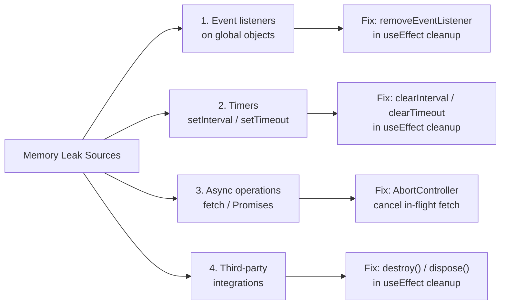
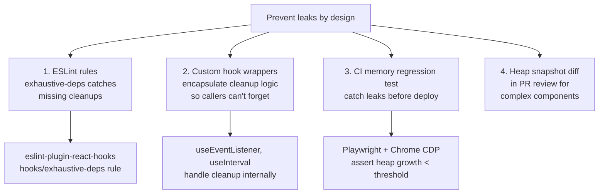
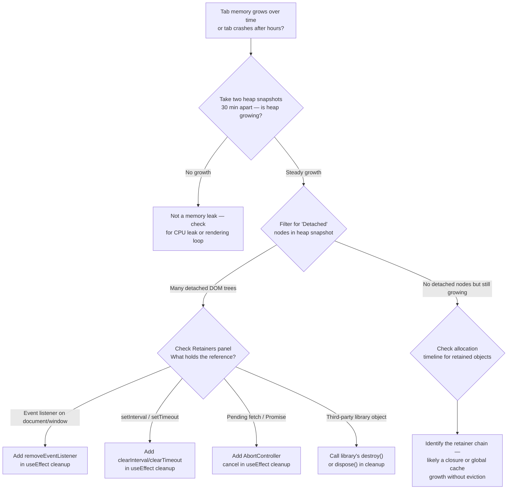

# Browser Memory Leaks

<!-- meta
level: senior
domain: reliability
prereqs: []
readtime: 14
incident-type: memory leak
-->

## The Incident

> **Notera (note-taking SPA) · Q2 2024 · ~200k DAU, desktop-heavy usage**

Our support queue started filling with a specific complaint: "Tab crashes after a few hours." Users who kept Notera open all day reported the browser tab consuming 1.8–2.4 GB of RAM before Chrome killed it. A few power users sent screenshots of Chrome Task Manager.

The on-call checked everything server-side. Backend API P99 was 140ms. Database connections: normal. CDN hit rate: 96%. Nothing in our infrastructure metrics explained a tab crash. The engineers marked the tickets as "likely user's machine" for a week.

Then one of our engineers kept the app open for 4 hours with Chrome DevTools → Memory tab open. She took heap snapshots every 30 minutes and used the "Comparison" view. The retained heap grew 180MB per hour. By filtering for "Detached" nodes — DOM nodes no longer in the tree but still referenced by JavaScript — she found 4,847 detached `div` elements after 2 hours, each one a complete note editor component.

The specific log line that made it clear: in the Memory tab's "Retainers" panel, every detached tree traced back to a single line: `document.addEventListener('keydown', handleEditorShortcuts)` inside a `useEffect` with no cleanup function. Every time a user opened and closed a note, a new event listener was added to `document` and the old one was never removed. The event listener held a reference to the editor component's closure, which held the editor DOM tree, which prevented garbage collection of the entire 40KB per-note subtree.

## Why Smart Engineers Get This Wrong

The mistake is thinking about memory in terms of **visible state** rather than **reference graphs**. When a component unmounts, it disappears from the UI. Engineers assume "gone from UI" means "gone from memory." But the JavaScript garbage collector doesn't collect by UI visibility — it collects by reachability. If anything still holds a reference to the component, the component and everything it referenced lives forever.

The second mistake is that `addEventListener` is not automatically paired with `removeEventListener`. Engineers who use class components learned lifecycle methods (`componentDidMount` / `componentWillUnmount`). In hooks, `useEffect` returns a cleanup function — but this is optional, easy to forget, and not enforced by TypeScript or linting by default. The gap between "I understand useEffect" and "I always write the cleanup function" is where most React memory leaks live.

| What engineers assume | What actually happens |
|---|---|
| Unmounted components are garbage collected | Any external reference (event listener, timer, closure) keeps the entire component subtree alive |
| useEffect cleanup is optional and rarely needed | Any useEffect that registers external state (addEventListener, setInterval, RxJS subscriptions) must clean up or it leaks |
| Memory leaks show up quickly in testing | Leaks accumulate slowly; a 180MB/hour leak is undetectable in a 5-minute test session |

## The Investigation Playbook

### 1. Confirm the leak with heap snapshots

Open Chrome DevTools → Memory tab → "Heap snapshot". Take a snapshot at T=0, T=30min, T=60min. In the comparison view:

```
Snapshot 1: 45 MB (fresh app)
Snapshot 2: 78 MB (30 min)  +33 MB
Snapshot 3: 111 MB (60 min) +33 MB
```

> **What you're looking for:** Steady linear growth in retained heap size. A flat line or occasional spikes that return to baseline are normal; a consistent upward trend means something is not being freed.

### 2. Find detached DOM nodes

In the Memory tab → take a heap snapshot → in the filter box type "Detached". Expand the tree:

```
Detached HTMLDivElement  × 4,847
  Detached HTMLDivElement
    Detached HTMLDivElement
      ...
```

> **What you're looking for:** Detached DOM trees. Click one → check "Retainers" panel at the bottom. The retainer chain will show you which JavaScript object is holding the reference.

### 3. Find accumulating event listeners

```javascript
// Run in DevTools Console to count event listeners on document
const listeners = getEventListeners(document);
console.log(Object.entries(listeners).map(([type, list]) =>
  `${type}: ${list.length} listeners`
).join('\n'));
```

Do this at T=0 (app start) and after opening/closing 20 notes. Compare counts.

> **What you're looking for:** A listener count that grows each time you open and close a component. `keydown: 1` → `keydown: 21` after 20 note opens is a definitive leak.

### 4. Identify the leak source with allocation timeline

DevTools → Memory → Allocation instrumentation on timeline → Record 1 minute of open/close actions → Stop. Look for blue bars that don't turn grey (grey = garbage collected, blue = still retained).

> **What you're looking for:** Blue allocation bars that persist after you close the component. Click the bar — it shows you the stack trace of the allocation that was never freed.

## The Fix at Three Altitudes

<!-- level:junior -->

### Junior: Understand It and Apply the Standard Fix

Every `useEffect` that registers something external must **unregister it in the cleanup function**. The cleanup runs when the component unmounts.

```tsx
// LEAKS: adds a listener every render, never removes it
useEffect(() => {
  document.addEventListener('keydown', handleShortcuts);
}); // No dependency array = runs every render

// ALSO LEAKS: runs once on mount, but never cleans up
useEffect(() => {
  document.addEventListener('keydown', handleShortcuts);
}, []); // ← cleanup missing

// CORRECT: cleanup removes the listener on unmount
useEffect(() => {
  document.addEventListener('keydown', handleShortcuts);
  return () => {
    document.removeEventListener('keydown', handleShortcuts); // ← same reference!
  };
}, []); // Runs once on mount, cleans up on unmount
```

**Critical detail:** `removeEventListener` must receive the **exact same function reference** as `addEventListener`. If you inline a new arrow function in the cleanup, it won't match:

```tsx
// BUG: different function reference — removeEventListener does nothing
useEffect(() => {
  document.addEventListener('keydown', (e) => handleShortcuts(e));
  return () => {
    document.removeEventListener('keydown', (e) => handleShortcuts(e)); // ← new function, no match
  };
}, []);

// FIX: stable reference
useEffect(() => {
  const handler = (e: KeyboardEvent) => handleShortcuts(e);
  document.addEventListener('keydown', handler);
  return () => document.removeEventListener('keydown', handler);
}, []);
```

**Same pattern for timers and subscriptions:**

```tsx
useEffect(() => {
  const intervalId = setInterval(autosave, 30_000);
  return () => clearInterval(intervalId); // Must clear
}, []);

useEffect(() => {
  const subscription = observable$.subscribe(handleUpdate);
  return () => subscription.unsubscribe(); // Must unsubscribe
}, []);
```

<!-- /level:junior -->

<!-- level:senior -->

### Senior: Tune It, Operate It, Know When It Fails

The event listener pattern is the most common React leak, but there are four distinct leak categories in production SPAs. Each needs a different detection approach.

**The four leak categories:**



**Async operation leak (fetch after unmount):**

```tsx
useEffect(() => {
  const controller = new AbortController();

  fetch(`/api/notes/${noteId}`, { signal: controller.signal })
    .then(res => res.json())
    .then(data => {
      // Without AbortController, this setState runs even if component unmounted
      // — "Can't perform a React state update on an unmounted component"
      setNote(data);
    })
    .catch(err => {
      if (err.name !== 'AbortError') throw err; // Ignore expected abort
    });

  return () => controller.abort(); // Cancel in-flight request on unmount
}, [noteId]);
```

**Third-party integration leak (e.g., Quill rich text editor):**

```tsx
useEffect(() => {
  const editor = new Quill('#editor', { theme: 'snow' });
  editorRef.current = editor;
  return () => {
    editor.off(); // Remove all Quill event listeners
    editorRef.current = null;
    // If Quill doesn't have a destroy(), remove its container manually
  };
}, []);
```

**Production monitoring for memory leaks:**

```javascript
// Periodic memory sampling — send to your analytics on LongTask events
if ('memory' in performance) {
  setInterval(() => {
    const { usedJSHeapSize, totalJSHeapSize } = (performance as any).memory;
    analytics.track('heap_usage', {
      used_mb: Math.round(usedJSHeapSize / 1_048_576),
      total_mb: Math.round(totalJSHeapSize / 1_048_576),
      ratio: usedJSHeapSize / totalJSHeapSize,
    });
  }, 60_000);
}
// Alert if used_mb grows > 50MB/hour for a session
```

**The three failure modes to watch for:**

1. **Stale closure leaks** — a cleanup function closes over the wrong dependency. If `handleShortcuts` is re-created each render (depends on state), the cleanup captures the old version and the remove doesn't match the current listener. Fix with `useCallback` or include the handler in the dependency array.

2. **Third-party teardown incomplete** — library's `destroy()` method removes the library's own event listeners but not ones you added to the library's events. Always check the library's docs for "cleanup" or "destroy" APIs.

3. **`useEffect` dependency array missing** — no dependency array means the effect runs after every render and the cleanup runs before every re-run. High frequency of effect/cleanup cycles won't cause permanent leaks, but will cause performance issues and can cause subtle state bugs.

<!-- /level:senior -->

<!-- level:staff -->

### Staff: Design Systems That Don't Need This Fix

Individual leak fixes are necessary, but they're reactive. At scale, you need leak *prevention* at the architecture level, because individual developers will always occasionally forget a cleanup.

**The systemic prevention approach:**



**Custom hooks that make leaks structurally impossible:**

```tsx
// Encapsulate event listener lifecycle — callers cannot forget cleanup
function useEventListener<K extends keyof DocumentEventMap>(
  type: K,
  handler: (event: DocumentEventMap[K]) => void,
  options?: AddEventListenerOptions,
) {
  const savedHandler = useRef(handler);
  useEffect(() => { savedHandler.current = handler; }, [handler]);

  useEffect(() => {
    const listener = (event: DocumentEventMap[K]) => savedHandler.current(event);
    document.addEventListener(type, listener, options);
    return () => document.removeEventListener(type, listener, options);
  }, [type]);
}

// Usage — cleanup is impossible to forget
function NoteEditor({ noteId }: { noteId: string }) {
  useEventListener('keydown', (e) => {
    if (e.metaKey && e.key === 's') saveNote(noteId);
  });
  // ...
}
```

**Memory regression test in CI:**

```typescript
// playwright.memory.spec.ts
test('note editor does not leak on open/close cycle', async ({ page }) => {
  await page.goto('/');
  const initialHeap = await getHeapSize(page);

  for (let i = 0; i < 20; i++) {
    await page.click('[data-testid="new-note"]');
    await page.click('[data-testid="close-note"]');
  }

  await page.evaluate(() => gc()); // Force GC via --js-flags=--expose-gc
  const finalHeap = await getHeapSize(page);

  expect(finalHeap - initialHeap).toBeLessThan(5 * 1024 * 1024); // < 5MB growth
});

async function getHeapSize(page: Page): Promise<number> {
  const client = await page.context().newCDPSession(page);
  const metrics = await client.send('Performance.getMetrics');
  return metrics.metrics.find(m => m.name === 'JSHeapUsedSize')!.value;
}
```

> "The goal isn't to fix every leak as it's reported — it's to make leaks detectable before they ship. A CI test that opens and closes every major component 20 times and asserts heap growth < 5MB catches 90% of leaks before they ever reach production. The custom hook wrappers catch the other 10% at the call site."

**Prerequisites for the architectural alternative:** Requires Playwright in CI and the `--js-flags=--expose-gc` flag to force GC between component cycles. The custom hook approach requires team buy-in to prefer `useEventListener` over direct `addEventListener` in code review.

<!-- /level:staff -->

## The Decision Tree



## Interview Gauntlet

### Junior questions

**Q: What causes a memory leak in a React component?**  
Expected: A memory leak occurs when a component is unmounted but something external still holds a reference to it — typically an event listener on `document` or `window`, a `setInterval`, or an unresolved `fetch`. The garbage collector can't collect the component because it's still reachable through that external reference. Every time the component is mounted/unmounted, another reference accumulates.  
Follow-up that separates junior from senior: *"Why doesn't React automatically remove event listeners when a component unmounts?"*  
30-second one-liner: "A leak happens when useEffect registers something external and the cleanup function doesn't unregister it — the component unmounts visually but stays in memory because JavaScript can still reach it."

**Q: Write the correct pattern for adding and removing a keydown listener in a React component.**  
Expected:
```tsx
useEffect(() => {
  const handler = (e: KeyboardEvent) => { /* ... */ };
  document.addEventListener('keydown', handler);
  return () => document.removeEventListener('keydown', handler);
}, []);
```
The trap: inlining a different arrow function in cleanup (different reference, remove does nothing), or omitting the dependency array (runs every render).

### Senior questions

**Q: How would you diagnose a memory leak in a production SPA when you can't reproduce it locally?**  
Expected: Use Chrome DevTools Memory tab to take heap snapshots at T=0, T=30min, T=60min and compare retained heap in the comparison view. Filter for "Detached" nodes to find unmounted components still in memory. Use the allocation timeline to find which specific allocations are not being freed. For production, instrument `performance.memory.usedJSHeapSize` at intervals and alert when it grows monotonically over a session. Set up a Playwright test that simulates the user flow and asserts heap growth below a threshold.  
The trap: relying only on `console.memory` readings without a GC trigger between measurements — unreleased memory looks like a leak until you force GC.

**Q: Why must `removeEventListener` receive the exact same function reference as `addEventListener`?**  
Expected: The browser identifies listeners by function reference identity, not function equality. Two arrow functions `() => handler(e)` are two different objects in memory even if they're textually identical. `removeEventListener` with a different reference is a no-op — the original listener remains registered. Fix: store the handler in a variable before registering, then pass the same variable to remove.

### Staff questions

**Q: How do you prevent memory leaks at the architecture level rather than fixing them one-by-one?**  
Expected: Three approaches: (1) Custom hooks that encapsulate lifecycle management (`useEventListener`, `useInterval`) so callers can't forget cleanup. (2) ESLint `react-hooks/exhaustive-deps` rule catches missing dependencies that often correspond to missing cleanups. (3) Playwright memory regression tests in CI that open/close every major component N times, force GC, and assert heap growth below a threshold — catches leaks before they ship. The meta-point: individual fixes are reactive; you want the architecture to make leaks structurally harder to write.  
Follow-up: *"What's the tradeoff of wrapping all event listeners in a custom hook versus using addEventListener directly?"*

## Connections

**Before this:** No prerequisites — but understanding JavaScript closures and garbage collection helps  
**After this:** [progressive-hydration](/progressive-hydration) (memory cost of hydrating too much), performance-profiling (broader browser performance investigation)  
**Related incidents:**
- *Gmail (2011)* — early SPA pioneers discovered memory leak patterns at scale; prompted foundational research on JavaScript GC in long-lived applications
- *Slack desktop (2019)* — documented memory growth in their Electron app over long sessions; traced to accumulated DOM nodes in message history
- *Notion (2022)* — community reports of browser tab memory growth in large workspaces; combination of retained DOM trees and unoptimized block rendering
