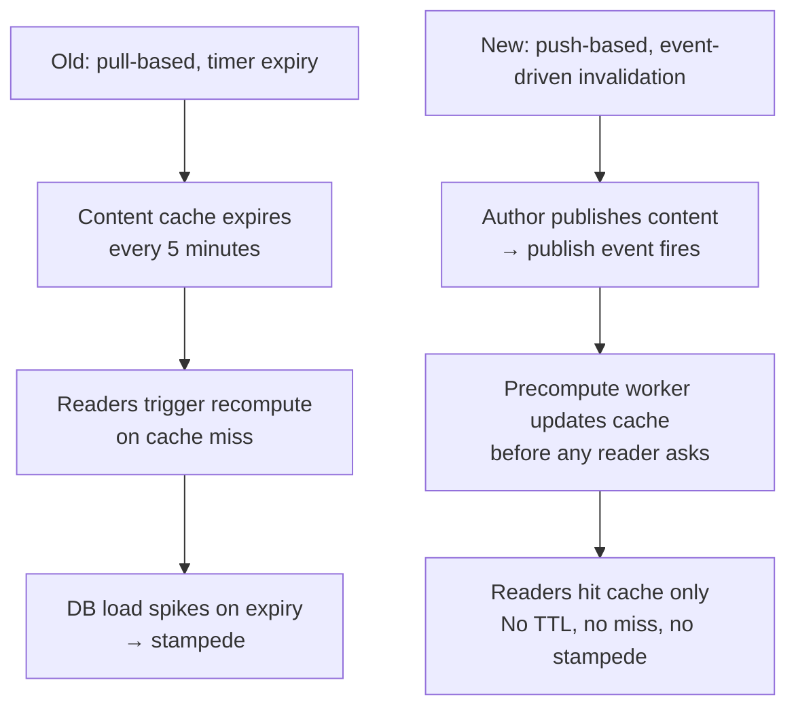
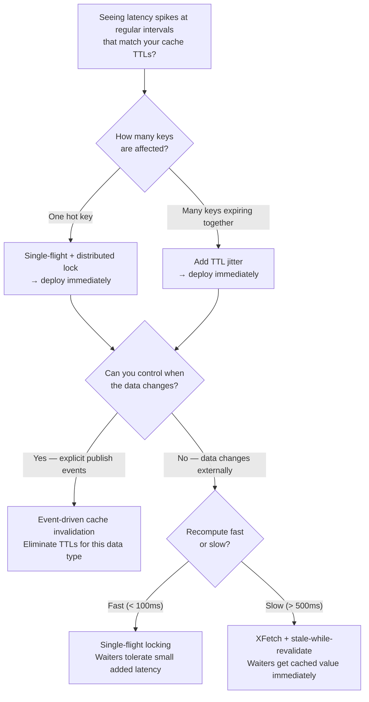

# Cache Stampede (Dog-Piling)

<!-- meta
level: junior
domain: reliability
prereqs: []
readtime: 15
incident-type: latency spike
-->

## The Incident

> **Threadly (social content platform) · Q4 2022 · ~800k DAU, 22k RPS peak**

It started with a tweet. An influential tech blogger shared a link to one of our longform articles at 11:43 PM. By midnight, 40,000 people had the tab open. Our on-call engineer woke to PagerDuty at 00:07: P99 latency had climbed from 180ms to 9.4s over six minutes. Error rate was 28% and climbing.

Her first instinct was to check Redis. The cache cluster looked fine — CPU at 12%, memory healthy, no evictions. She checked the CDN. Edge hit rate was normal. She restarted the two API servers showing high CPU and watched the metrics... latency stayed at 9.4s. The restarts did nothing.

The break came when she pulled the Postgres slow query log. The same query — `SELECT * FROM articles WHERE slug = 'why-rust-matters'` with a 12-table join for comments and ratings — appeared 847 times in a 300ms window. All of them were in flight simultaneously. All returned the same 14KB payload.

The cache key had a TTL of 5 minutes. It expired at 00:06:58. In the 300ms before the first request repopulated it, 847 requests slipped through to the database at once. The connection pool had 100 slots. 747 threads queued. Average queue wait: 8.2 seconds. The cascade was complete: slow DB → more in-flight requests → more DB load → slower DB.

## Why Smart Engineers Get This Wrong

We think of caches as **passive storage** — a bucket that either has the value or doesn't. But under concurrent load, a cache expiry is an **active event** that instantly changes the behavior of every reader simultaneously. The moment the TTL fires, all 847 in-flight requests transition from "cache hit" behavior to "go query the database" behavior — at once.

The second mistake is treating cache misses as low-probability random events. "Our cache miss rate is 0.1% — that's fine." But for a hot key, every expiry is a 100% miss rate event for the entire duration of the recompute. And the recompute takes *longer* when the database is under load, which extends the miss window, which lets more requests through. The problem is self-reinforcing.

| What engineers assume | What actually happens |
|---|---|
| Cache misses are rare, random, and independent | Every reader misses simultaneously the instant the TTL fires |
| Recomputing the value is fast | DB handles 847 identical joins at once; each takes 8s instead of 40ms |
| Restarting servers fixes unexplained latency spikes | The root cause is a DB coordination problem — server state is irrelevant |

## The Investigation Playbook

### 1. Confirm the stampede in 60 seconds

```sql
-- Find many identical queries running simultaneously in Postgres
SELECT query, COUNT(*), MAX(now() - query_start) AS max_duration
FROM pg_stat_activity
WHERE state = 'active' AND query NOT LIKE '%pg_stat%'
GROUP BY query
HAVING COUNT(*) > 10
ORDER BY COUNT(*) DESC
LIMIT 20;
```

> **What you're looking for:** The same SELECT appearing dozens or hundreds of times with identical parameters. Max duration will be abnormally high — the connection pool is saturated.

### 2. Correlate the timing to cache expiry

```bash
# Check current TTL of your hot key in Redis
redis-cli TTL "article:why-rust-matters"

# Sample miss rate twice, 10 seconds apart — watch for a spike
redis-cli INFO stats | grep keyspace_misses
sleep 10
redis-cli INFO stats | grep keyspace_misses
```

> **What you're looking for:** Miss rate spiking in the same interval as your latency spike. If incidents happen every ~300s and your TTL is 300s, that's the confirmation.

### 3. Quantify the blast radius

In Datadog / Grafana, look for these signals correlating in time:
- **DB connection pool saturation:** `pg_stat_activity` count with `wait_event_type = 'Client'` spikes
- **Single-query rate spike:** query rate for one statement jumps to N × expected concurrency
- **Cache miss rate:** vertical line at the expiry interval, visible in Redis/Memcached metrics

### 4. Stop the bleeding immediately

```bash
# Extend the TTL from Redis CLI to buy time for a proper deploy
redis-cli EXPIRE "article:why-rust-matters" 3600
```

This extends the existing (potentially stale) cached value's lifetime, ending the DB bombardment instantly. Ship the real fix during business hours.

## The Fix at Three Altitudes

<!-- level:junior -->

### Junior: Understand It and Apply the Standard Fix

The stampede forms because all misses race to recompute. The fix: ensure only **one** request recomputes while others wait. This is called **single-flight** or request coalescing.

**In-process single-flight** (works within one server):

```javascript
const inFlight = new Map();

async function getCached(key, recompute, ttlSeconds) {
  const cached = await redis.get(key);
  if (cached !== null) return JSON.parse(cached);

  // Another request is already recomputing — share its result
  if (inFlight.has(key)) return inFlight.get(key);

  // We're first — recompute and let others join
  const promise = (async () => {
    const value = await recompute();
    await redis.setex(key, ttlSeconds, JSON.stringify(value));
    return value;
  })().finally(() => inFlight.delete(key));

  inFlight.set(key, promise);
  return promise;
}
```

For distributed systems (multiple servers), use a Redis distributed lock:

```javascript
async function getCachedDistributed(key, recompute, ttlSeconds) {
  const cached = await redis.get(key);
  if (cached !== null) return JSON.parse(cached);

  const lockKey = `lock:${key}`;
  // NX = only set if not exists; PX 5000 = 5s lock TTL (auto-releases on crash)
  const acquired = await redis.set(lockKey, '1', 'NX', 'PX', 5000);

  if (!acquired) {
    // Another server holds the lock — wait briefly and retry
    await sleep(50);
    const retry = await redis.get(key);
    return retry ? JSON.parse(retry) : recompute(); // fallback if lock expired
  }

  try {
    const value = await recompute();
    await redis.setex(key, ttlSeconds, JSON.stringify(value));
    return value;
  } finally {
    await redis.del(lockKey);
  }
}
```

**Also add TTL jitter.** If 1,000 keys are written at the same time with the same TTL, they all expire at the same time. Stagger them:

```javascript
// Bad: synchronized expiry
await redis.setex(key, 300, value);

// Good: expire between 270–330s
const jitter = Math.floor(Math.random() * 60) - 30;
await redis.setex(key, 300 + jitter, value);
```

TTL jitter is the cheapest one-liner fix — interviewers love hearing it mentioned.

<!-- /level:junior -->

<!-- level:senior -->

### Senior: Tune It, Operate It, Know When It Fails

Single-flight locking introduces a new failure mode: **lock holder death**. If the server crashes while holding the lock and the recompute never completes, every reader waits for the full lock TTL before someone else retries. Choose the lock TTL carefully:

- Too short: lock expires before recompute finishes → multiple servers recompute → partial stampede
- Too long: server crash → all readers stall for the full duration

A better production approach is **probabilistic early expiry (XFetch)**. Instead of waiting for expiry, individual requests *volunteer* to refresh early with rising probability as TTL approaches. Readers never stall — one request refreshes in the background, everyone else keeps getting the valid cached value:

```javascript
async function getCachedXFetch(key, recompute, ttlSeconds, beta = 1.0) {
  const [rawValue, rawExpiry, rawDelta] = await redis.mget(key, `${key}:expiry`, `${key}:delta`);
  if (rawValue === null) return fallbackRecompute(key, recompute, ttlSeconds);

  const expiresAt = parseFloat(rawExpiry);
  const deltaMs = parseFloat(rawDelta) || 200; // recompute duration from last run
  const ttlRemaining = expiresAt - Date.now() / 1000;

  // Probability of volunteering to refresh rises as expiry approaches.
  // Beta controls aggressiveness: higher = refresh earlier.
  const shouldRefreshEarly = -beta * Math.log(Math.random()) * (deltaMs / 1000) > ttlRemaining;

  if (shouldRefreshEarly) {
    // Fire-and-forget background refresh; current reader gets cached value immediately
    setImmediate(() => recomputeAndStore(key, recompute, ttlSeconds));
  }

  return JSON.parse(rawValue);
}
```

Store recompute timing alongside the value so XFetch knows how expensive a refresh is:

```javascript
async function recomputeAndStore(key, recompute, ttlSeconds) {
  const start = Date.now();
  const value = await recompute();
  const deltaMs = Date.now() - start;
  const expiresAt = Date.now() / 1000 + ttlSeconds;

  await redis.pipeline()
    .setex(key, ttlSeconds, JSON.stringify(value))
    .set(`${key}:expiry`, expiresAt)
    .set(`${key}:delta`, deltaMs)
    .exec();

  return value;
}
```

**The three failure modes to instrument:**

1. **Lock holder crash** — detect with: `redis.get(lockKey)` returning null while the same DB query count exceeds 50/s. Set a lock TTL no longer than 2× your p95 recompute time.
2. **XFetch beta misconfiguration** — beta too high refreshes wastefully early; too low lets the stampede through. Calibrate: target refreshing when `ttlRemaining` drops below `2 × average_delta_ms`. Start with `beta = 1.0`.
3. **Stale value stuck in cache** — if the recompute fails permanently, stale data lives forever. Add a max staleness guard: refuse to serve values older than `3 × ttlSeconds`.

```javascript
// Emit these metrics on every cache operation:
metrics.increment('cache.hit', { key_prefix });
metrics.increment('cache.miss', { key_prefix });
metrics.increment('cache.coalesced', { key_prefix }); // requests that waited for lock
metrics.timing('cache.recompute_ms', deltaMs, { key_prefix });
```

Alert: if `cache.coalesced` rate exceeds 100/min for any key prefix, page on-call. That's the leading indicator before users notice latency.

<!-- /level:senior -->

<!-- level:staff -->

### Staff: Design Systems That Don't Need This Fix

The locking and jitter patterns are correct, but they're load-bearing duct tape. They don't address why a single cache key carries the entire weight of your most-trafficked content — or why the cache expires on a timer rather than on a content change event.



Timer-based TTL is a proxy for "we don't have a good cache invalidation mechanism." For content that only changes when a human publishes an update, the cache should be invalidated *on publish* — not on a timer. The timer approach is appropriate for data that changes on its own schedule (prices, inventory, weather). It's wrong for content with explicit lifecycle events.

**The conversation to have with your team:**

> "We keep patching the stampede with locking and jitter, but the root cause is that we're using TTL-based invalidation for content that has explicit publish events. I want to spend this sprint building an invalidation pipeline: every content publish triggers a background precompute job that refreshes the cache before the first reader asks. No more TTLs on article content — the cache is valid until the next publish. This eliminates the entire stampede class for this data type and simplifies the read path."

**Prerequisites for the architectural alternative:** A reliable event stream (Kafka, SQS, or database triggers on the content table) and a precompute worker. This is worth the investment when: (a) content is high-traffic, (b) update frequency is low relative to read frequency, and (c) the recompute is deterministic given the content. It's the wrong model for user-personalized data that varies per request.

<!-- /level:staff -->

## The Decision Tree



## Interview Gauntlet

### Junior questions

**Q: What is a cache stampede and why does it happen?**  
Expected: A popular cache key expires. All concurrent readers miss simultaneously and all query the database at once. The database gets overwhelmed, the cache can't repopulate fast enough, and the problem compounds.  
Follow-up that separates junior from senior: *"How do you prevent it in a distributed system with 20 servers where in-process locks don't cross server boundaries?"*  
30-second one-liner: "Hot cache key expires — all readers race to the database at once — database falls over."

**Q: What is TTL jitter and when does it help?**  
Expected: Adding a random offset to TTLs so keys written at the same time don't expire at the same time. Prevents synchronized mass-expiry.  
The trap: "jitter prevents stampedes" — it prevents *synchronized* stampedes from many keys. A single hot key with jitter still stampedes on every individual expiry.

### Senior questions

**Q: You're on-call. P99 latency spiked 50× over 5 minutes, no deploy happened. Walk me through your first 10 minutes.**  
Expected: Check DB connection pool saturation immediately (not Redis — that usually looks fine). Pull slow query log for repeated identical queries. Correlate the spike timestamp with your cache key TTL intervals. Immediate mitigation: `redis-cli EXPIRE` on the hot key to buy time. Then identify the single-flight gap and plan a deploy.  
The trap: restarting app servers — does nothing because the root cause is a DB coordination problem, not server state.

**Q: When would you choose XFetch over a distributed lock?**  
Expected: XFetch when the recompute is slow (> 500ms) and zero added latency for readers is required. Distributed lock when the recompute is fast and brief waiter stalls are acceptable. XFetch is more complex to implement and requires storing recompute timing metadata. Locks are simpler but introduce stall risk on lock holder crash.

### Staff questions

**Q: How do you design a content platform so cache stampedes are architecturally impossible?**  
Expected: Event-driven cache invalidation: content publish triggers precompute; cache has no TTL for content with explicit lifecycle events. Readers never trigger DB queries. Stampede becomes impossible because the cache is always warm when a publish event fires, and the next expiry never comes.  
Follow-up: *"What's the failure mode if the precompute worker falls behind?"*  
The honest answer: "I'd design the worker to be idempotent and have a dead-letter queue. The fallback is always serving the last known good value — stale is better than unavailable for non-financial content."

## Connections

**Before this:** No prerequisites — this is a good entry point for distributed systems and reliability topics  
**After this:** [thundering-herd](/thundering-herd) (the generalized form of this pattern), circuit-breaker (what to do when the DB is already overwhelmed and you need to stop the cascade)  
**Related incidents:**
- *Reddit 2012 front page latency* — hot content keys expiring simultaneously under viral traffic, mitigated with background refresh daemons and stale-while-revalidate
- *Slack reconnect storm 2015* — all clients reconnected after an outage simultaneously; each triggered identical session loads — same coordination failure, different layer
- *HN "hug of death" pattern* — a single URL going viral causes simultaneous cache misses at the origin; CloudFlare's "Cache Reserve" exists specifically to prevent this
