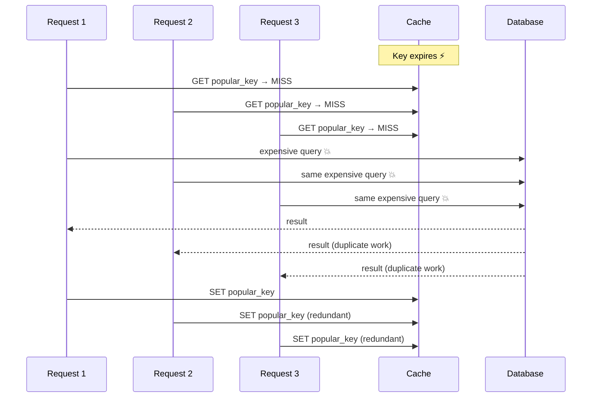
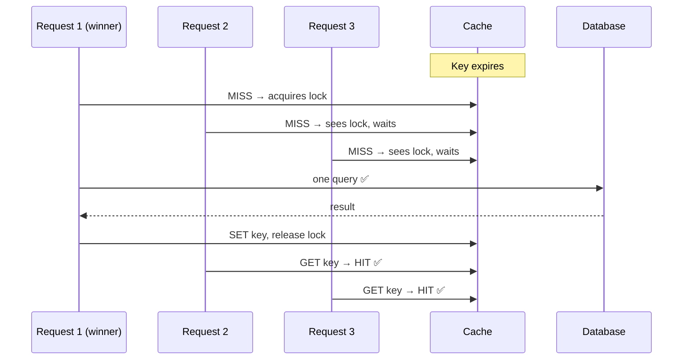
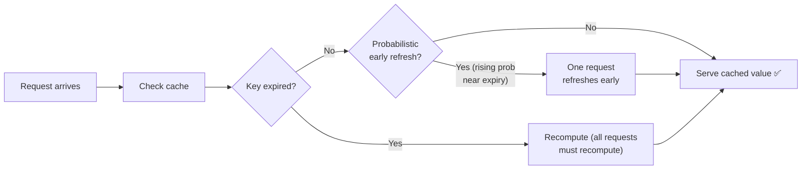

# Cache Stampede (Dog-Piling)

## The core idea in plain English

Imagine a bakery with one very popular cake. The last slice sells out. Suddenly 500 people are all told "sold out" at the same time and rush to the kitchen to each start baking their own version of that cake. The kitchen collapses. That's a cache stampede.

**The pattern:** a popular cached value expires → all pending requests miss the cache simultaneously → all hammer the database with the same expensive query → database gets overloaded → the cache never gets repopulated → the problem compounds.

## Problem statement

A hot key in your cache expires. In the brief window before it's repopulated, **many concurrent requests all miss simultaneously**, all hit the backing store (database or upstream service) to recompute the same value, and all write it back. This is a highly specific form of the **thundering herd** problem, also called *dog-piling*.



## Solution / approach

Three classic mitigations — strong interview answers mention all three and their trade-offs.

### 1. Locking / single-flight (request coalescing)

Only the **first** request that misses the cache does the recompute. All other concurrent requests either wait for it or briefly serve stale data.



```javascript
const locks = new Map();

async function getCached(key, recompute, ttl) {
  const hit = await cache.get(key);
  if (hit !== null) return hit;

  // Coalesce concurrent misses for the same key into one recompute.
  if (locks.has(key)) return locks.get(key);

  const p = (async () => {
    const value = await recompute(key);
    await cache.set(key, value, ttl);
    return value;
  })().finally(() => locks.delete(key));

  locks.set(key, p);
  return p;
}
```

In distributed systems the lock is a short-lived Redis key (`SET lock NX PX`). Losers either wait-and-retry or serve the stale (expired) value.

### 2. Probabilistic early expiration (XFetch)

Instead of letting everyone recompute at the moment of expiry, each request **probabilistically decides to refresh slightly early** as the key nears its TTL. The chance of refreshing rises as expiry approaches. One lucky (or unlucky) request refreshes ahead of time; everyone else keeps reading the still-valid value. The stampede never forms because expiry is smeared over time.



```javascript
// XFetch: recompute early with rising probability near expiry
function shouldRefresh(deltaMs, expiryMs, beta = 1) {
  // deltaMs = time the recompute took; expiryMs = ms until the key expires
  return Date.now() - deltaMs * beta * Math.log(Math.random()) >= expiryMs;
}
```

### 3. Stale-while-revalidate

Serve the *expired* value immediately while a **single background task** refreshes it. Readers never block; the backend sees exactly one recompute call. This is the same model behind the HTTP `stale-while-revalidate` cache directive.

### Supporting tactics

- **Never expire hot keys.** Refresh them on a background schedule instead of letting them expire.
- **Add jitter to TTLs.** If 1,000 items are written at the same time with the same TTL, they expire simultaneously. `ttl = baseTTL + random(0, baseTTL * 0.1)` staggers the expirations.

## Interview gotchas

| Strategy | Mechanism | Trade-off |
|---|---|---|
| Locking / single-flight | One recomputes, others wait | Adds latency for waiters; lock expiry needs care |
| Probabilistic early expiry (XFetch) | Smears expiry over time | Slightly complex; needs recompute timing info |
| Stale-while-revalidate | Serve old, refresh in background | Readers may get stale data briefly |

- TTL jitter is the cheapest one-liner fix — interviewers love hearing it mentioned.
- Locking needs a fallback if the recomputing request dies while holding the lock (lock with short TTL + auto-expiry in Redis).
