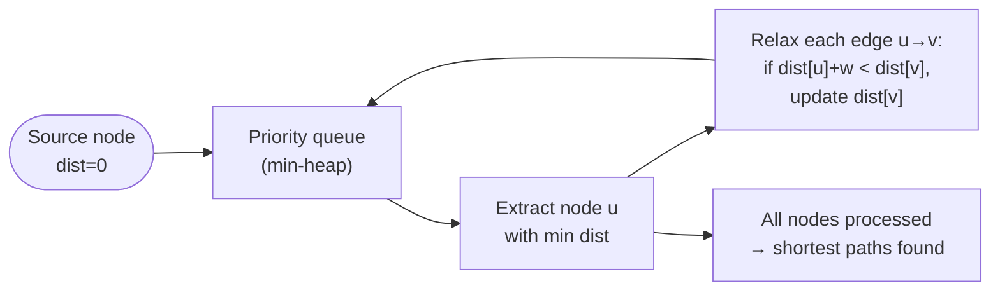
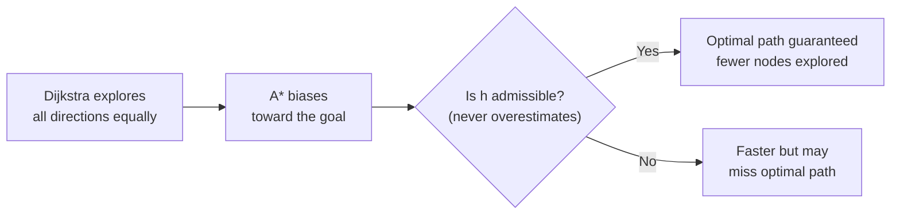

# Dijkstra's Algorithm vs. Modern Pathfinding

## The core idea in plain English

You're in a city and need directions from A to B. **Dijkstra's algorithm** is like someone who spreads out in all directions equally, marking every street's distance from A until they eventually reach B. It's exhaustive and always finds the shortest path — but it explores a lot of streets you'd never drive down.

**A\*** is smarter: it knows roughly where B is and keeps heading in that direction, only detouring if a shorter route exists. Same guaranteed result, much less exploration.

## Problem statement

Find the shortest path between nodes in a weighted graph. Dijkstra is the textbook answer, but it explores in *all directions* uniformly. For large graphs (road networks, game maps) that's wasteful — you often know roughly where the destination is. What improves on plain Dijkstra?

## Solution / approach

### Dijkstra's algorithm (the baseline)

Greedy: repeatedly extract the unvisited node with the smallest known distance, relax its edges.



```javascript
function dijkstra(graph, src) {
  const dist = new Map();
  for (const v of graph.nodes) dist.set(v, Infinity);
  dist.set(src, 0);

  const pq = new MinHeap([[0, src]]);      // [distance, node]
  while (!pq.isEmpty()) {
    const [d, u] = pq.pop();
    if (d > dist.get(u)) continue;          // stale entry, skip
    for (const { to, w } of graph.edges(u)) {
      const nd = d + w;
      if (nd < dist.get(to)) {
        dist.set(to, nd);
        pq.push([nd, to]);
      }
    }
  }
  return dist;
}
```

- Requires **non-negative** edge weights (use Bellman–Ford for negative weights).
- With a binary heap: **O((V + E) log V)**.

### A\* — guided search

A\* adds a **heuristic** `h(n)` that estimates the distance from node `n` to the goal. Instead of exploring by `g(n)` (cost from start), it explores by `f(n) = g(n) + h(n)` (cost from start + estimated cost to goal).



- If `h = 0`, A\* is identical to Dijkstra.
- Common heuristic for maps: straight-line (Euclidean) distance to goal.
- **Admissible** = never overestimates → guarantees optimal solution.
- **Consistent** (monotone) = `h(n) ≤ w(n,m) + h(m)` for every edge → guarantees no node needs to be re-expanded.

### Other practical speedups

- **Bidirectional search**: run Dijkstra from both source and target simultaneously; stop when the two frontiers meet in the middle. Roughly halves the search space.
- **Contraction Hierarchies (CH)**: precompute "shortcut" edges that bypass intermediate nodes. Query time drops to milliseconds even for continent-scale road networks. Powers production routing engines (OSRM, Valhalla).

### The 2024/2025 theoretical breakthrough

For decades, the best known algorithm for **single-source shortest paths on directed graphs with non-negative real weights** was Dijkstra with a Fibonacci heap at `O(m + n log n)` — essentially bounded by the cost of sorting the priority frontier.

Recent work (Duan, Mao and collaborators, ~2024–2025) published an algorithm that **breaks this sorting barrier**, achieving sub-`O(m log n)` time in the comparison-addition model by avoiding the need to maintain a fully sorted frontier. The key insight: only enough ordering work is done to find the next *batch* of nodes to settle, rather than keeping the entire frontier sorted.

> **Note for interviews:** This result is theoretical and asymptotic. Dijkstra with a binary heap is still what you implement in practice. Knowing *why* the barrier existed (sorting the frontier) is the substance of the answer.

## Interview gotchas

- Dijkstra is *uninformed*; A\* is *informed*. The only structural difference is the heuristic term `h(n)`.
- Admissibility guarantees optimality; consistency additionally guarantees no node needs re-expansion.
- For negative edge weights, use **Bellman-Ford** (O(VE)) or, for dense graphs with negative weights but no negative cycles, Johnson's algorithm.
- Production routing (Google Maps, Uber) doesn't run raw Dijkstra — it uses CH or similar preprocessing to achieve sub-millisecond queries on graphs with hundreds of millions of edges.
