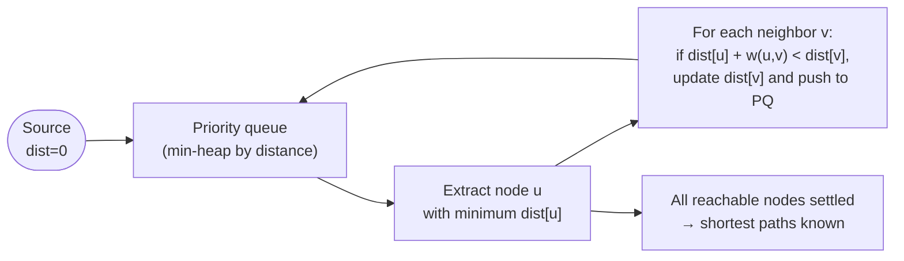
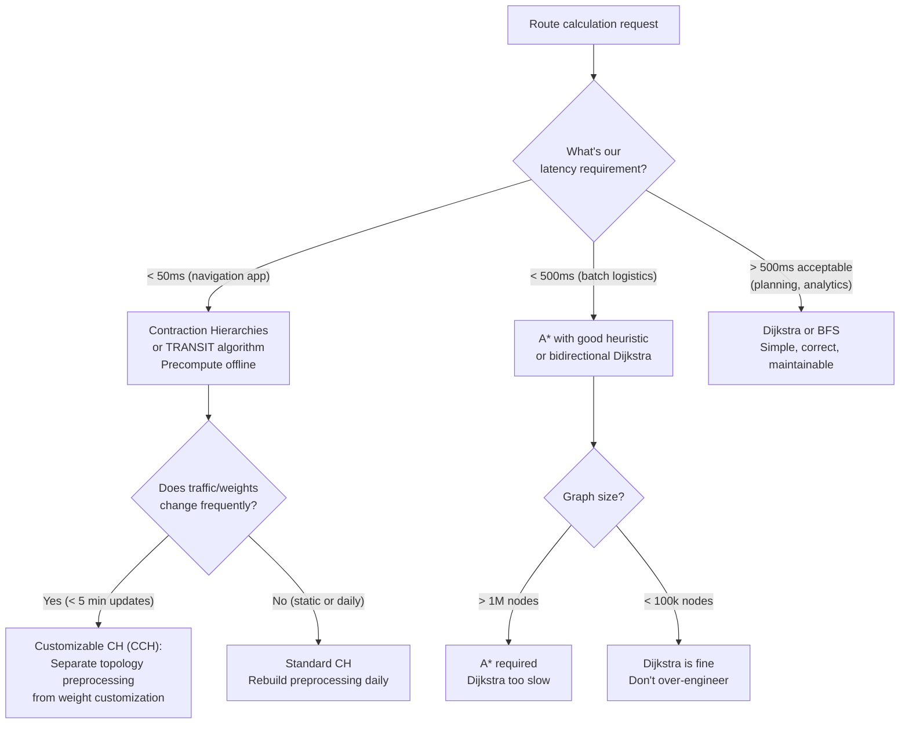
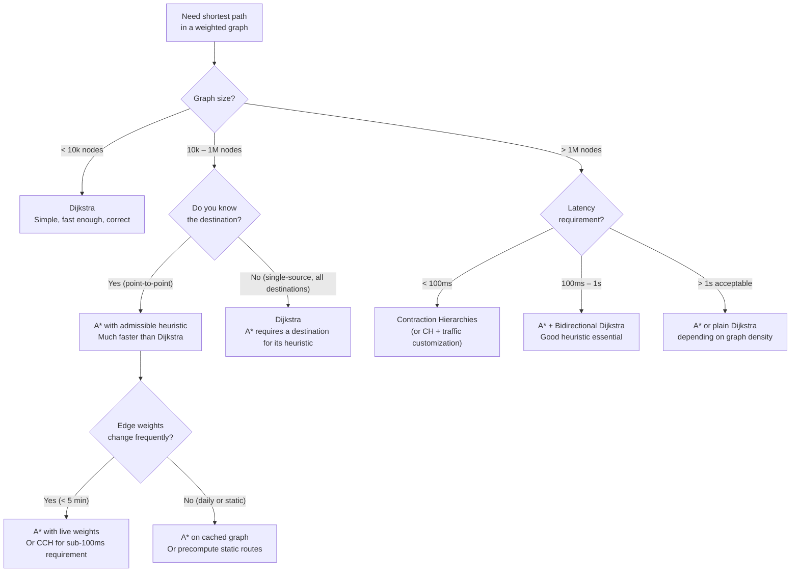

# Dijkstra's Algorithm vs. Modern Pathfinding

<!-- meta
level: senior
domain: algorithms
prereqs: []
readtime: 16
incident-type: latency spike
-->

## The Incident

> **Routify (last-mile delivery SaaS) · Q2 2023 · ~800 delivery drivers, 4,000 route calculations/hour**

We launched traffic-aware routing in March. Product had wanted it for months — customers complained that our routes ignored rush hour. The feature was straightforward: replace our static road graph with a live traffic-weighted graph from a traffic API. Same Dijkstra implementation, just with dynamic edge weights instead of static ones.

Two weeks after launch, we got a Slack message from our largest customer: "ETA estimates are completely wrong and drivers are arriving 40 minutes late." More alarming: our API response times had degraded from 180ms to 1,100ms for route calculations. We'd gone from "fast enough that drivers don't notice" to "so slow that the app feels broken."

The traffic data made the graph dramatically larger. Static routing used a pruned road graph with ~180,000 nodes and ~420,000 edges — we'd removed minor roads, parking lots, private roads. The live traffic graph used raw OSM data: 2.1 million nodes and 5.8 million edges. And because traffic weights changed every 5 minutes, we couldn't cache routes. Every route request ran Dijkstra from scratch on a 2.1M node graph.

Dijkstra on a graph with V nodes and E edges runs in O((V + E) log V) with a binary heap. For our graph: (2.1M + 5.8M) × log(2.1M) ≈ 168M operations per route. At 4,000 routes/hour — one every 0.9 seconds — a single route calculation took our routing server's full CPU for 900ms and queued the next request.

The fix that unblocked drivers in 72 hours: switch from Dijkstra to A\* with a straight-line distance heuristic. On our dataset, A\* explored 11% of the nodes Dijkstra explored for typical delivery routes. Median latency: 110ms. The 5-year fix was Contraction Hierarchies — now routes calculate in 6ms.

## Why Smart Engineers Get This Wrong

The mistake is thinking of Dijkstra as "the correct algorithm for shortest path" and treating performance as an implementation detail (use a better data structure, add more servers). But Dijkstra's fundamental behavior — exploring nodes in all directions equally from the source — is architecturally incompatible with large geographic graphs under real-time constraints.

The second mistake: underestimating how much graph size matters to pathfinding. A 12× increase in graph size (180k → 2.1M nodes) causes more than a 12× increase in computation — because Dijkstra's runtime includes the log factor over the priority queue, and because a larger graph means Dijkstra explores proportionally more dead-end directions before reaching the destination.

The third mistake: treating A\* as a "newer Dijkstra" when it's a fundamentally different strategy. Dijkstra is blind — it explores by cost. A\* is sighted — it explores by cost *plus an estimate of remaining distance*. On geographic graphs, this makes A\* 3-10× faster without sacrificing correctness.

| What engineers assume | What actually happens |
|---|---|
| Dijkstra is "the shortest path algorithm" — optimize around it | Dijkstra's blind exploration is prohibitive on large graphs; algorithm choice matters more than implementation |
| A larger graph = proportionally more work | A 12× larger graph causes more than 12× more work due to Dijkstra's all-directions exploration |
| Traffic-aware routing just means different edge weights | Traffic data often comes from raw map sources that are 10–50× larger than pruned production graphs |

## The Investigation Playbook

### 1. Profile the route calculation time breakdown

```python
import time
import cProfile

def profile_route(graph, source, destination):
    pr = cProfile.Profile()
    pr.enable()

    start = time.perf_counter()
    result = dijkstra(graph, source, destination)
    elapsed = time.perf_counter() - start

    pr.disable()
    pr.print_stats(sort='cumulative')

    print(f"Graph: {graph.node_count} nodes, {graph.edge_count} edges")
    print(f"Nodes explored: {result.explored_count}")
    print(f"Nodes as % of graph: {result.explored_count / graph.node_count:.1%}")
    print(f"Time: {elapsed * 1000:.1f}ms")
```

> **What you're looking for:** If `nodes explored / graph size` is above 30%, Dijkstra is exploring too broadly. A\* should reduce this to < 15%. If you're exploring > 50% of the graph for typical routes, your graph is too large and needs preprocessing or pruning.

### 2. Check if the heuristic is admissible

```python
# For geographic routing, Euclidean distance is a valid admissible heuristic
# because no road can be shorter than a straight line between two points
import math

def haversine_km(lat1, lon1, lat2, lon2):
    R = 6371  # Earth's radius in km
    phi1, phi2 = math.radians(lat1), math.radians(lat2)
    dphi = math.radians(lat2 - lat1)
    dlambda = math.radians(lon2 - lon1)
    a = math.sin(dphi/2)**2 + math.cos(phi1) * math.cos(phi2) * math.sin(dlambda/2)**2
    return 2 * R * math.asin(math.sqrt(a))

# Verify: for every edge (u, v) with weight w,
# assert haversine_km(u, v) <= w * speed_factor
# If this fails, the heuristic is inadmissible and A* may not find optimal routes
```

### 3. Measure before and after algorithm switch

```python
# Instrument your routing calls with these metrics
metrics.timing('route.calculation_ms', elapsed_ms, tags=['algorithm:dijkstra'])
metrics.count('route.nodes_explored', result.explored_count, tags=['algorithm:dijkstra'])
metrics.timing('route.calculation_ms', elapsed_ms, tags=['algorithm:astar'])
metrics.count('route.nodes_explored', result.explored_count, tags=['algorithm:astar'])
```

> Compare `nodes_explored` between algorithms on the same route requests. A 10× reduction in nodes explored should produce a ~10× reduction in latency.

## The Fix at Three Altitudes

<!-- level:junior -->

### Junior: Understand It and Apply the Standard Fix

**Dijkstra's algorithm** finds the shortest path from a source to all other nodes in a weighted graph with non-negative edge weights.



```javascript
function dijkstra(graph, src, dst) {
  const dist = new Map();
  for (const v of graph.nodes) dist.set(v, Infinity);
  dist.set(src, 0);

  const pq = new MinHeap([[0, src, [src]]]);  // [distance, node, path]
  const visited = new Set();

  while (!pq.isEmpty()) {
    const [d, u, path] = pq.pop();
    if (visited.has(u)) continue;  // stale entry — skip
    visited.add(u);

    if (u === dst) return { distance: d, path };

    for (const { to, weight } of graph.neighbors(u)) {
      const nd = d + weight;
      if (nd < dist.get(to)) {
        dist.set(to, nd);
        pq.push([nd, to, [...path, to]]);
      }
    }
  }
  return null; // no path found
}
```

**Dijkstra's weakness:** it explores nodes in all directions equally. On a map, if you're routing from New York to Boston, Dijkstra explores New Jersey, Connecticut, and Pennsylvania before it figures out the destination is north.

**A\*** fixes this by adding a **heuristic** `h(n)` — an estimate of the remaining distance from node `n` to the destination. Instead of exploring by `g(n)` (cost from source), it explores by `f(n) = g(n) + h(n)`:

```javascript
function aStar(graph, src, dst, heuristic) {
  const gScore = new Map();  // actual cost from src
  for (const v of graph.nodes) gScore.set(v, Infinity);
  gScore.set(src, 0);

  // Priority queue ordered by f(n) = g(n) + h(n)
  const pq = new MinHeap([[heuristic(src, dst), 0, src, [src]]]);
  const visited = new Set();

  while (!pq.isEmpty()) {
    const [f, g, u, path] = pq.pop();
    if (visited.has(u)) continue;
    visited.add(u);

    if (u === dst) return { distance: g, path };

    for (const { to, weight } of graph.neighbors(u)) {
      const tentativeG = g + weight;
      if (tentativeG < gScore.get(to)) {
        gScore.set(to, tentativeG);
        const fScore = tentativeG + heuristic(to, dst);
        pq.push([fScore, tentativeG, to, [...path, to]]);
      }
    }
  }
  return null;
}

// For geographic routing: straight-line distance is an admissible heuristic
// (no road can be shorter than a straight line)
function straightLineKm(nodeA, nodeB) {
  return haversine_km(nodeA.lat, nodeA.lon, nodeB.lat, nodeB.lon);
}
```

**The admissibility requirement:** the heuristic must *never overestimate* the true remaining distance. A heuristic that overestimates causes A\* to overlook optimal paths. Straight-line distance is always safe for geographic routing because no road is shorter than a straight line.

- If `h = 0`, A\* is identical to Dijkstra — explores everything.
- If `h` is perfect (equals true remaining cost), A\* explores exactly the optimal path and nothing else.

<!-- /level:junior -->

<!-- level:senior -->

### Senior: Tune It, Operate It, Know When It Fails

A\* is a practical improvement on most production graphs, but it still runs in O((V + E) log V) in the worst case — for graphs with many edges between the source and destination. For continent-scale road networks (hundreds of millions of nodes), even A\* is too slow for real-time queries.

**Contraction Hierarchies (CH)** is the technique behind Google Maps, Uber, and OSRM. The insight: for a road network, most "important" roads (highways) appear in most long-distance routes. If you precompute shortcut edges that skip over less-important roads, queries only traverse the high-importance nodes — reducing the effective graph size from millions to thousands.

```
CH preprocessing (offline, done once or periodically):
1. Rank nodes by "importance" (how many shortest paths pass through them)
2. Contract each node in order of importance: add shortcut edges that bypass it
3. Store the shortcut graph separately

CH query (online, fast):
1. Run bidirectional Dijkstra on the shortcut graph
2. From source, only traverse upward (increasing node importance)
3. From destination, only traverse upward
4. Meet in the middle at the highest-importance nodes
```

Query times on a CH-preprocessed graph: **sub-millisecond** for city-to-city routes, **2–10ms** for continent-wide routing. This is how Google Maps returns directions in < 50ms for a cross-country drive.

**Bidirectional Dijkstra** is a simpler intermediate step — run Dijkstra simultaneously from source and destination, stop when the two frontiers meet:

```javascript
function bidirectionalDijkstra(graph, src, dst) {
  const distFwd = new Map([[src, 0]]);
  const distBwd = new Map([[dst, 0]]);
  const pqFwd = new MinHeap([[0, src]]);
  const pqBwd = new MinHeap([[0, dst]]);
  const settledFwd = new Set();
  const settledBwd = new Set();
  let bestPath = Infinity;

  while (!pqFwd.isEmpty() || !pqBwd.isEmpty()) {
    // Alternate between forward and backward search
    if (!pqFwd.isEmpty()) {
      const [d, u] = pqFwd.pop();
      if (settledFwd.has(u)) continue;
      settledFwd.add(u);

      if (settledBwd.has(u)) {
        bestPath = Math.min(bestPath, d + distBwd.get(u));
      }
      // relax forward edges...
    }
    // Similarly for backward search...

    // Termination: both frontiers have explored nodes with dist > bestPath/2
    if (/*termination condition*/) break;
  }
  return bestPath;
}
```

Bidirectional Dijkstra explores roughly half the nodes of unidirectional Dijkstra — sufficient for medium-scale graphs (city-level routing).

**The three failure modes to instrument:**

1. **Inadmissible heuristic in A\*** — if the heuristic overestimates, A\* may return suboptimal routes. Validate by running both Dijkstra and A\* on a test set and comparing distances. Alert if they diverge by more than 0.1%.
2. **CH preprocessing staleness** — CH shortcuts are precomputed from the static graph structure. If road network topology changes (new roads, closures), shortcuts become incorrect. Rebuild preprocessing daily or on topology change events.
3. **Memory overhead of CH shortcuts** — CH can add 2–5× more edges than the original graph. For a 5M edge graph, that's 10–25M edges in memory. Plan for this in your infrastructure sizing.

<!-- /level:senior -->

<!-- level:staff -->

### Staff: Design Systems That Don't Need This Fix

The Routify incident was caused by a product decision (traffic-aware routing) being implemented by a data substitution (different edge weights) without rethinking the algorithmic architecture. The real question a staff engineer asks: given the query volume, latency requirement, and graph characteristics — what is the right **precomputation vs query-time** tradeoff?



**The precomputation insight:** every second of offline preprocessing can buy milliseconds of online query speed. For a routing product, the query volume (millions of routes/day) and latency requirement (< 100ms) almost always justify significant offline preprocessing investment. The alternative — faster servers — is linear cost scaling; better algorithms are constant cost.

For traffic-aware systems specifically, **Customizable Contraction Hierarchies (CCH)** separates preprocessing into two phases: topology preprocessing (done once, takes hours) and weight customization (done on every traffic update, takes seconds). This lets you incorporate 5-minute traffic updates without rebuilding the full CH structure.

**The conversation to have with your team:**

> "We're running Dijkstra on a 2.1M node graph in real time. That's a misuse of the algorithm — Dijkstra is designed for correctness, not for large-graph real-time queries. We need to make a deliberate architectural decision: either we preprocess the graph with Contraction Hierarchies (6ms queries, minutes of preprocessing), or we accept A\* as our ceiling (110ms queries, no preprocessing). Given our latency requirement and query volume, I'd recommend investing in CH preprocessing. The graph topology is stable — it only changes when OSM updates, which is daily at most. Let's build the preprocessing pipeline this quarter."

**Prerequisites for Contraction Hierarchies:** Stable graph topology (don't contract a graph that changes every minute). Engineering capacity to build and maintain the preprocessing pipeline (significant upfront investment). Sufficient memory for the expanded shortcut graph. Teams at < 100k route calculations/day should choose A\* — CH is premature optimization below that volume.

<!-- /level:staff -->

## The Decision Tree



## Interview Gauntlet

### Junior questions

**Q: Explain Dijkstra's algorithm. What is its time complexity?**  
Expected: Greedy algorithm that repeatedly extracts the unvisited node with smallest known distance, then relaxes its outgoing edges. Uses a min-heap priority queue. Time complexity: O((V + E) log V) with a binary heap. Requires non-negative edge weights — negative weights cause incorrect results (use Bellman-Ford instead).  
Follow-up that separates junior from senior: *"Why can't Dijkstra handle negative edge weights?"*  
30-second one-liner: "Dijkstra spreads out like water — uniformly in all directions — until it reaches every node. Guaranteed optimal with non-negative weights."

**Q: What is A\* and how does it differ from Dijkstra?**  
Expected: A\* adds a heuristic `h(n)` that estimates remaining cost to the destination. Instead of ordering the priority queue by `g(n)` (cost from source), it orders by `f(n) = g(n) + h(n)`. This biases exploration toward the destination, exploring far fewer nodes on typical geographic graphs. If `h` is admissible (never overestimates), A\* is guaranteed to find the optimal path.  
The trap: saying A\* is "always faster" — on dense graphs or when `h` is weak, it can degrade to Dijkstra's performance.

### Senior questions

**Q: You're building routing for a delivery app. Routes on a city graph take 200ms. What do you do?**  
Expected: First, profile: how many nodes is Dijkstra exploring? If > 30% of the graph, switch to A\* with a geographic heuristic — should reduce nodes explored to 5–15%, bringing latency under 50ms. If A\* is still too slow (graph > 500k nodes, latency requirement < 50ms), implement Contraction Hierarchies offline preprocessing. Measure the latency requirement first — don't over-engineer if 200ms is acceptable.  
The trap: adding more servers to run Dijkstra in parallel — treats a linear scaling problem when a better algorithm is a constant-factor improvement.

**Q: What does "admissible heuristic" mean and why does it matter for A\*?**  
Expected: Admissible means the heuristic never overestimates the true remaining cost. If `h` overestimates, A\* may not explore the path that's actually cheapest — because the heuristic made another path look cheaper than it is. This can cause A\* to return a suboptimal path. For geographic routing, straight-line (Euclidean/haversine) distance is always admissible because no road can be shorter than a straight line.  
Consistent vs admissible: consistent (monotone) additionally satisfies `h(n) ≤ w(n,m) + h(m)` for every edge — guarantees no node needs re-expansion. Straight-line distance is both admissible and consistent.

### Staff questions

**Q: How does Google Maps return walking/driving directions in under 50ms for a continent-spanning trip?**  
Expected: Contraction Hierarchies (CH). Offline: rank roads by "importance" (how many shortest paths pass through them). Contract low-importance roads by adding shortcut edges that bypass them. At query time: bidirectional Dijkstra on the shortcut graph, only traversing upward in the importance hierarchy. Result: the effective graph explored per query shrinks from millions of nodes to thousands, enabling sub-millisecond queries even on continent-scale graphs. Preprocessing takes minutes to hours but only needs to be redone when the road topology changes, not when traffic weights change.  
Follow-up: *"How do you handle real-time traffic with CH? Rebuilding preprocessing every 5 minutes is too expensive."*  
Expected answer: Customizable CH (CCH) — separate topology preprocessing (done once) from weight customization (fast, done on every traffic update, ~seconds for a city-scale graph).

## Connections

**Before this:** No prerequisites — this article is self-contained  
**After this:** h3-spatial-index (spatial indexing as a preprocessing strategy for geographic queries), consistent-hashing (precomputation-vs-query-time tradeoff in a different domain)  
**Related incidents:**
- *Routify (this incident)* — traffic-aware routing using raw OSM graph caused 12× latency regression; A\* reduced it to 110ms, CH reduced it to 6ms
- *Uber routing 2016 blog post* — publicly documented shift from Dijkstra to CH-based routing as driver/rider scale grew; same latency-vs-graph-size tradeoff
- *Waze 2022 routing bug* — admissible heuristic violation in a graph update caused routes that were locally optimal but globally suboptimal; users were directed on longer routes
