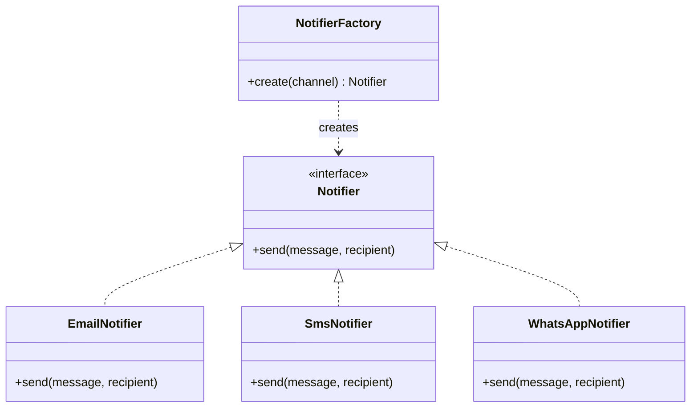
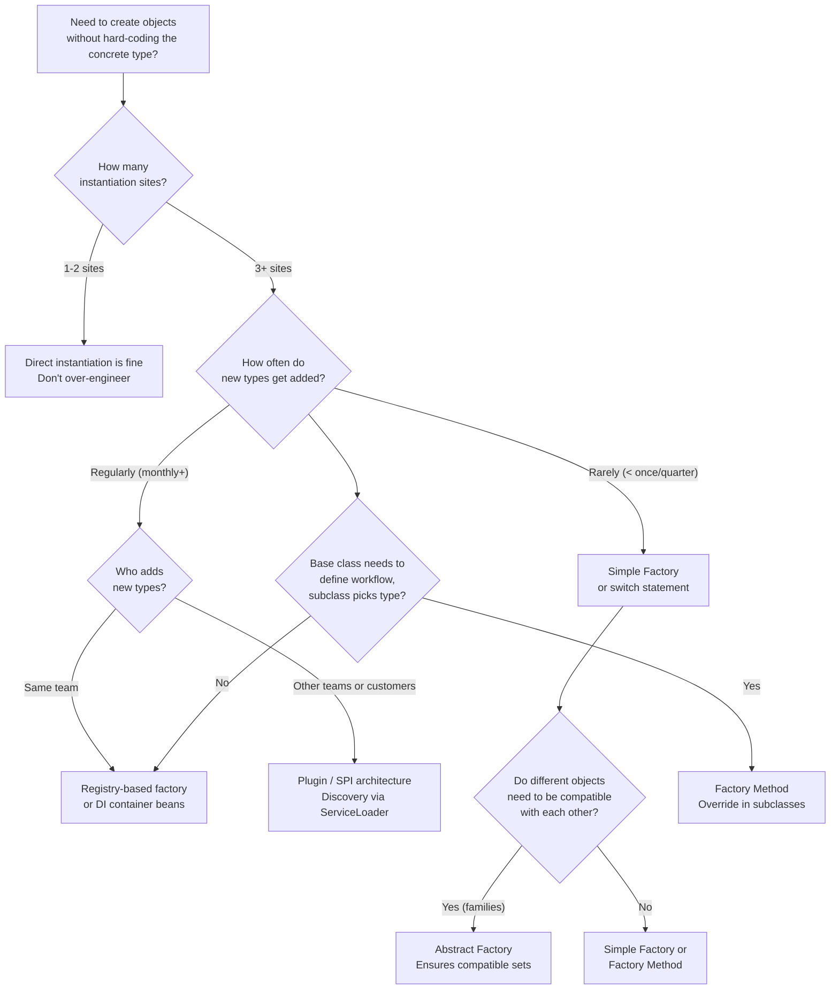

# Factory Design Pattern

<!-- meta
level: junior
domain: architecture
prereqs: []
readtime: 14
incident-type: maintainability collapse
-->

## The Incident

> **Sendloop (marketing automation SaaS) · Month 18 · 3 developers, $2.8M ARR**

We'd been profitable for 18 months when our largest customer asked for WhatsApp notifications. Simple feature — we already sent email, SMS, and push. One more channel. How hard could it be?

The answer: 14 files. Adding a single notification channel required editing **14 different files** across the codebase. Not because we'd written bad code at launch. Because we'd written direct instantiation everywhere: `new EmailNotifier()`, `new SmsNotifier()`. Every class that sent a notification had decided for itself which notifier to create.

```java
// Before: in OrderService
if (user.getPreference().equals("email")) {
    new EmailNotifier(config.getSMTP()).send(order.confirmationMessage());
} else if (user.getPreference().equals("sms")) {
    new SmsNotifier(config.getTwilioKey()).send(order.confirmationMessage());
}

// Same pattern duplicated in: CampaignService, ReminderService,
// PasswordResetService, InvoiceService, SupportTicketService...
// 14 files total
```

The WhatsApp integration took one developer three days to ship. It should have taken three hours. Two files were missed on the first deploy — WhatsApp messages silently dropped for affected users for 48 hours before a customer reported it. We shipped a bug because the pattern made it impossible to audit confidently.

That week, we refactored to a factory. The sprint after that, our CTO asked for in-app notifications. We added it in two hours. One new class, one new registration line. Zero files edited in existing notification-sending code.

## Why Smart Engineers Get This Wrong

Direct instantiation (`new ConcreteClass()`) is the natural, obvious thing to do. It's explicit. It's readable. For the first implementation, it's correct. The mistake is not recognizing when "the decision of which concrete type to create" has become a shared concern — one that multiple callers are independently making and that will need to change together.

Engineers are often told "don't over-engineer — YAGNI." That's right. But YAGNI applies to *features*, not to *dependency direction*. When you write `new EmailNotifier()` in six services, you haven't avoided complexity — you've distributed it. The factory doesn't add features; it centralizes a decision that is already being made in six places. The refactoring cost grows faster than linearly: from N call sites to N+1 is fine; from N=1 to N=14 is a migration.

The second mistake: engineers conflate the three "factory" patterns (Simple Factory, Factory Method, Abstract Factory) and don't know which one fits their situation. These are distinct tools for distinct problems, and mixing them up produces either under-engineering (using Simple Factory where Factory Method is needed) or over-engineering (reaching for Abstract Factory when a registry map suffices).

| What engineers assume | What actually happens |
|---|---|
| Direct instantiation is fine — we can refactor later | Each new call site adds to the migration cost; 14 sites is a multi-day refactor |
| Adding a new type requires only a new class | Without a factory, adding a type requires editing every file that creates instances — and auditing the edit is the hard part |
| Factories are "enterprise Java boilerplate" | Factories are a response to a real problem: distributed construction decisions that need to change together |

## The Investigation Playbook

When someone proposes "we need a factory" (or you suspect you need one), quantify the problem first:

### 1. Find all direct instantiation call sites

```bash
# Find every place a concrete class is instantiated
grep -rn "new EmailNotifier\|new SmsNotifier\|new PushNotifier" src/
```

> **What you're looking for:** More than 2–3 call sites across different classes/packages. If the same concrete class is being constructed in many places, centralization is warranted.

### 2. Count files that would need to change to add a new type

```bash
# Simulate "what files would I need to change to add WhatsApp?"
grep -rl "EmailNotifier\|SmsNotifier" src/ | wc -l
```

> **What you're looking for:** If more than 2–3 files would change, the factory pattern pays for itself immediately.

### 3. Check if construction involves configuration

```bash
# Are constructors being called with environment-specific config?
grep -n "new.*Notifier(" src/ | grep -v "test"
```

> **What you're looking for:** If callers are passing config parameters (SMTP hosts, API keys) directly to constructors, they're taking on responsibility they shouldn't have. That configuration belongs in the factory.

## The Fix at Three Altitudes

<!-- level:junior -->

### Junior: Understand It and Apply the Standard Fix

A **factory** centralizes the decision of which concrete type to create. Callers depend on an interface; the factory decides which implementation they get.

The "Factory" idea comes in three distinct forms. Know which fits your situation.

---

### Simple Factory (an idiom, not a GoF pattern)

One method, one `switch` statement. Appropriate when the set of types is small and stable.



```java
interface Notifier {
    void send(String message, String recipient);
}

class NotifierFactory {
    private final Config config;

    NotifierFactory(Config config) { this.config = config; }

    Notifier create(String channel) {
        return switch (channel) {
            case "email"     -> new EmailNotifier(config.smtpHost(), config.smtpPort());
            case "sms"       -> new SmsNotifier(config.twilioKey());
            case "whatsapp"  -> new WhatsAppNotifier(config.whatsappToken());
            default          -> throw new IllegalArgumentException("Unknown channel: " + channel);
        };
    }
}

// Callers no longer know or care what EmailNotifier is:
class OrderService {
    private final NotifierFactory notifiers;

    void confirmOrder(Order order, User user) {
        Notifier n = notifiers.create(user.notificationChannel());
        n.send(order.confirmationMessage(), user.contactInfo());
    }
}
```

**Downside:** Adding a new channel requires editing the `switch` in the factory. This violates the Open/Closed Principle (open for extension, closed for modification). For Sendloop's 3 channels, this is acceptable. At 10+ channels with frequent additions, use a registry instead.

**Registry-based factory** (avoids editing the switch):

```java
class NotifierFactory {
    private final Map<String, Supplier<Notifier>> registry = new HashMap<>();

    void register(String channel, Supplier<Notifier> constructor) {
        registry.put(channel, constructor);
    }

    Notifier create(String channel) {
        var ctor = registry.get(channel);
        if (ctor == null) throw new IllegalArgumentException("Unknown channel: " + channel);
        return ctor.get();
    }
}

// Registration (at startup):
factory.register("email",    () -> new EmailNotifier(config.smtpHost()));
factory.register("sms",      () -> new SmsNotifier(config.twilioKey()));
factory.register("whatsapp", () -> new WhatsAppNotifier(config.whatsappToken()));

// Adding a new channel:
factory.register("slack",    () -> new SlackNotifier(config.slackWebhook()));
// ^ Zero existing files modified
```

---

### Factory Method (GoF) — let subclasses decide the type

Use when you have a base workflow that subclasses need to customize the object type within.

```java
abstract class Dialog {
    // Template method — the workflow is fixed, the object type is not
    void render() {
        Button button = createButton();  // factory method call
        button.onClick(this::close);
        button.render();
    }

    abstract Button createButton();  // subclasses decide what Button to create
}

class WindowsDialog extends Dialog {
    Button createButton() { return new WindowsButton(); }
}

class MacDialog extends Dialog {
    Button createButton() { return new MacButton(); }
}
```

**Use Factory Method when:** the parent class defines *how* to use an object; subclasses decide *which* object to use. The factory method is the "hook" that subclasses override.

---

### Abstract Factory (GoF) — create families of compatible objects

Use when you need to ensure that a set of objects work together (same theme, same platform, same vendor):

```java
interface GUIFactory {
    Button   createButton();
    Checkbox createCheckbox();
    TextField createTextField();
}

class MacFactory implements GUIFactory {
    public Button    createButton()   { return new MacButton(); }
    public Checkbox  createCheckbox() { return new MacCheckbox(); }
    public TextField createTextField(){ return new MacTextField(); }
}

class WindowsFactory implements GUIFactory {
    public Button    createButton()   { return new WindowsButton(); }
    // ...
}

// Client receives a GUIFactory — can't accidentally mix Mac button with Windows checkbox
class App {
    App(GUIFactory factory) {
        Button b = factory.createButton();
        Checkbox c = factory.createCheckbox();
        // Guaranteed compatible set
    }
}
```

**When to use which:**

| Need | Pattern |
|---|---|
| Create one type from a parameter | Simple Factory / registry |
| Let subclasses decide the concrete type | Factory Method |
| Ensure a family of objects is compatible | Abstract Factory |

<!-- /level:junior -->

<!-- level:senior -->

### Senior: Tune It, Operate It, Know When It Fails

At production scale, the factory pattern interacts with three common concerns: **dependency injection**, **testing**, and **configuration management**.

**Factories and dependency injection containers** (Spring, Guice, Dagger): DI containers are factories under the hood. For simple cases, you can skip writing factories manually and let the container handle construction:

```java
// With Spring: declare the notifiers as beans; inject by type or qualifier
@Component
@Qualifier("email")
class EmailNotifier implements Notifier { ... }

@Component
@Qualifier("sms")
class SmsNotifier implements Notifier { ... }

// Inject a map of all Notifier beans keyed by qualifier:
@Service
class NotifierService {
    private final Map<String, Notifier> notifiers;

    NotifierService(Map<String, Notifier> notifiers) {
        this.notifiers = notifiers;
    }

    Notifier forChannel(String channel) {
        return Optional.ofNullable(notifiers.get(channel))
            .orElseThrow(() -> new IllegalArgumentException("Unknown: " + channel));
    }
}
```

Spring populates the `Map<String, Notifier>` automatically with all `Notifier` beans — adding a new notifier requires only a new `@Component` class. No factory code changes.

**Testing with factories:** A well-designed factory makes testing easy because you can inject a test-specific factory:

```java
// In tests: inject a factory that returns fakes
NotifierFactory testFactory = new NotifierFactory(Map.of(
    "email",    () -> new FakeEmailNotifier(),
    "sms",      () -> new FakeSmsNotifier()
));

OrderService service = new OrderService(testFactory);
service.confirmOrder(testOrder, testUser);

FakeEmailNotifier fakeEmail = (FakeEmailNotifier) testFactory.create("email");
assertThat(fakeEmail.sentMessages()).hasSize(1);
```

**The three failure modes to watch for:**

1. **Factory knows too much** — the factory imports configuration, business logic, and concrete implementations. It becomes a God class. Keep factories thin: construct the object with its dependencies, nothing else. Business decisions (which channel to use) stay in callers.
2. **Thread-safety on shared factory state** — a registry-based factory with a mutable map is dangerous if channels are registered after startup. Make the registry immutable after initialization, or protect registration with a lock.
3. **Circular dependencies through the factory** — `ServiceA` creates `ServiceB` through the factory; `ServiceB` creates `ServiceA` through the factory. This is a design smell, not a factory problem — but factories make circular deps easier to hide. Add a dependency graph check at startup.

**Validate that all registrations are covered:**

```java
// At startup, verify all channels your application might request are registered
@PostConstruct
void validateFactory() {
    List<String> requiredChannels = config.getSupportedChannels();
    requiredChannels.forEach(channel -> {
        if (!registry.containsKey(channel)) {
            throw new ConfigurationException("No notifier registered for: " + channel);
        }
    });
}
```

<!-- /level:senior -->

<!-- level:staff -->

### Staff: Design Systems That Don't Need This Fix

The factory pattern solves "which concrete type do I create at runtime?" But at staff scale, the deeper question is: why are you constructing objects at runtime based on a configuration value? In most cases, the answer is that the system wasn't designed for extensibility upfront.

For a notification system, the staff-level design challenge is not "how do I wire up the factory?" — it's **"how do I add a new notification channel without modifying anything that already exists?"**

The answer is a **plugin architecture** (sometimes called a Service Provider Interface or SPI in Java). New channels are not registered in application code — they're discovered at startup through a protocol:

```java
// The plugin protocol: any class implementing this interface
// and declared in META-INF/services can be discovered automatically
public interface NotifierPlugin {
    String channel();           // "whatsapp", "slack", etc.
    Notifier create(Config c);  // factory method
}

// WhatsApp team ships their plugin as a JAR:
// META-INF/services/com.sendloop.NotifierPlugin contains:
// com.sendloop.whatsapp.WhatsAppPlugin
public class WhatsAppPlugin implements NotifierPlugin {
    public String channel() { return "whatsapp"; }
    public Notifier create(Config c) { return new WhatsAppNotifier(c.whatsappToken()); }
}

// Core application: discover plugins via ServiceLoader (no import of plugin classes)
ServiceLoader<NotifierPlugin> loader = ServiceLoader.load(NotifierPlugin.class);
Map<String, NotifierPlugin> plugins = new HashMap<>();
loader.forEach(plugin -> plugins.put(plugin.channel(), plugin));
```

With a plugin architecture: adding a new channel requires adding a JAR to the classpath. Zero modifications to the core application. The core codebase doesn't even need to know WhatsApp exists.

This is the model used by logging frameworks (Log4j appenders), database drivers (JDBC), and build tools (Maven/Gradle plugins). It's appropriate when: channel additions come from different teams, channels have independent release cycles, or you're building a platform that third-parties extend.

**The conversation to have with your team:**

> "We keep modifying the notifier factory every time we add a channel. We're adding one channel per quarter. At that rate, modifying a central factory is fine — it's two lines and a test. But we're also talking about opening this up to customers who want to bring their own notification providers. For that, we need a plugin model where new providers don't require changes to our core codebase. Let me spec out what the NotifierPlugin interface should look like and what the discovery mechanism should be. If we design this now, customer-supplied providers become a quarter's worth of API work rather than a multi-quarter platform re-architecture."

**Prerequisites for the architectural alternative:** Team agreement on the extension protocol (interface design). A plugin isolation story (class loaders, security sandboxing if third-parties provide plugins). Versioning discipline (interface changes must be backward-compatible).

<!-- /level:staff -->

## The Decision Tree



## Interview Gauntlet

### Junior questions

**Q: What problem does the Factory pattern solve?**  
Expected: When multiple callers need to create objects but shouldn't know (or hard-code) which concrete class to use. Centralizes the "which implementation?" decision in one place, so callers depend only on an interface. Adding a new type requires changing one place (the factory), not every call site.  
Follow-up that separates junior from senior: *"When would you NOT use a factory?"*  
The answer: when there's only one implementation and no expectation of others. `new Logger()` in a CLI script doesn't need a factory.  
30-second one-liner: "Factory lets callers say 'give me a Notifier' without knowing or caring which one they get."

**Q: What's the difference between Factory Method and Abstract Factory?**  
Expected: Factory Method = one product type, decided by subclass override. Abstract Factory = a family of related products, ensuring they're compatible with each other. Factory Method uses inheritance (subclass overrides a method). Abstract Factory uses composition (you inject the factory, which creates a consistent set of related objects).  
Memorable rule: "Factory Method creates one thing. Abstract Factory creates a matched set."

**Q: What does the Open/Closed Principle mean in the context of a Simple Factory?**  
Expected: A simple factory with a `switch` statement violates Open/Closed — adding a new type requires editing the factory (it's not "closed for modification"). A registry-based factory or plugin model fixes this: new types are added by registration, not by editing the switch. The factory itself never changes.

### Senior questions

**Q: You inherit a codebase where `new SmsNotifier(twilioKey)` is called in 12 different places. How do you refactor this safely?**  
Expected: (1) Create a `Notifier` interface that matches `SmsNotifier`'s public API. (2) Create a `NotifierFactory` that constructs `SmsNotifier` with its config. (3) Introduce the factory in a new class, not by touching existing classes. (4) Change call sites one at a time (or one file at a time), using search-and-replace with manual review. (5) Run tests after each batch. (6) Remove config passing from call sites only after all have been migrated.  
The trap: "rewrite all 12 files in one PR" — makes code review impossible and increases regression risk. Small, safe migrations are better.

**Q: How do DI containers (Spring, Guice) relate to the Factory pattern?**  
Expected: DI containers are auto-wired factory registries. You declare components and their dependencies; the container handles construction and injection. For the Factory pattern: `Map<String, Notifier>` injection in Spring automatically assembles all beans implementing `Notifier` keyed by bean name. This replaces hand-written factory switches with container-managed wiring. The downside: construction is implicit — you need to understand the container's resolution rules to know what gets injected where.

### Staff questions

**Q: When would you choose a plugin architecture over a factory registry, and what are the tradeoffs?**  
Expected: Plugin/SPI when: new types come from different teams, have independent release cycles, or come from external parties. Factory registry when: types are all in one codebase, one team, and changes are infrequent. Tradeoffs of plugins: class loading complexity, versioning discipline required, harder to debug. Benefits: zero modifications to core code per new type, true separation of concerns.

**Q: A team says "we've been adding a new payment provider every month and the factory keeps getting bigger — is there a better pattern?" What's your response?**  
Expected: Ask how the providers are added: are they new classes in the same codebase, or independent services? If independent services: the factory itself is the wrong level of abstraction — use a payment provider abstraction over an HTTP API (each provider is a service, not a class). If same codebase: a plugin/SPI registry eliminates factory modification. The real question is: does "adding a provider" mean deploying new code to your system, or configuring/connecting an external system? These are architecturally different problems.

## Connections

**Before this:** No prerequisites — this is a foundational design patterns article  
**After this:** dependency-inversion principle (the underlying reason factories improve designs), cqrs (at the architecture level, CQRS separates "which command handler" from the command dispatch — the same factory idea at service scale)  
**Related incidents:**
- *Sendloop (this incident)* — 18 months of direct instantiation; adding one notification channel required editing 14 files and produced a silent 48-hour bug
- *Netflix Hystrix extensibility* — Hystrix's command pattern is a Factory Method at infrastructure scale: the base `HystrixCommand` defines the workflow, subclasses decide what work to run
- *Java JDBC driver loading pre-Java 6* — `Class.forName("com.mysql.Driver")` was manual plugin loading; ServiceLoader (Java 6+) automated discovery — the same SPI pattern described in the Staff section
