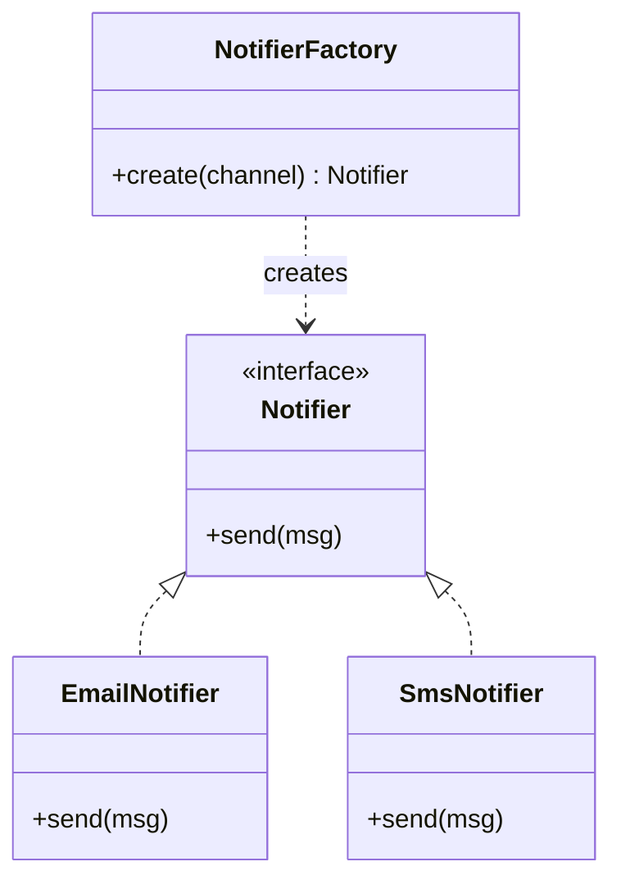
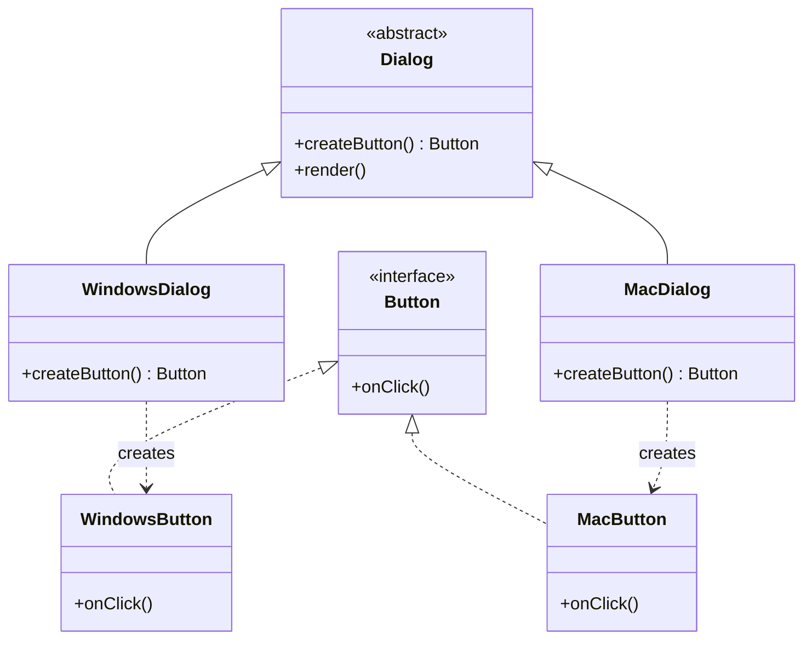
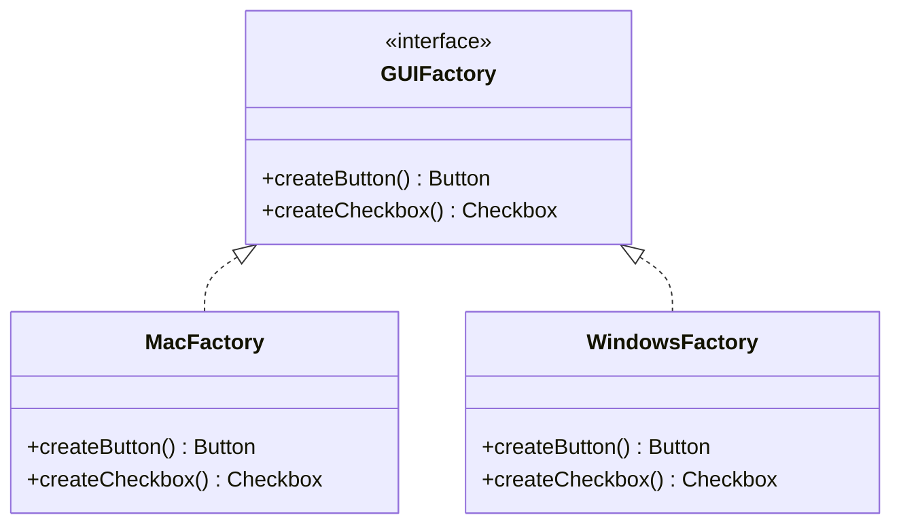

# Factory Design Pattern

## The core idea in plain English

You're building a notification system. You need to send messages via email, SMS, or push notification depending on the user's preference. Without a factory, every piece of code that sends a notification has to know about `EmailNotifier`, `SmsNotifier`, `PushNotifier` and decide which one to create. Change the rules or add a new channel → edit everywhere.

A **factory** centralizes that decision. Callers just say "give me a notifier" without knowing or caring which concrete class they get.

## Problem statement

Your code needs to create objects, but you don't want callers to hard-code concrete classes with `new`. Direct instantiation couples the caller to a specific implementation, making it hard to:

- swap implementations (e.g. choose a payment provider at runtime),
- centralize complex construction logic,
- add new types without editing every call site.

## Solution / approach

The "Factory" idea comes in three commonly-confused flavors.

### 1. Simple Factory (an idiom, not a GoF pattern)

A single method decides which concrete class to instantiate based on a parameter.



```java
class NotifierFactory {
    static Notifier create(String channel) {
        return switch (channel) {
            case "email" -> new EmailNotifier();
            case "sms"   -> new SmsNotifier();
            default      -> throw new IllegalArgumentException(channel);
        };
    }
}
```

**Downside:** The `switch` violates open/closed — adding a channel means editing the factory itself.

### 2. Factory Method (GoF)

Define an abstract "creator" with a method subclasses override to pick the product. The base class defines the workflow; the subclass decides the concrete type.



```java
abstract class Dialog {
    abstract Button createButton();        // the factory method

    void render() {
        Button b = createButton();         // base logic, concrete type chosen by subclass
        b.onClick(this::close);
    }
}

class WindowsDialog extends Dialog {
    Button createButton() { return new WindowsButton(); }
}
```

**Benefit:** Adding a new platform = adding one new subclass. Existing `Dialog` code is untouched (open/closed satisfied).

### 3. Abstract Factory (GoF)

Produces **families** of related objects that must work together. Ensures you can't accidentally mix incompatible products.



```java
interface GUIFactory {
    Button   createButton();
    Checkbox createCheckbox();
}

class MacFactory implements GUIFactory {
    public Button   createButton()   { return new MacButton(); }
    public Checkbox createCheckbox() { return new MacCheckbox(); }
}
```

The client receives a `GUIFactory` and gets a consistent set of widgets — you can't accidentally mix a Mac button with a Windows checkbox.

### When to use which

| Need | Pattern |
|---|---|
| Pick one concrete type from a parameter | Simple Factory |
| Let subclasses decide the concrete type | Factory Method |
| Create whole families of compatible objects | Abstract Factory |

## Interview gotchas

- **Factory Method vs Abstract Factory**: Factory Method = *one* product via inheritance; Abstract Factory = *family* of products via composition (often implemented *using* factory methods internally).
- The underlying principle is **Dependency Inversion**: callers depend on abstractions (`Notifier`, `Button`), not concretions (`EmailNotifier`, `WindowsButton`).
- Modern alternative: a **DI container** (Spring, Guice, etc.) often replaces hand-written factories for wiring dependencies at application scale.
