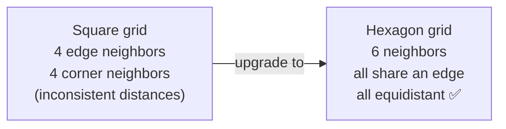
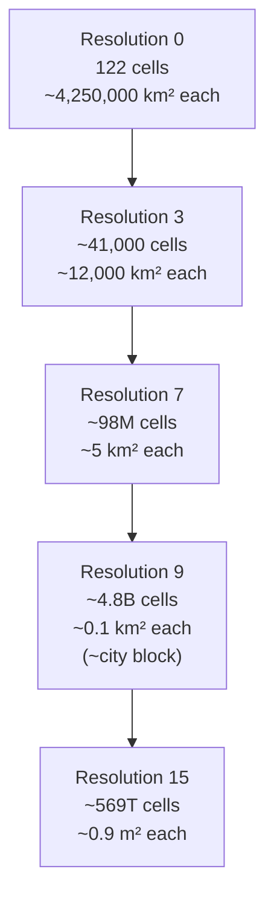
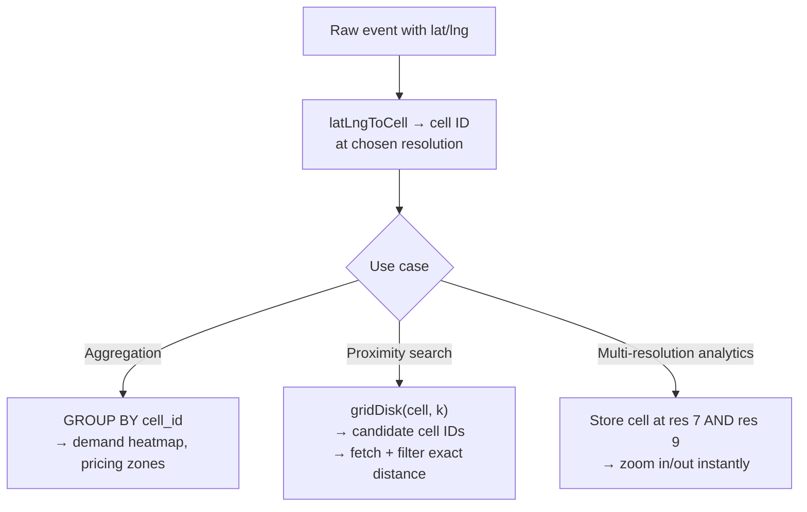

# Hexagonal Hierarchical Spatial Index (H3)

## The core idea in plain English

Imagine dividing the entire Earth into a grid of cells, giving each cell an ID, and storing events (rides, deliveries, check-ins) by their cell ID instead of raw lat/long. Now "find everything near me" becomes "find all events in nearby cells" — a fast ID lookup instead of expensive geometry math. That's spatial indexing.

**H3** (popularized by Uber) does this with hexagons instead of squares, and with 16 levels of zoom built in.

## Problem statement

You need to index points on the Earth's surface to answer: *"which riders and drivers are near each other?"*, *"aggregate demand per area"*, *"expand search radius"* — efficiently and at scale.

A naive rectangular grid has two problems:

- **Distortion**: square cells cover wildly different real-world areas near the poles vs the equator.
- **Unequal neighbors**: a square cell has 4 edge-adjacent neighbors (close) and 4 corner-adjacent neighbors (farther away). Distance to "all neighbors" is inconsistent.

## Solution / approach

### Why hexagons?



- A hexagon has **6 neighbors, all sharing an edge**, and all neighbor centers are equidistant. "Rings" of cells expand uniformly — great for radius search, smoothing, and flow analysis.
- Hexagons approximate circles better than squares, reducing edge distortion.

### Why hierarchical?

H3 defines **16 resolution levels** (0–15). Each level subdivides cells by roughly 7×.



This lets you pick the right precision for your use case and roll fine cells up to coarser parents for aggregation.

> **The catch:** You can't tile a sphere perfectly with only hexagons. H3 places the grid on an icosahedron and must introduce exactly **12 pentagons** (at the icosahedron's vertices, positioned over oceans). Also, parent/child containment is *approximate* — a child isn't perfectly contained by its parent.

### Core operations

```javascript
import { latLngToCell, gridDisk, cellToParent } from 'h3-js';

// Point → cell ID (a 64-bit integer, displayed as hex string) at resolution 9
const cell = latLngToCell(37.7749, -122.4194, 9);

// All cells within k=2 rings (the cell + neighbors up to distance 2)
const nearby = gridDisk(cell, 2);

// Roll up to a coarser cell for aggregation
const parent = cellToParent(cell, 7);
```

### How it's used in practice



1. **Bucketing**: convert every event's lat/lng to an H3 cell ID → `GROUP BY cell_id`. Cheap aggregation of demand, supply, and pricing per area.
2. **Proximity search**: take a query point's cell → `gridDisk(cell, k)` for candidate cells → fetch indexed records → filter by exact distance afterward.
3. **Multi-resolution joins**: store the cell at several resolutions to zoom analytics in/out instantly.

## Interview gotchas

- Cell IDs are **integers / hex strings** — fast to index, hash, and compare; no expensive geometry at query time.
- Know the **12 pentagons** and **approximate hierarchy** — classic "what's the limitation?" follow-up.
- Compare against alternatives:

| System | Shape | Hierarchy | Neighbor distance |
|---|---|---|---|
| **H3** | Hexagon | Approximate | Uniform (6 equidistant) |
| **Geohash** | Rectangle | Exact (string prefix) | Non-uniform (edge vs corner) |
| **S2 (Google)** | Quadrilateral on cube | Exact | Non-uniform |

- H3's uniform neighbors make it better for radius expansion and flow analysis. Geohash's string-prefix hierarchy makes prefix-range queries easy in standard databases.
