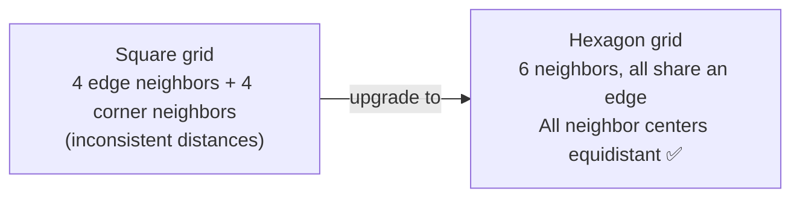
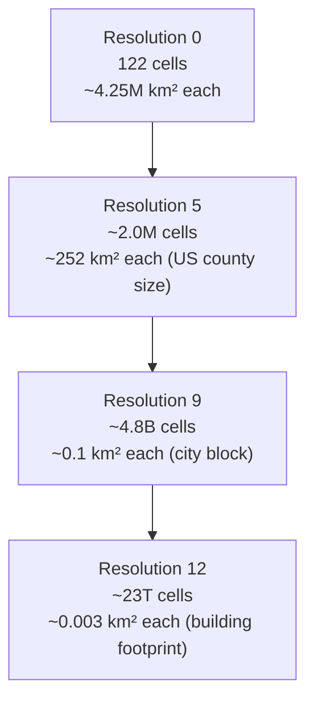
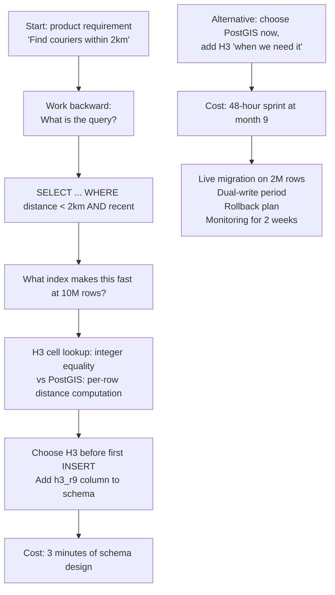
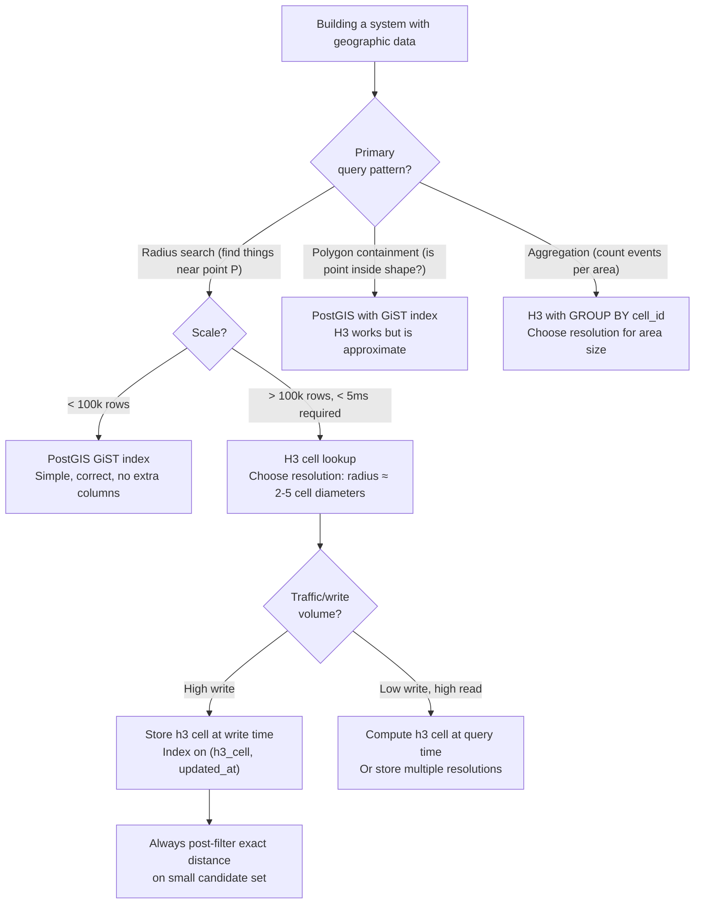

# Hexagonal Hierarchical Spatial Index (H3)

<!-- meta
level: senior
domain: algorithms
prereqs: [dijkstra-vs-pathfinding]
readtime: 15
incident-type: latency spike
-->

## The Incident

> **Nearfield (hyperlocal delivery marketplace) · Month 9 · ~40k orders/day, 1,200 active couriers**

Our geofencing system worked fine at launch. By month nine, it didn't. The query that checked "which active couriers are within 2km of this order?" had degraded from 45ms to 2,800ms. Orders were timing out. Couriers were assigned 3 minutes late. Customers were emailing about cold food.

We hadn't changed the query. The table hadn't changed schema. Only one thing had changed: it now had 2.1 million location rows instead of 190,000.

The query used a `ST_DWithin` PostGIS call with a raw lat/lon index:

```sql
SELECT courier_id FROM courier_locations
WHERE ST_DWithin(
    location::geography,
    ST_SetSRID(ST_Point(-122.4194, 37.7749), 4326)::geography,
    2000  -- 2km in meters
)
AND updated_at > NOW() - INTERVAL '5 minutes';
```

We ran `EXPLAIN ANALYZE`. The planner had switched from an index scan on `courier_locations_location_idx` (a GiST index) to a sequential scan. The GiST index existed and was valid. The planner had decided that at 2.1 million rows with our current dead tuple ratio, the sequential scan was cheaper.

The problem was two-layered: stale planner statistics (same issue as autovacuum bloat) *and* the wrong indexing strategy for our query pattern. A GiST index on raw geography is good for exact shape matching. For "find everything within radius K of point P" across 2 million points, you want a **spatial index that pre-partitions space** — so the query only touches a small, predictable fraction of rows without any geometry computation.

We migrated to H3 in a 48-hour sprint. The same query, restructured to look up H3 cells instead of computing distances: 8ms.

## Why Smart Engineers Get This Wrong

The mistake is treating spatial indexing as purely an infrastructure problem ("the index is too slow — we need a faster query engine or more RAM"). But the choice of *how* you represent geographic coordinates fundamentally determines what queries are fast.

Raw lat/lon with a GiST index requires computing actual geometric distances at query time to filter results. For "find things within 2km of point P," the database must evaluate `ST_DWithin(stored_point, P, 2000)` for every candidate in the index range. That's floating-point trigonometry on every row.

H3 eliminates that computation: convert every location to an H3 cell ID at write time. At query time, compute `gridDisk(target_cell, k)` to get the set of nearby cell IDs, then look up those IDs with a plain integer equality check. Integer equality is orders of magnitude faster than geographic distance computation. The "is this point within 2km?" question becomes "is this row's integer cell ID in this list of integers?"

The second mistake: choosing a spatial indexing resolution without thinking about the query pattern. H3's 16 resolution levels mean you have to think about your use case and pick the right granularity. Pick too coarse (large cells) and nearby-cell lookups pull in too many irrelevant results. Pick too fine (tiny cells) and a radius search requires checking hundreds of cells.

| What engineers assume | What actually happens |
|---|---|
| A PostGIS GiST index on coordinates handles all spatial queries efficiently | GiST indexes require per-row distance computation at query time; they degrade at scale |
| Adding more memory or a faster DB fixes geographic query slowness | Algorithm choice (precomputed cell ID vs runtime distance) matters more than infrastructure |
| You can add spatial indexing later when needed | Retrofitting spatial indexes on 2M rows while keeping the service live is 10× harder than designing with it from the start |

## The Investigation Playbook

### 1. Find the query plan switch

```sql
-- Check the actual plan being used
EXPLAIN (ANALYZE, BUFFERS, FORMAT TEXT)
SELECT courier_id FROM courier_locations
WHERE ST_DWithin(location::geography, ST_SetSRID(ST_Point(-122.4, 37.77), 4326)::geography, 2000)
AND updated_at > NOW() - INTERVAL '5 minutes';
```

> **What you're looking for:** `Seq Scan` where you expect `Index Scan on courier_locations_location_idx`. If you see a sequential scan on a table with a spatial index, the planner has decided the index is too expensive — usually due to bloat (check `n_dead_tup`) or stale statistics (run `ANALYZE`).

### 2. Verify the index exists and is being used correctly

```sql
-- List all indexes on the table
SELECT indexname, indexdef FROM pg_indexes
WHERE tablename = 'courier_locations';

-- Force the index to verify it works
SET enable_seqscan = OFF;  -- disable seq scan for this session
EXPLAIN (ANALYZE, BUFFERS)
SELECT courier_id FROM courier_locations
WHERE ST_DWithin(location::geography, ST_SetSRID(ST_Point(-122.4, 37.77), 4326)::geography, 2000)
AND updated_at > NOW() - INTERVAL '5 minutes';
-- Compare execution time with index forced vs planner's choice
SET enable_seqscan = ON;   -- re-enable after testing
```

### 3. Measure the baseline for migration planning

```sql
-- How many unique locations are queried per time window?
-- This determines what H3 resolution you need
SELECT
    COUNT(*) AS total_rows,
    COUNT(DISTINCT DATE_TRUNC('minute', updated_at)) AS update_frequency_per_minute,
    ST_Extent(location) AS bounding_box
FROM courier_locations
WHERE updated_at > NOW() - INTERVAL '1 hour';
```

> **What you're looking for:** The bounding box tells you geographic spread. Update frequency tells you write volume. Both inform H3 resolution choice.

### 4. Test H3 query performance before full migration

```javascript
// Proof-of-concept: run H3 lookup against a test column
// before migrating the full schema
const { latLngToCell, gridDisk } = require('h3-js');

const targetCell = latLngToCell(37.7749, -122.4194, 9);  // resolution 9 ≈ 0.1 km²
const nearbyCells = gridDisk(targetCell, 2);  // cells within k=2 rings ≈ 2km

// SQL equivalent:
// SELECT courier_id FROM courier_locations
// WHERE h3_cell = ANY($1)
// AND updated_at > NOW() - INTERVAL '5 minutes'
console.log(`Checking ${nearbyCells.length} cells for 2km radius at res 9`);
// → 19 cells (1 center + 6 ring-1 + 12 ring-2)
```

## The Fix at Three Altitudes

<!-- level:junior -->

### Junior: Understand It and Apply the Standard Fix

**H3** divides the Earth's surface into a hierarchy of hexagonal cells. Every point on Earth maps to exactly one cell at each of H3's 16 resolution levels (resolution 0 = 122 massive cells covering the whole planet; resolution 15 = 569 trillion cells, each ~0.9m²).

**Why hexagons?**



A hexagonal grid has two advantages over squares:
1. All 6 neighbors are equidistant from the center — perfect for radius searches
2. Hexagons approximate circles better than squares, reducing edge distortion for geographic data

**The 16 resolution levels:**



**Core operations:**

```javascript
import { latLngToCell, gridDisk, cellToParent, gridDistance } from 'h3-js';

// Convert a lat/lon point to its H3 cell at resolution 9
const cell = latLngToCell(37.7749, -122.4194, 9);
// → '8928308280fffff' (a 64-bit integer displayed as hex)

// Get all cells within k=2 rings (radius search)
// k=1: 1 + 6 = 7 cells, k=2: 7 + 12 = 19 cells, k=3: 19 + 18 = 37 cells
const nearbyCells = gridDisk(cell, 2);

// Roll up to a coarser resolution for aggregation
const parentCell = cellToParent(cell, 7);  // one step coarser

// Distance in grid steps between two cells (not km — grid distance)
const steps = gridDistance(cellA, cellB);
```

**Database schema with H3:**

```sql
-- Add H3 cell column (h3 cells stored as bigint or text)
ALTER TABLE courier_locations ADD COLUMN h3_cell TEXT;

-- Populate with H3 cell at resolution 9
UPDATE courier_locations
SET h3_cell = h3_lat_lng_to_cell(ST_Y(location::geometry), ST_X(location::geometry), 9);

-- Index on the cell ID (plain btree — fast integer equality)
CREATE INDEX idx_courier_h3_cell ON courier_locations (h3_cell, updated_at);
```

```sql
-- Radius query: no geometry computation at query time
-- gridDisk computed in application code, passed as array parameter
SELECT courier_id FROM courier_locations
WHERE h3_cell = ANY($1)  -- $1 = array of H3 cell IDs from gridDisk(targetCell, k)
AND updated_at > NOW() - INTERVAL '5 minutes';
```

The query becomes: "find rows whose integer cell ID is in this list." That's a btree index lookup with integer equality — extremely fast.

<!-- /level:junior -->

<!-- level:senior -->

### Senior: Tune It, Operate It, Know When It Fails

**Choosing the right resolution** is the most important tuning decision. Get it wrong and your radius search either misses results (too coarse, cells too large) or checks too many cells (too fine, cells too small):

| Resolution | Cell diameter | Cells in k=3 ring | Best for |
|---|---|---|---|
| 7 | ~5.2 km | 37 cells | City-level aggregation, pricing zones |
| 8 | ~2.0 km | 37 cells | Neighborhood-level matching |
| 9 | ~0.53 km | 37 cells | Block-level matching (courier ↔ order) |
| 10 | ~0.20 km | 37 cells | Building-level matching |
| 12 | ~0.029 km | 37 cells | Sub-building precision |

Rule of thumb: choose a resolution where your search radius is roughly **2–5 cell diameters**. For a 2km courier search: cell diameter of 0.5km (resolution 9) means k=2 rings cover ~2km. For a 500m search: use resolution 10 with k=2 rings covering ~800m, then filter exact distance afterward.

**Store at multiple resolutions for multi-scale queries:**

```sql
-- Separate columns for different use cases
ALTER TABLE courier_locations
    ADD COLUMN h3_r9  TEXT,  -- block-level (courier matching)
    ADD COLUMN h3_r7  TEXT;  -- city-level (demand heatmap)

-- Index both
CREATE INDEX idx_courier_h3_r9 ON courier_locations (h3_r9, updated_at);
CREATE INDEX idx_courier_h3_r7 ON courier_locations (h3_r7);
```

**Always filter exact distance after the H3 lookup.** H3 cells are hexagonal approximations — the grid disk includes cells at the edge of the radius that may be slightly farther than your threshold. For correctness, add a secondary filter:

```sql
-- H3 lookup (fast, approximate) + exact distance filter (precise, on small result set)
SELECT courier_id,
       ST_Distance(location::geography,
                   ST_SetSRID(ST_Point($lon, $lat), 4326)::geography) AS distance_m
FROM courier_locations
WHERE h3_cell = ANY($1)  -- $1 = gridDisk result
AND updated_at > NOW() - INTERVAL '5 minutes'
HAVING distance_m <= $2  -- exact distance threshold
ORDER BY distance_m;
```

The H3 lookup reduces the candidate set from 2 million rows to ~19 rows. The exact distance filter runs on 19 rows — negligible cost.

**The 12 pentagons caveat:** H3 places exactly 12 pentagonal cells on the icosahedron vertices (positioned over oceans, away from populated areas). `gridDisk` across a pentagon behaves differently from a hexagon — it does not produce a symmetric ring. In practice this affects < 0.0001% of queries. Know it exists; don't over-engineer around it.

**Parent/child containment is approximate:** A child cell at resolution 9 is not perfectly contained by its parent at resolution 7. When rolling up data for aggregation, use `cellToParent` and accept ±1 cell of boundary fuzziness. This is acceptable for heatmaps, demand aggregation, and pricing zones — not for compliance-critical geographic boundaries.

**The three failure modes to instrument:**

1. **Resolution mismatch** — search radius in km doesn't match cell size at chosen resolution. Symptom: queries return too few results (radius smaller than 1 cell) or check too many cells (k too large). Validate: for each resolution in use, log `nearbyCells.length` and `result_count` per query.
2. **H3 index cache invalidation** — if H3 cell IDs are computed at write time and stored in the DB, schema migrations or resolution changes require a full table backfill. Track which resolution each cell column uses with a comment or config constant.
3. **gridDisk for large k** — the number of cells in a ring-k disk is `3k² + 3k + 1`. k=10 gives 331 cells; k=20 gives 1,261 cells. For large-radius searches, this can become expensive as a database `ANY` query parameter. Cap k at 10; for larger radii, either use a coarser resolution or switch to a bounding-box pre-filter.

<!-- /level:senior -->

<!-- level:staff -->

### Staff: Design Systems That Don't Need This Fix

The Nearfield incident was avoidable. The H3 retrofit was urgent, expensive (48-hour sprint, careful data backfill, coordinated deploy), and risky (location data drives order assignment — errors cost money). The same decision made at schema design time would have been a 4-line change.

This is the general pattern with indexing strategies: **the right time to choose your spatial indexing primitive is before you write your first row of data**. Retrofitting is not just more work — it requires a live migration on production data, a dual-write period, a cutover, and weeks of monitoring for regressions.

The staff-level principle: **query patterns drive data model design, not the reverse**.



For system design interviews and architecture decisions: the choice of spatial indexing primitive belongs in the same conversation as the data model, not in the "performance optimization" roadmap.

**When to choose what:**

| Primitive | Best for | Not for |
|---|---|---|
| H3 | Radius search, demand aggregation, pricing zones, supply/demand matching | Exact polygon containment, compliance boundaries |
| PostGIS GiST | Arbitrary polygon queries, exact shape matching, complex geographic relationships | Large-scale radius search at low latency |
| Geohash | Simple string prefix queries in standard SQL databases | Equidistant neighbor search (diagonal neighbors are farther) |
| S2 (Google) | Exact hierarchy, Google Maps integration | When H3's uniform neighbors matter more than exact containment |

**The conversation to have with your team:**

> "We're designing the courier location schema. Our primary query is 'couriers within Nkm of a point.' Before we pick a storage format, let's lock in the algorithm: H3 cell lookup or PostGIS distance. At 10M location rows, H3 means a btree index lookup on an integer; PostGIS means per-row distance computation on a GiST index. H3 wins at scale. Let's design the column in now and set the resolution from day one — changing it later is a production migration."

**Prerequisites for this approach:** Understanding of your query patterns before schema design (requires product conversation upfront). H3 compute at write time (add to your location update service). Acceptance that H3 gives an approximate result that needs exact-distance post-filtering for correctness.

<!-- /level:staff -->

## The Decision Tree



## Interview Gauntlet

### Junior questions

**Q: What is H3 and why use hexagons instead of a rectangular grid?**  
Expected: H3 is a hierarchical spatial indexing system that divides Earth's surface into hexagonal cells at 16 resolution levels. Hexagons are preferred because all 6 neighbors share an edge and all neighbor centers are equidistant — unlike squares where diagonal neighbors are farther than edge-adjacent neighbors. This uniform distance property makes radius searches and flow analysis more accurate.  
Follow-up that separates junior from senior: *"What's the 12 pentagon caveat and why does it exist?"*  
30-second one-liner: "H3 converts lat/lon to a hex cell ID — then nearby-cell queries become fast integer lookups instead of slow geometry computations."

**Q: How do you use H3 to answer 'find all couriers within 2km of this point'?**  
Expected: (1) At write time, convert each courier's lat/lon to an H3 cell ID at an appropriate resolution and store it in the DB. (2) At query time, convert the target point to its H3 cell, call `gridDisk(cell, k)` to get nearby cell IDs, and look up rows where `h3_cell = ANY(nearby_cells)`. (3) Optionally post-filter by exact distance on the small candidate set. Index: btree on `(h3_cell, updated_at)`.

### Senior questions

**Q: How do you choose the right H3 resolution for a given use case?**  
Expected: The rule of thumb: your search radius should be roughly 2–5 cell diameters. For a 2km courier search: resolution 9 (cell diameter ~0.5km) with k=2 rings covers ~2km. Also consider: update frequency (high write volume favors storing fewer resolution columns), query pattern (aggregation vs point-in-time lookup), and precision requirements (higher resolution = more cells = smaller coverage but higher precision). Store at multiple resolutions if you need both block-level matching and city-level aggregation.  
The trap: choosing resolution 12 "for precision" on a 2km search — you'd need k=70 rings (thousands of cells per query).

**Q: You're migrating 5 million location rows from raw lat/lon to H3. How do you do this without downtime?**  
Expected: (1) Add the new `h3_cell` column with nullable default. (2) Backfill in batches (1k–10k rows at a time with pg_sleep between batches to avoid I/O spikes). (3) Add the new index after backfill. (4) Deploy new code that writes `h3_cell` on every INSERT/UPDATE (dual-write). (5) Verify H3-based queries return correct results on a small traffic percentage. (6) Cut over reads to H3 queries. (7) Drop old GiST index after cutover confirmed.  
The trap: running a single `UPDATE ... SET h3_cell = ...` with no WHERE clause on 5M rows — locks the table, causes downtime.

### Staff questions

**Q: When should you choose PostGIS over H3?**  
Expected: PostGIS when: you need exact polygon containment (compliance zones, legal boundaries), complex spatial relationships (intersection, union, buffer), or arbitrary shape queries. H3 when: radius search at scale (> 100k points), demand aggregation (heatmaps, pricing zones), supply/demand matching. H3 is approximate for boundary queries — the hexagonal cells don't perfectly align with arbitrary polygons. For systems that need both (geofence enforcement + rider matching), use H3 for matching and PostGIS for compliance checks.

**Q: How would you design the data model for a global ride-sharing platform's driver location service?**  
Expected: Separate the write path (high-frequency location updates, 1 Hz per driver) from the read path (match riders to nearby drivers). Write path: insert `driver_locations` with `h3_r9` and `h3_r7` columns precomputed. Partition by time for efficient pruning. Read path: `gridDisk(rider_cell, 2)` on `h3_r9` index to find candidate drivers within ~2km; secondary filter for exact distance; secondary filter for driver status (available, not on trip). Aggregation (demand heatmap): `GROUP BY h3_r7` on recent locations. Two indexes: `(h3_r9, updated_at, status)` for matching, `(h3_r7, updated_at)` for aggregation. TTL/partitioning to drop rows older than 5 minutes.

## Connections

**Before this:** [dijkstra-vs-pathfinding](/dijkstra-vs-pathfinding) — both articles explore the "precompute to make queries fast" tradeoff; H3 is spatial precomputation, CH is graph precomputation  
**After this:** consistent-hashing (partitioning a keyspace into buckets — the same conceptual family as H3's cell partitioning), indexing-strategy (the general principle of which index type for which query pattern)  
**Related incidents:**
- *Nearfield (this incident)* — PostGIS GiST index degraded at 2M rows; 48-hour H3 migration reduced query latency from 2,800ms to 8ms
- *Uber H3 open-source release 2018* — Uber published H3 after using it internally for demand forecasting and driver matching; blog post describes the same query pattern optimization described here
- *Lyft geofencing 2019* — PostGIS-based geofence checks degraded under surge traffic; switched to H3 precomputed cell membership for primary matching
