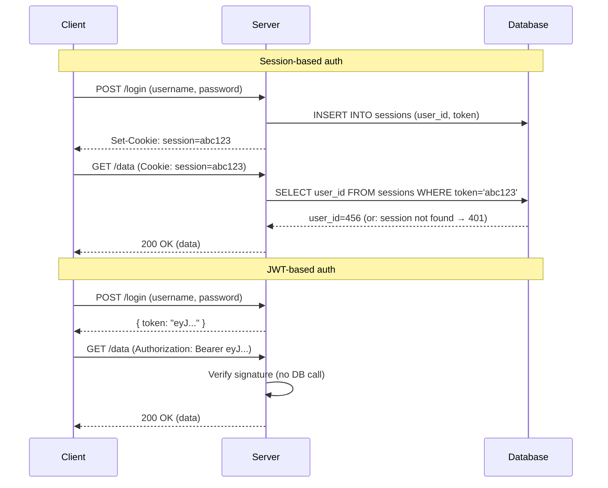
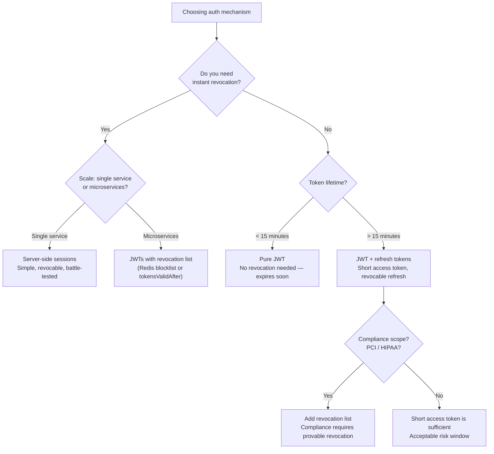
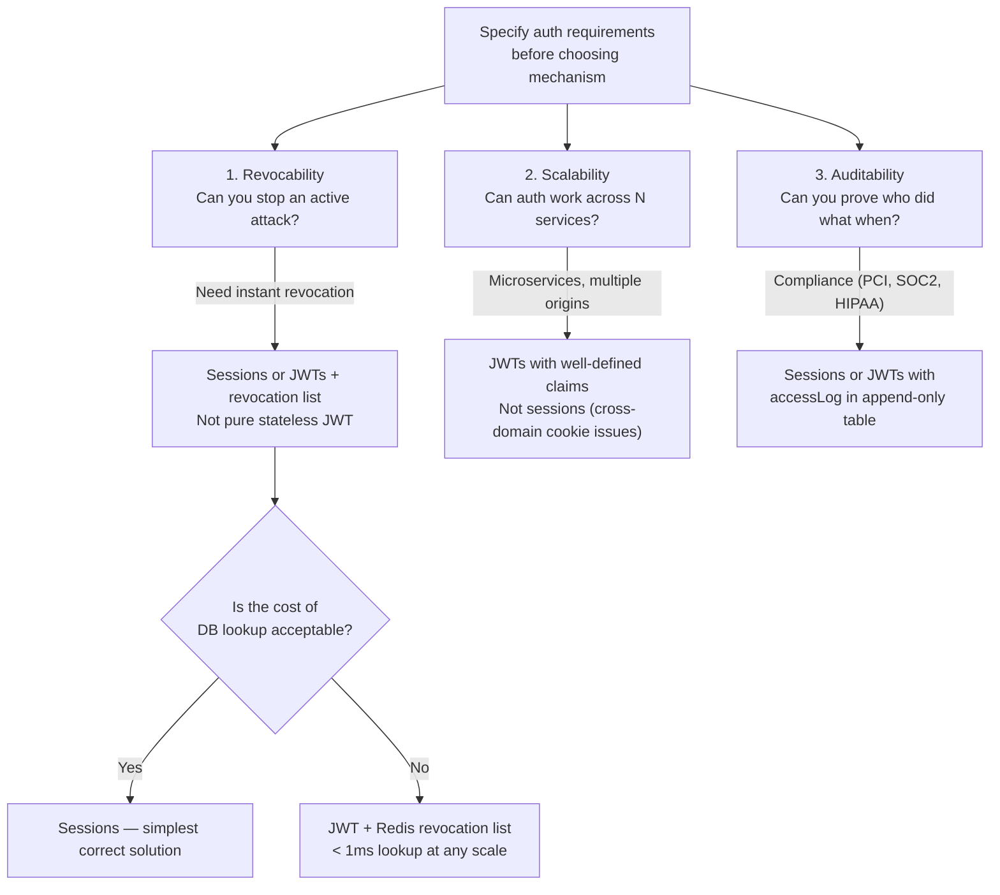
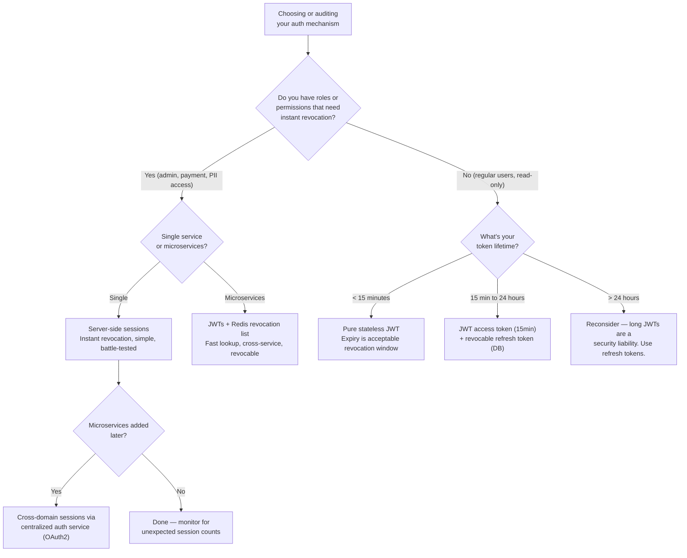

# JWT vs Session Authentication

<!-- meta
level: junior
domain: architecture-patterns
prereqs: []
readtime: 12
incident-type: security incident
-->

## The Incident

> **Trustline (B2B fintech platform) · Q3 2023 · ~100k users, ~$8M daily transaction volume**

At 14:20 on a Thursday, our security team got an alert from our anomaly detection system: an admin service account was calling the customer data export API at 40 requests per minute — far above its normal 2/hour rate. We identified the account as belonging to a contractor who had left two weeks ago. We immediately disabled the account in our user database, changed the shared secrets, and notified the team that the threat was contained.

It wasn't. At 16:45, the export API calls continued. Same account, same request signature. The account was disabled in the database — our auth middleware checked `users.is_active = false` for session-based users. But this account was authenticating with a JWT, issued 3 hours earlier with a 24-hour expiry. Our middleware verified the JWT's cryptographic signature — which was valid — and extracted the `sub` (user ID) and `role` claims from the token. It never checked the database.

By the time the JWT expired naturally at 14:20 the next day, the attacker had exfiltrated 14,200 customer records. The attack continued for 23 hours and 40 minutes after we thought we had stopped it.

The moment of realization: a senior engineer asked "but how is it still working if the account is disabled?" A junior dev on the team answered, correctly: "Because the JWT doesn't expire for another 23 hours and we never check the database on JWT requests."

## Why Smart Engineers Get This Wrong

The mistake is confusing **authentication** with **authorization**. JWT verification proves "this token was signed by our server at some point in the past." It says nothing about the current state of the user in the system. When engineers add `users.is_active` checks to their session middleware, they feel secure — and they are, for sessions. But then they add JWT support and don't add the same database check, because "JWTs are stateless, that's the whole point."

The second mistake is treating statelessness as an unqualified good. "No database lookup on every request" is a valid performance argument. But what you give up is the ability to revoke tokens. Many engineers learn about JWTs in tutorials that emphasize the stateless benefit without mentioning that revocation requires re-introducing statefulness.

| What engineers assume | What actually happens |
|---|---|
| Disabling a user account stops their access | Only works for session-based auth; JWT middleware validates the signature, not the database state |
| JWT expiry is the revocation mechanism | Expiry is a time bomb — it stops the attack in 24 hours regardless of what you do; it's not revocation |
| Stateless auth is simpler and more secure | Stateless auth trades revocability for scalability; it's a tradeoff, not a strict improvement |

## The Investigation Playbook

### 1. Identify which auth mechanism is in use

```bash
# Decode a JWT without verifying — look at the payload
echo "eyJ..." | cut -d. -f2 | base64 -d 2>/dev/null | python3 -m json.tool
# Output: { "sub": "user-123", "role": "admin", "exp": 1703001234, "iat": 1702914834 }
```

> **What you're looking for:** `exp` claim — if the token was issued hours ago and won't expire for hours more, disabling the database account won't stop it.

### 2. Find all active sessions vs active JWTs

```sql
-- For session-based auth: sessions in DB
SELECT user_id, created_at, last_used_at, expires_at
FROM sessions
WHERE user_id = 'compromised-user-id' AND expires_at > NOW();

-- For JWT: you CANNOT enumerate active JWTs without a token store
-- (This is the revocation gap — there's nothing to query)
```

> **What you're looking for:** If your JWT implementation has no `jwt_revocation_list` or `token_store` table, you have no way to revoke active tokens.

### 3. Immediate mitigation if you can't revoke

```bash
# Emergency option: rotate the JWT signing secret
# This invalidates ALL JWTs signed with the old secret — affects all users
# Only do this if the threat is severe enough to justify global logout

# In your secrets manager:
JWT_SECRET=$(openssl rand -hex 32)
# Rotate secret in your auth service — all existing JWTs become invalid
```

> **What you're looking for:** Confirm you have a path to emergency secret rotation and understand its blast radius (all users logged out).

### 4. Add a blocklist for targeted revocation

```sql
-- Create a token revocation table (add this immediately)
CREATE TABLE revoked_tokens (
    jti VARCHAR(255) PRIMARY KEY,  -- JWT ID claim
    user_id VARCHAR(255) NOT NULL,
    revoked_at TIMESTAMPTZ NOT NULL DEFAULT NOW(),
    expires_at TIMESTAMPTZ NOT NULL  -- Clean up expired entries
);

-- Index for fast lookup on every request
CREATE INDEX idx_revoked_tokens_jti ON revoked_tokens(jti);
CREATE INDEX idx_revoked_tokens_expires ON revoked_tokens(expires_at);
```

> **What you're looking for:** Once you have `jti` (JWT ID) in your tokens and a revocation table, you can revoke individual tokens by inserting a row — without affecting other users.

## The Fix at Three Altitudes

<!-- level:junior -->

### Junior: Understand It and Apply the Standard Fix

**Sessions** and **JWTs** are two different approaches to proving "this request comes from an authenticated user":



**The core tradeoff:**

| | Session | JWT |
|---|---|---|
| Revocation | Instant (delete from DB) | Impossible without extra infrastructure |
| Scalability | DB lookup on every request | No DB lookup — works across servers |
| Payload size | Small cookie | Self-contained token (larger) |
| Best for | Apps needing instant revocation | Stateless microservices, short-lived tokens |

**The standard fix: short expiry + refresh tokens**

```javascript
// Issue short-lived access tokens (15 minutes)
const accessToken = jwt.sign(
  { sub: user.id, role: user.role },
  process.env.JWT_SECRET,
  { expiresIn: '15m', jwtid: crypto.randomUUID() } // jwtid enables revocation
);

// Issue long-lived refresh token (stored in DB — revocable)
const refreshToken = crypto.randomBytes(32).toString('hex');
await db.insertRefreshToken({
  token: refreshToken,
  userId: user.id,
  expiresAt: new Date(Date.now() + 7 * 24 * 60 * 60 * 1000), // 7 days
});
```

With 15-minute access tokens, a compromised token expires in at most 15 minutes. Revoking the refresh token (DB delete) prevents the attacker from getting new access tokens. The blast radius of any compromise is bounded.

<!-- /level:junior -->

<!-- level:senior -->

### Senior: Tune It, Operate It, Know When It Fails

Short access tokens reduce the revocation window but don't eliminate it. For situations requiring true instant revocation (admin accounts, PCI-scoped access, compliance requirements), implement a revocation list.

**JWT revocation with `jti` claim:**

```javascript
// Middleware: check revocation on every JWT request
async function verifyJWT(token: string): Promise<JWTPayload> {
  const payload = jwt.verify(token, process.env.JWT_SECRET) as JWTPayload;

  // Check revocation list — O(1) with Redis or indexed DB column
  const isRevoked = await redis.get(`revoked:${payload.jti}`);
  if (isRevoked) throw new UnauthorizedError('Token has been revoked');

  return payload;
}

// Revoke a specific token (by jti) or all tokens for a user
async function revokeToken(jti: string, expiresAt: Date): Promise<void> {
  // Store in Redis with TTL matching token expiry — auto-cleaned up
  const ttlSeconds = Math.max(0, Math.floor((expiresAt.getTime() - Date.now()) / 1000));
  await redis.setex(`revoked:${jti}`, ttlSeconds, '1');
}

async function revokeAllUserTokens(userId: string): Promise<void> {
  // Update a "token valid from" timestamp in DB
  await db.users.update(userId, { tokensValidAfter: new Date() });
  // In verifyJWT: also check payload.iat >= user.tokensValidAfter
}
```

**When to use sessions vs JWTs — the operational matrix:**



**The three failure modes to instrument:**

1. **Token replay after rotation** — rotating the JWT secret invalidates all tokens, but if your load balancer uses multiple instances with different secrets loaded at different times, some instances still accept old tokens. Fix: broadcast secret rotation across all instances atomically.

2. **Clock skew on `exp` validation** — JWT expiry is checked with `Date.now()`. If server clocks drift > 30s, tokens appear expired prematurely (or accepted too late). Fix: include a small `leeway` in your JWT library (typically 30–60 seconds).

3. **`jti` missing from old tokens** — if you add `jti` to tokens today, old tokens without `jti` can't be individually revoked. Keep your `tokensValidAfter` approach as a fallback that works for all tokens regardless of `jti` presence.

<!-- /level:senior -->

<!-- level:staff -->

### Staff: Design Systems That Don't Need This Fix

The JWT vs session debate is fundamentally about where you store state: in the token (JWT) or on the server (session). Both are valid depending on your threat model. The staff question is: what security properties does your system actually need, and does your auth mechanism provide them?

**The three auth properties to specify before choosing a mechanism:**



The Trustline incident happened because the team added JWT support to optimize performance (eliminate DB lookups) without acknowledging what they were giving up (revocability). The right conversation is:

> "JWTs eliminate the per-request DB lookup, which saves about 2ms per request. At our scale, that's meaningful. But what we're trading is the ability to revoke individual tokens instantly. Given that we have admin roles with access to all customer data, the 15-minute maximum exposure window of short access tokens is acceptable for regular users — but for admin tokens, we need instant revocation. The right design is: regular users get 15-minute JWTs, admins get sessions or JWTs with a Redis revocation check."

**Prerequisites for the architectural alternative:** Redis for revocation list (or Postgres with an indexed `jti` column — the DB lookup you wanted to avoid). For true instant revocation of long-lived tokens, you accept the latency cost for high-privilege accounts and keep stateless JWTs for low-privilege ones.

<!-- /level:staff -->

## The Decision Tree



## Interview Gauntlet

### Junior questions

**Q: What is a JWT and how is it different from a session cookie?**  
Expected: A JWT is a self-contained token containing claims (user ID, role, expiry) signed with a secret. The server validates the signature cryptographically — no database lookup needed. A session cookie contains an opaque random string; the server looks up the session in a database to find the associated user. JWT is stateless (no server-side state); sessions require server-side storage.  
Follow-up that separates junior from senior: *"If a user is suspended, how do you immediately revoke a JWT issued 3 hours ago with a 24-hour expiry?"*  
30-second one-liner: "JWT puts identity in the token itself — fast but not revocable. Sessions put identity in a database — one delete stops any session instantly."

**Q: What is the purpose of the `exp` claim in a JWT?**  
Expected: `exp` (expiry) is a Unix timestamp after which the token should be rejected. It's the only built-in "revocation" mechanism for pure JWTs — but it's time-bound, not demand-driven. You can't expire a token early based on a user action; you have to wait for `exp` to pass. The fix for early revocation is a blocklist or short token lifetimes.  
The trap: confusing `exp` (expiry from issuance) with `iat` (issued at) and `nbf` (not before).

### Senior questions

**Q: You have JWTs with 24-hour expiry and need to add instant revocation without migrating to sessions. What do you build?**  
Expected: Add a `jti` (JWT ID) claim — a unique UUID per token. On issue, store `jti` in a Redis set with TTL matching the token expiry. On each request, after signature verification, do `GET revoked:{jti}` in Redis. If found, reject. To revoke a token, do `SET revoked:{jti} 1 EX {remaining_ttl}`. To revoke all tokens for a user, store a `tokensValidAfter` timestamp in the user record and check `payload.iat >= user.tokensValidAfter` on each request. This adds one Redis lookup per request (< 1ms) and enables instant revocation without migrating to sessions.  
The trap: proposing to migrate to sessions — valid but expensive. The question is specifically about adding revocation to JWTs.

**Q: What is the purpose of a refresh token and how does it improve security?**  
Expected: A refresh token is a long-lived token (7–30 days) stored server-side (in a database) used to issue new short-lived access tokens (15 minutes). The access token is what authenticates API requests — its short life limits the damage if stolen. The refresh token can be revoked by deleting its database record. This gives you the scalability of JWTs (no DB lookup per API request) with the revocability of sessions (DB lookup on refresh, which happens infrequently). The refresh token is also what you rotate on logout — delete the refresh token, and the user can't get new access tokens.

### Staff questions

**Q: A compliance officer says all user sessions must be revocable within 60 seconds. You currently have stateless JWTs with 1-hour expiry across 12 microservices. What's your plan?**  
Expected: Options from least to most invasive: (1) Add Redis revocation list with `jti` claim — one Redis lookup per request across all services, < 1ms overhead, revocation propagates in < 1s. (2) Reduce JWT expiry to 60 seconds — effectively gives you 60s revocation window without infrastructure changes, but forces token refreshes every minute which increases auth service load 4×. (3) Migrate to an auth gateway that validates tokens once and issues short-lived service-level tokens per microservice — complex but eliminates per-service revocation logic. I'd recommend (1) as the pragmatic fix: Redis is already in the stack, the change is localized to JWT middleware, and it solves the compliance requirement without architectural disruption.  
Follow-up: *"The compliance officer says the 60-second Redis TTL means revocation isn't guaranteed — what if Redis is down?"*

## Connections

**Before this:** No prerequisites — this is foundational security  
**After this:** [mutex-lock](/mutex-lock) (stateful coordination patterns), [api-idempotency](/api-idempotency) (related theme of stateless vs stateful request handling), oauth2-and-oidc  
**Related incidents:**
- *Trustline (this incident)* — compromised admin JWT continued exfiltrating data for 23 hours after account was disabled; 14,200 customer records exfiltrated
- *Okta (2022)* — support tool compromise; attackers leveraged long-lived session tokens that weren't invalidated during incident response
- *LastPass (2022)* — breach response was complicated by inability to immediately invalidate all active sessions across a distributed system
