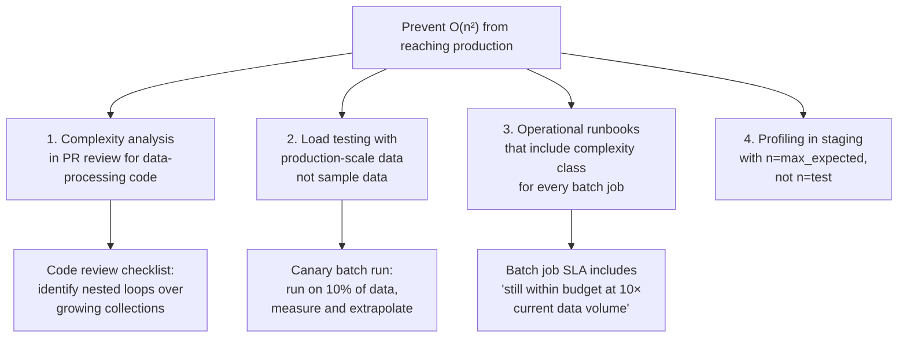
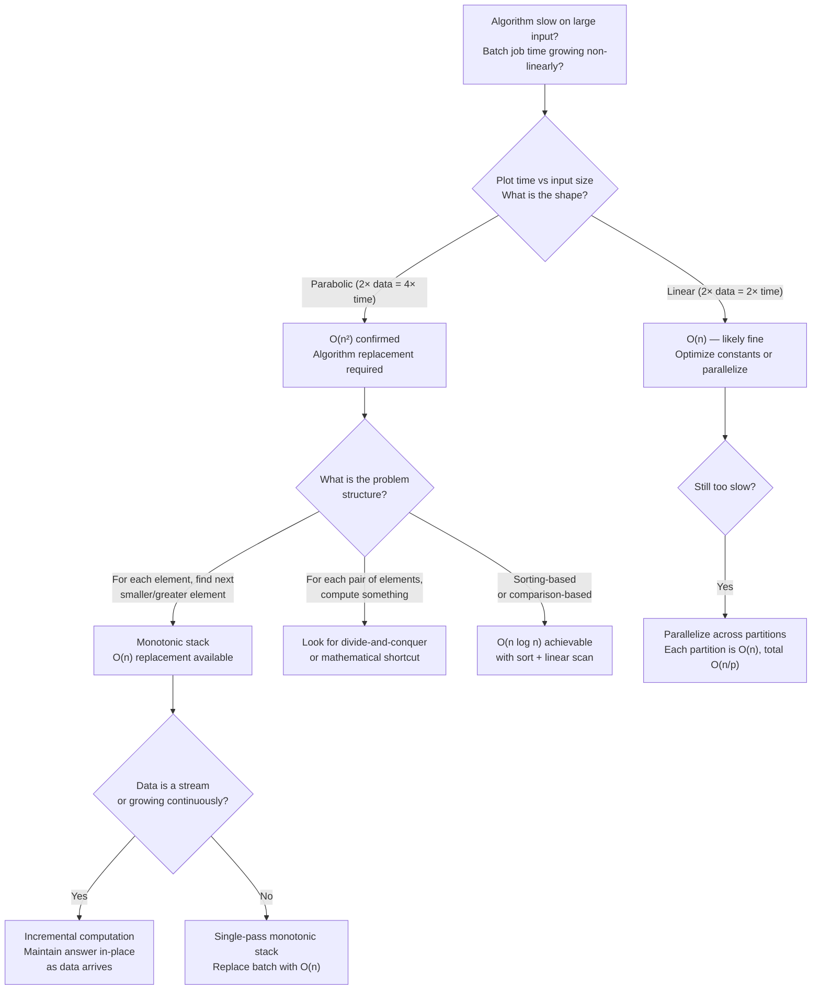

# Monotonic Stack

<!-- meta
level: junior
domain: algorithms
prereqs: []
readtime: 11
incident-type: performance regression
-->

## The Incident

> **Pricewatch (e-commerce price tracking SaaS) · Q1 2024 · ~50k DAU, 2.8M tracked products**

Our nightly batch job — "find the next day each product's price drops below its current price" — was the backbone of our price alert feature. At launch with 50k products, it took 4 seconds. Nobody thought about it. By Q1 2024, we had 2.8M tracked products and the same job was taking 47 minutes.

We were blowing through the 15-minute window we had before our morning dashboard refresh. Users were arriving to see yesterday's alert data. The on-call team did the obvious things: moved the job to our beefiest server (8× CPU, 4× RAM), rewrote the Python inner loop in Go, and added a Postgres index on the price history table. Each change cut 15–20% off the runtime. After all three optimizations, the job took 31 minutes. Still broken.

A new engineer on the team asked to see the algorithm before we tried anything else. We pulled up the code:

```python
def find_next_price_drop(prices: list[float]) -> list[int]:
    n = len(prices)
    result = [-1] * n
    for i in range(n):          # For each price...
        for j in range(i+1, n): # ...scan every future price
            if prices[j] < prices[i]:
                result[i] = j
                break
    return result
```

She graphed execution time vs product count on a whiteboard. It was a parabola. We were running an O(n²) algorithm. Doubling the catalog didn't double the runtime — it quadrupled it. No amount of hardware could outrun quadratic scaling.

The realization: 50k products = 2.5 billion comparisons. 2.8M products = 7.84 trillion comparisons. We weren't in a "tune the code" situation. We were in a "replace the algorithm" situation.

## Why Smart Engineers Get This Wrong

The mistake is reaching for infrastructure optimization before algorithmic analysis. "The job is slow" → "let's scale the server" is a reasonable first instinct when you're responsible for uptime and don't have time to rewrite code. But O(n²) algorithms don't respond to vertical scaling — you're trading money for linear improvement on a curve that goes parabolic.

The second mistake is not recognizing "next smaller element" as a canonical problem. The nested loop is natural to write — "for each element, scan the rest of the array" — but it's the classic setup for a monotonic stack solution. Engineers who haven't seen monotonic stacks before don't have the pattern, and engineers who have seen them may not recognize the disguise when it appears as a domain-specific business problem ("next price drop") rather than as a textbook problem ("next smaller element").

| What engineers assume | What actually happens |
|---|---|
| Hardware upgrades solve slow batch jobs | O(n²) algorithms scale quadratically — 10× more data = 100× more work, regardless of CPU |
| "For each element, check all others" is a reasonable pattern for any size | This pattern is O(n²) and breaks above ~100k elements for real-time use or ~10M for batch |
| Business domain problems need domain solutions | "Next smaller element" appears in price drops, temperature falls, span of stock prices — same algorithm |

## The Investigation Playbook

### 1. Profile the algorithmic complexity

```python
import time

sizes = [1_000, 5_000, 10_000, 50_000, 100_000]
for n in sizes:
    prices = list(range(n, 0, -1))  # Worst case: descending prices
    start = time.perf_counter()
    find_next_price_drop(prices)
    elapsed = time.perf_counter() - start
    print(f"n={n:>7,}: {elapsed:.3f}s")
```

> **What you're looking for:** If doubling `n` quadruples the time, you have O(n²). If it doubles the time, you have O(n log n). If it stays flat, O(1) or O(log n). Plot these on a graph — the shape tells you the complexity class.

### 2. Identify the pattern

Look at the algorithm structure. Nested loops over the same array = O(n²) by default:

```python
for i in range(n):       # O(n)
    for j in range(i, n):  # O(n) per outer iteration
        ...               # Total: O(n²)
```

> **What you're looking for:** Any structure where "for each element, scan the remaining elements." This is almost always replaceable with a stack, hash map, or divide-and-conquer approach.

### 3. Verify the O(n) solution produces identical output

Before replacing the algorithm, use the slow version as a reference to test the fast version:

```python
import random

def test_equivalence(n=10_000):
    prices = [random.uniform(10, 100) for _ in range(n)]
    slow = find_next_price_drop_quadratic(prices)
    fast = find_next_price_drop_monotonic(prices)
    assert slow == fast, f"Mismatch at first diff index"
    print(f"Verified: both produce identical output for n={n}")

test_equivalence()
```

> **What you're looking for:** Identical output for random and edge-case inputs (ascending, descending, all-equal prices). The monotonic stack must be a drop-in replacement.

## The Fix at Three Altitudes

<!-- level:junior -->

### Junior: Understand It and Apply the Standard Fix

A **monotonic stack** is a stack that maintains a specific ordering property — elements are always either increasing or decreasing from bottom to top. It solves "next smaller element," "next greater element," and related problems in O(n) by processing each element exactly once.

**The core insight:** Instead of scanning forward from each element, scan left-to-right and use the stack to track elements waiting for their answer.

```
Prices: [5, 3, 7, 2, 4]
         0  1  2  3  4   (indices)

Question: for each price, what's the index of the next lower price?
Brute force: check all future elements — O(n²)
```

**Monotonic stack walkthrough (decreasing stack):**

```
Process price[0]=5: stack=[], push 0.        stack=[0]
Process price[1]=3: 3 < 5, so price[0] found its answer! result[0]=1, pop 0, push 1.  stack=[1]
Process price[2]=7: 7 > 3, push 2.           stack=[1, 2]
Process price[3]=2: 2 < 7, result[2]=3, pop 2.  stack=[1]
                    2 < 3, result[1]=3, pop 1.  stack=[]
                    push 3.                      stack=[3]
Process price[4]=4: 4 > 2, push 4.            stack=[3, 4]
End: remaining stack elements have no next smaller price (result stays -1)

Result: [1, 3, 3, -1, -1]
```

**Implementation:**

```python
def find_next_price_drop(prices: list[float]) -> list[int]:
    n = len(prices)
    result = [-1] * n
    stack: list[int] = []  # Stores indices, maintains decreasing price order

    for i in range(n):
        # While the stack has elements and the current price is lower:
        while stack and prices[i] < prices[stack[-1]]:
            idx = stack.pop()
            result[idx] = i  # current index i is the "next lower price" for idx
        stack.append(i)

    # Remaining elements in stack have no future lower price — result stays -1
    return result
```

**Why this is O(n):** Each element is pushed onto the stack exactly once and popped exactly once. Even though there's a `while` loop inside the `for` loop, the total number of push+pop operations across the entire run is exactly `2n`. The inner `while` loop doesn't re-scan — it only pops elements that were waiting.

```python
# Verify: same result, dramatically faster
import time

prices = list(range(2_800_000, 0, -1))  # 2.8M prices

start = time.perf_counter()
result = find_next_price_drop(prices)
print(f"Monotonic stack: {time.perf_counter() - start:.2f}s")  # ~0.8s

# vs the O(n²) version: 47 minutes
```

<!-- /level:junior -->

<!-- level:senior -->

### Senior: Tune It, Operate It, Know When It Fails

The monotonic stack appears in more problems than "next smaller element." Recognizing the pattern matters for interviews and code review.

**The pattern family:**

| Problem variant | Stack property | When to pop |
|---|---|---|
| Next smaller element | Decreasing (top is largest) | current < top |
| Next greater element | Increasing (top is smallest) | current > top |
| Previous smaller element | Scan right-to-left, decreasing | current < top |
| Largest rectangle in histogram | Increasing | current < top |
| Stock span problem | Decreasing | current >= top |

**Real-world applications beyond price drops:**

```python
# Temperature alert: next warmer day
def daily_temperatures(temps: list[int]) -> list[int]:
    result = [0] * len(temps)
    stack: list[int] = []
    for i, temp in enumerate(temps):
        while stack and temps[i] > temps[stack[-1]]:
            idx = stack.pop()
            result[idx] = i - idx  # Days to wait, not the index
        stack.append(i)
    return result

# Inventory: next time stock exceeds current level
# Architecture: next request load above current threshold
# These are all the same algorithm with a different comparison and payload
```

**The failure mode: confusing "strictly less than" vs "less than or equal to":**

```python
# For "next lower price" (strictly less):
while stack and prices[i] < prices[stack[-1]]:  # strict less-than

# For "next price that is NOT higher" (less than or equal):
while stack and prices[i] <= prices[stack[-1]]:  # less-than-or-equal

# These produce different results for equal values:
# prices = [5, 5, 3]
# strict: result[0] = 2 (next price that is strictly lower)
# non-strict: result[0] = 1 (next price that is equal or lower)
```

**Distributed batch processing at scale:**

For 2.8M products, the algorithm is O(n) but running it as a single-threaded Python process still takes ~0.8s serially. For 100M products, partition by product category:

```python
# Partition price history by product category — each worker handles one category
def process_category_partition(category_id: int) -> dict:
    prices = fetch_price_history(category_id)
    return {
        product_id: find_next_price_drop(price_list)
        for product_id, price_list in prices.items()
    }

# Parallelize with Celery or Spark
results = celery.group(
    process_category_partition.s(cat_id)
    for cat_id in get_all_categories()
).apply_async()
```

**Monitoring the batch job:**

```python
import structlog
log = structlog.get_logger()

def find_next_price_drop_with_metrics(prices, product_id):
    start = time.perf_counter()
    result = find_next_price_drop(prices)
    duration = time.perf_counter() - start
    log.info("price_drop_computed",
             product_id=product_id,
             price_count=len(prices),
             duration_ms=round(duration * 1000, 2))
    return result

# Alert if any single product takes > 100ms (indicates data anomaly)
```

<!-- /level:senior -->

<!-- level:staff -->

### Staff: Design Systems That Don't Need This Fix

The Pricewatch incident was an algorithmic problem disguised as a scaling problem. The team added servers, rewrote in Go, and tuned indexes — all addressing the wrong layer. The right fix was O(n) instead of O(n²), achievable with the same Python, same hardware, same database.

At the staff level, the question is: how do we prevent O(n²) algorithms from reaching production in the first place, and how do we detect them before they become incidents?



**The complexity canary pattern:**

```python
def run_price_drop_batch(product_ids: list[str]) -> None:
    n = len(product_ids)
    estimated_ops = n * (n - 1) / 2  # O(n²) formula
    if estimated_ops > 1_000_000_000:  # 1 billion operations
        log.warning("batch_complexity_exceeded",
                    n=n,
                    estimated_ops=estimated_ops,
                    message="This may take too long — review algorithm")
        raise BatchComplexityError(f"n={n} exceeds safe O(n²) threshold")
```

**The data pipeline that removes the batch entirely:**

For true scale (100M+ products), the batch model itself is wrong. The right architecture is streaming:

```
Price update arrives → Kafka event → Stream processor runs monotonic stack
incrementally → Updated "next_drop_date" written to product record immediately

No batch window. No quadratic scaling. No stale dashboard.
```

> "Before we scheduled this batch job, we should have asked: do we need all price histories up-front, or can we maintain the 'next drop date' incrementally as prices update? An incremental approach amortizes the work over price update events, each of which is O(log n) with a heap — we never scan the full history again."

**Prerequisites for the architectural alternative:** Requires an event-driven price update pipeline (Kafka or similar) and a stream processor that can maintain state per product. Worth it at 10M+ products where even O(n) batch takes minutes. For < 10M products, O(n) batch with proper scheduling is the pragmatic choice.

<!-- /level:staff -->

## The Decision Tree



## Interview Gauntlet

### Junior questions

**Q: What is a monotonic stack and what problem does it solve?**  
Expected: A monotonic stack maintains elements in either strictly increasing or strictly decreasing order. It solves "next smaller element," "next greater element," and related "for each element, find the next element satisfying a comparison" problems in O(n) instead of O(n²). The key insight: instead of scanning forward from each element, elements wait on the stack until the right element arrives.  
Follow-up that separates junior from senior: *"Why is the monotonic stack O(n) if there's a while loop inside the for loop?"*  
30-second one-liner: "A stack that stays sorted — each element is pushed and popped at most once, so the nested loop is O(n) total, not O(n²)."

**Q: Implement "next greater element" — for each element in an array, find the index of the next element that is larger.**  
Expected:
```python
def next_greater(nums: list[int]) -> list[int]:
    result = [-1] * len(nums)
    stack: list[int] = []
    for i, num in enumerate(nums):
        while stack and nums[i] > nums[stack[-1]]:
            result[stack.pop()] = i
        stack.append(i)
    return result
```
The trap: returning the value instead of the index, or using `>=` instead of `>` for strict "greater than."

### Senior questions

**Q: You have a batch job that takes 47 minutes on 2.8M records. How do you diagnose whether this is an algorithmic problem or a resource problem?**  
Expected: Profile the algorithm complexity empirically: run on n=10k, n=100k, n=1M and measure time. If the time ratio is 1:100:10000 for 1:10:100 data ratio, it's O(n²). If it's 1:10:100, it's O(n). If it's roughly 1:10:100 but with a large constant, it might be O(n) but resource-bound (I/O, memory). Only after confirming the complexity class do you reach for hardware. An O(n²) algorithm on 10× the hardware is still O(n²).  
Follow-up: *"The batch job runs on 2.8M products but the problem appears in a loop over price histories per product, not per product pair. Why is it still O(n²)?"*

**Q: What is the time complexity of the monotonic stack algorithm and why?**  
Expected: O(n) time, O(n) space. Each element is pushed exactly once and popped at most once. Even though the inner `while` loop can run multiple times per outer `for` iteration, the total number of push operations across the entire run is exactly n, and the total number of pop operations is at most n. So the total work is 2n = O(n). Space is O(n) for the stack in the worst case (a fully ascending array, where nothing is ever popped until the end).  
The trap: claiming it's O(n²) because of the nested loop — the amortized analysis shows this is incorrect.

### Staff questions

**Q: The price-tracking batch job runs nightly. A PM wants "real-time price drop alerts." How do you redesign the system?**  
Expected: Replace the nightly batch with an incremental streaming approach. When a price update event arrives (from a Kafka topic), a stream processor maintains the "next price drop date" for that product. For each product, keep a min-heap of (future_price, date) pairs. When a new price arrives, check if it's less than the current "alert price" — if so, trigger the alert immediately. The algorithm per event is O(log k) where k is the number of future prices stored per product, not O(n) over all products. This eliminates the batch window, the quadratic risk, and the stale data problem simultaneously.  
The meta-point: "real-time" requirements often make systems simpler, not harder — they force you to replace batch-oriented O(n) scans with event-driven O(1) or O(log n) operations.

## Connections

**Before this:** No prerequisites — but comfort with arrays and stacks helps  
**After this:** [dijkstra-vs-pathfinding](/dijkstra-vs-pathfinding) (related theme of algorithm choice at scale), dynamic-programming (next complexity class: O(n²) → O(n) reductions)  
**Related incidents:**
- *Pricewatch (this incident)* — O(n²) price drop algorithm scaled from 4s to 47min as catalog grew from 50k to 2.8M products
- *Leetcode contest timing (widely reported)* — many production codebases contain O(n²) patterns written during time pressure that fail when data scales
- *Amazon product recommendations (2003, cited in Werner Vogels' papers)* — early collaborative filtering used O(n²) item-item comparisons; the move to approximation algorithms at scale is a canonical case
