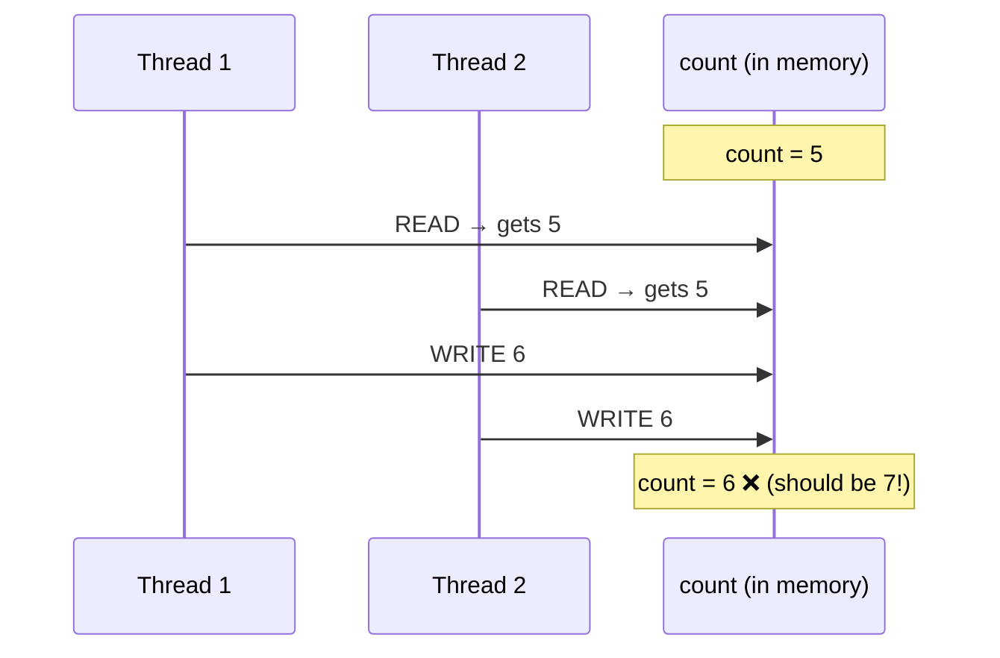
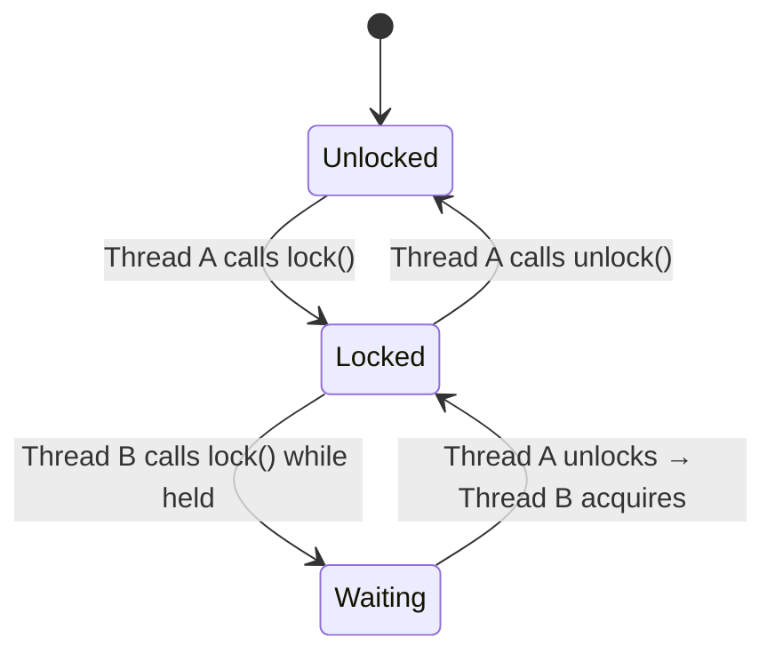
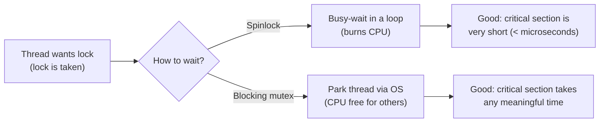
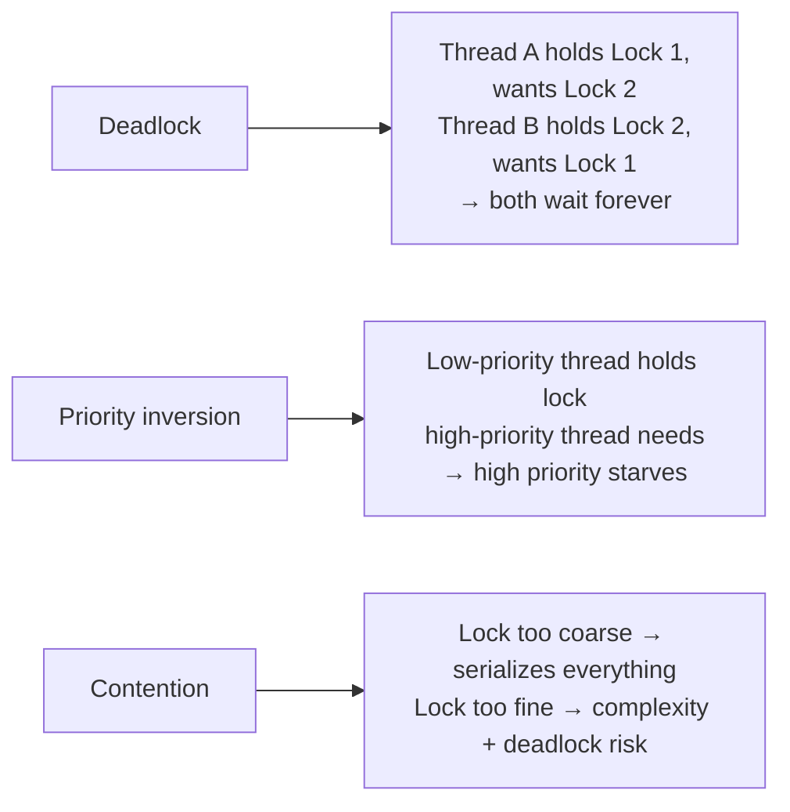

# Mutex Lock

## The core idea in plain English

Think of a single-stall bathroom at a café. There's one key hanging on the wall. When you want to use it, you take the key (lock). No one else can enter while you have it. When you leave, you hang the key back (unlock) and the next person can take it.

A **mutex** (mutual-exclusion lock) is exactly that: a token only one thread can hold at a time. Any other thread that tries to grab it will wait until it's released.

## Problem statement

Two or more threads access shared mutable state concurrently. Without coordination, their operations interleave and corrupt the state — a **race condition**.

Classic example: `count++` looks like one operation but is actually three:
1. Read `count` from memory
2. Increment it
3. Write it back

Two threads can both read the same value, both increment, and both write — losing one increment entirely.



## Solution / approach

A **mutex** ensures only one thread runs the critical section at a time.



```java
class Counter {
    private final Object lock = new Object();
    private long count = 0;

    void increment() {
        synchronized (lock) {   // acquire mutex
            count++;            // critical section — only one thread here at a time
        }                       // release on block exit (even on exception)
    }
}

// Or with explicit ReentrantLock:
ReentrantLock lock = new ReentrantLock();
lock.lock();
try {
    // critical section
} finally {
    lock.unlock();              // ALWAYS unlock in finally
}
```

### Key properties

- **Ownership**: a mutex is owned by the thread that locked it; only that thread may unlock it. (A *semaphore* has no ownership — that's the main distinction.)
- **Reentrancy**: a *reentrant* mutex lets the holding thread re-acquire it without deadlocking itself. Java's `synchronized` and `ReentrantLock` are reentrant.
- **Mutex vs binary semaphore**: a binary semaphore can be signaled by *any* thread and is used for signaling; a mutex is for locking and has ownership semantics.

### How is it implemented under the hood?

You can't implement a mutex with a simple "check the flag, then set it" — the check-then-set is itself a race. Real mutexes use a hardware **atomic instruction** like *compare-and-swap* (CAS) or *test-and-set*:

```
while (test_and_set(&locked) == 1) { /* spin or sleep */ }
```

Two strategies for the waiting part:



### The dangers



**Prevent deadlock** by: always acquiring locks in a consistent global order, using `tryLock` with timeouts, or using lock-free data structures.

**Fix priority inversion** with priority inheritance (the OS temporarily boosts the lock holder's priority).

## Interview gotchas

- Always release in a `finally` block — an exception in the critical section must not strand the lock.
- **Mutex vs Semaphore vs Read/Write lock**: mutex = one writer, ownership; semaphore = counter, no ownership, signaling; RW lock = many readers *or* one writer.
- Holding a lock across I/O or any blocking call is a classic performance bug — keep critical sections as short as possible.
