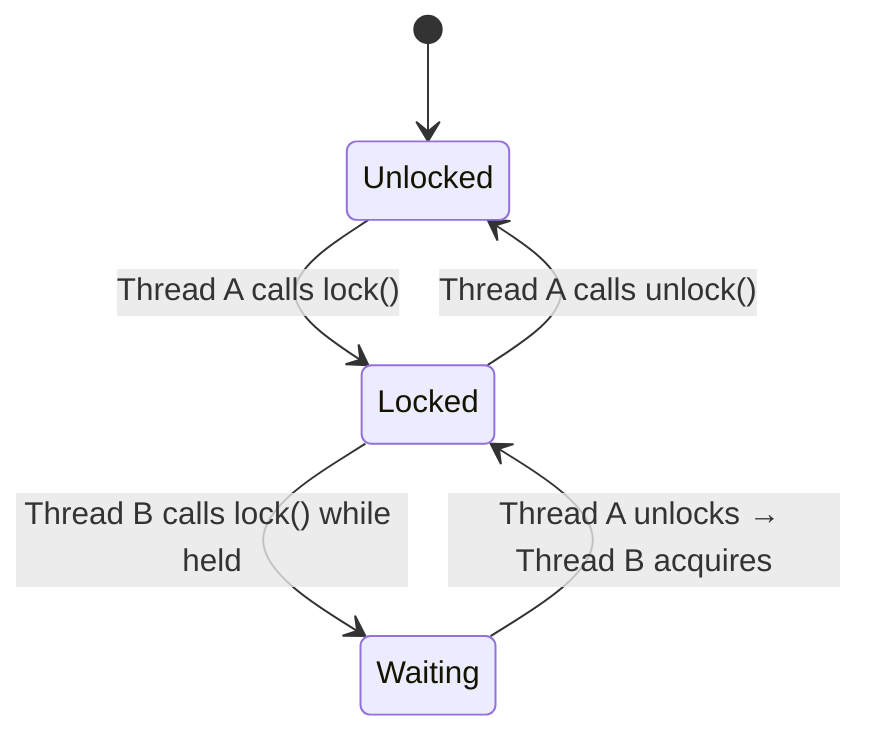
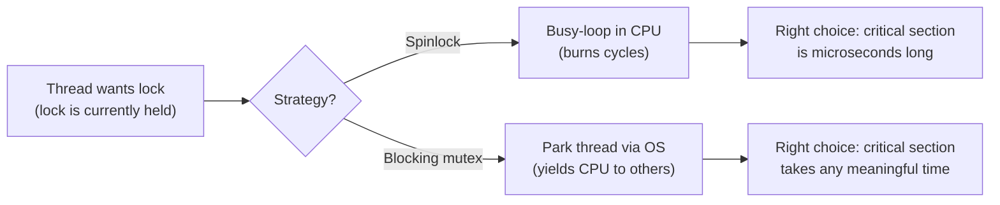
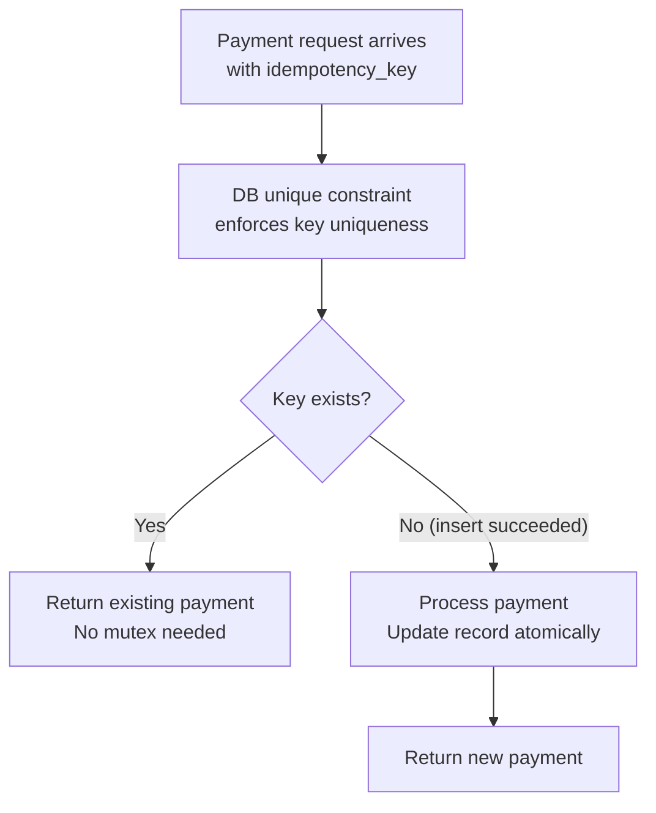

# Mutex Lock

<!-- meta
level: junior
domain: concurrency
prereqs: []
readtime: 16
incident-type: data corruption
-->

## The Incident

> **Payflow (B2B payments platform) · Q1 2023 · ~$2M daily transaction volume**

It was a Tuesday. Our engineering manager got a Slack message from the CFO at 9:14 AM: "Did we just charge 1,200 customers twice?" By 9:17 AM we had confirmed it. Between 09:01 and 09:04, 1,247 duplicate payment records had been created. Total amount incorrectly charged: $847,000.

The on-call team pulled the logs immediately. Every duplicate had the same shape: two payment records with the same `idempotency_key` and identical amounts, created within 50–200 milliseconds of each other. The `idempotency_key` was supposed to prevent this — if a key already existed, the payment endpoint was supposed to return the existing record instead of creating a new one. So why did it fail?

The code looked correct in isolation:

```python
existing = db.query("SELECT id FROM payments WHERE idempotency_key = ?", key)
if existing:
    return existing
payment = db.insert("INSERT INTO payments ...")
return payment
```

But at 09:01, we had deployed a new marketing campaign integration that spiked our concurrent payment requests from ~50/s to ~400/s. Under that load, two requests with the same `idempotency_key` arrived 30ms apart. Thread A checked — no existing record. Thread B checked — also no existing record (Thread A hadn't inserted yet). Thread A inserted. Thread B inserted. Both succeeded. 1,247 times.

The refunds took two weeks, three engineers, and one very uncomfortable call with our banking partner.

## Why Smart Engineers Get This Wrong

The mistake is treating "check then act" as a single atomic operation when it is two separate operations that can be interleaved. The code *reads correctly* — it checks, then acts. The problem is that in a concurrent system, another thread can execute between the check and the act.

Engineers who know about race conditions still make this mistake because they're thinking at the function level ("this function checks and inserts") rather than at the thread-interleaving level ("what happens if 50ms passes between these two lines while another thread is executing the same function?").

The second mistake: idempotency keys are often seen as an application-level concern and implemented entirely in application code. But application code runs concurrently across dozens of threads and servers. An idempotency check is only meaningful if the check-and-act is atomic — which requires either database-level constraints or explicit locking.

| What engineers assume | What actually happens |
|---|---|
| "check then act" is an atomic operation | The check and the act are separate — another thread runs between them |
| Idempotency key uniqueness logic belongs in application code | App code runs concurrently across threads; only the database can enforce uniqueness atomically |
| This only happens under high load, so low traffic protects us | Any two concurrent requests with the same key can race; load only increases probability |

## The Investigation Playbook

### 1. Identify the race window in 60 seconds

```sql
-- Find duplicate records that should be unique
SELECT idempotency_key, COUNT(*) as count, MIN(created_at), MAX(created_at),
       MAX(created_at) - MIN(created_at) AS race_window
FROM payments
WHERE created_at > NOW() - INTERVAL '1 hour'
GROUP BY idempotency_key
HAVING COUNT(*) > 1
ORDER BY count DESC;
```

> **What you're looking for:** Multiple records per idempotency_key with `race_window` in the 1–500ms range. That's the thread interleaving window.

### 2. Correlate with concurrency spike

```sql
-- Check request volume around the incident time
SELECT DATE_TRUNC('minute', created_at) AS minute, COUNT(*) AS requests
FROM payments
WHERE created_at BETWEEN '09:00' AND '09:10'
GROUP BY 1
ORDER BY 1;
```

> **What you're looking for:** Request volume spike in the minutes before the duplicates appear.

### 3. Find the missing constraint

```sql
-- Check if there's a unique constraint on idempotency_key (there should be)
SELECT constraint_name, constraint_type, column_name
FROM information_schema.table_constraints tc
JOIN information_schema.key_column_usage kcu USING (constraint_name)
WHERE tc.table_name = 'payments';
```

> **What you're looking for:** A UNIQUE constraint on `idempotency_key`. If it's missing, the DB is not enforcing uniqueness — you're depending entirely on application logic, which is the bug.

### 4. Immediate mitigation

```sql
-- Add the missing unique constraint (safe to run online in Postgres)
-- This will fail if duplicates already exist — deduplicate first
ALTER TABLE payments ADD CONSTRAINT payments_idempotency_key_unique
    UNIQUE (idempotency_key);
```

## The Fix at Three Altitudes

<!-- level:junior -->

### Junior: Understand It and Apply the Standard Fix

The fundamental problem is a **race condition**: two threads executing the same critical section interleave their operations. The fix is a **mutex** — a lock that ensures only one thread can execute the critical section at a time.



**In Java, the mutex is built into every object:**

```java
class PaymentService {
    private final Object lock = new Object();

    Payment createPayment(String idempotencyKey, Money amount) {
        synchronized (lock) {               // ONE thread at a time from here...
            Payment existing = db.findByIdempotencyKey(idempotencyKey);
            if (existing != null) return existing;

            return db.insert(new Payment(idempotencyKey, amount));
        }                                   // ...to here. Lock auto-released even on exception.
    }
}
```

Or with explicit `ReentrantLock` (gives you `tryLock` with timeout — useful for avoiding indefinite blocking):

```java
import java.util.concurrent.locks.ReentrantLock;

class PaymentService {
    private final ReentrantLock lock = new ReentrantLock();

    Payment createPayment(String idempotencyKey, Money amount) throws InterruptedException {
        if (!lock.tryLock(5, TimeUnit.SECONDS)) {
            throw new ServiceUnavailableException("Lock wait timeout");
        }
        try {
            Payment existing = db.findByIdempotencyKey(idempotencyKey);
            if (existing != null) return existing;
            return db.insert(new Payment(idempotencyKey, amount));
        } finally {
            lock.unlock(); // ALWAYS unlock in finally — exceptions must not strand the lock
        }
    }
}
```

**Key properties to know:**
- **Ownership**: only the thread that locked the mutex can unlock it. (A semaphore has no ownership — that's the main distinction.)
- **Reentrancy**: `ReentrantLock` and Java `synchronized` let the holding thread re-acquire without deadlocking itself.
- Always release in `finally` — an exception in the critical section must not leave the lock held forever.

<!-- /level:junior -->

<!-- level:senior -->

### Senior: Tune It, Operate It, Know When It Fails

An in-process mutex (`synchronized`, `ReentrantLock`) only works within **one JVM**. In a distributed system with 20 servers, Thread A on Server 1 and Thread B on Server 2 have completely separate lock objects — they don't protect each other.

For Payflow, the correct fix isn't a mutex. It's a **database-level unique constraint** with conflict handling:

```sql
-- Postgres: insert or return existing (atomic at DB level)
INSERT INTO payments (idempotency_key, amount, status)
VALUES (?, ?, 'pending')
ON CONFLICT (idempotency_key) DO NOTHING
RETURNING *;
```

```java
// If ON CONFLICT returns nothing, the record already existed — fetch it
Payment payment = db.insertOnConflictDoNothing(idempotencyKey, amount);
if (payment == null) {
    payment = db.findByIdempotencyKey(idempotencyKey);
}
return payment;
```

When you *do* need a distributed mutex (e.g. for a critical section that spans multiple services, or requires coordination beyond a single DB table), use a Redis-based lock:

```javascript
const lockKey = `lock:payment:${idempotencyKey}`;

async function createPaymentSafe(idempotencyKey, amount) {
  // SET NX PX: atomic "set if not exists" with auto-expiry
  const acquired = await redis.set(lockKey, '1', 'NX', 'PX', 10_000);

  if (!acquired) {
    // Another server holds the lock — this key is being processed
    throw new ConflictError('Payment with this idempotency key is in progress');
  }

  try {
    const existing = await db.findByIdempotencyKey(idempotencyKey);
    if (existing) return existing;
    return await db.insertPayment(idempotencyKey, amount);
  } finally {
    await redis.del(lockKey); // Release lock even on exception
  }
}
```

**Under the hood — how mutexes are implemented:** You cannot build a mutex with a simple "check the flag, then set it" — the check-then-set is itself a race. Real mutexes use atomic hardware instructions:

```
while (test_and_set(&locked) == 1) { /* spin or sleep */ }
```



**The three failure modes to instrument:**

1. **Deadlock** — Thread A holds Lock 1, wants Lock 2. Thread B holds Lock 2, wants Lock 1. Both wait forever. Detect with: lock wait timeout alerts (> 5s wait for any lock). Prevent with: always acquire locks in a consistent global ordering.
2. **Priority inversion** — Low-priority thread holds lock; high-priority thread needs it; high-priority thread starves. Detect with: high-priority task latency spikes while low-priority tasks run. Fix with: priority inheritance (OS-level) or avoid mixing priority levels that share locks.
3. **Lock too coarse** — Single lock on the entire payment service serializes all payments globally. Detect with: `lock.getQueueLength()` consistently > 10. Fix with: per-idempotency-key locks (stripe by key hash) rather than one global lock.

```java
// Striped locking: 256 independent locks, one per bucket of idempotency keys
private final Lock[] stripes = IntStream.range(0, 256)
    .mapToObj(i -> new ReentrantLock())
    .toArray(Lock[]::new);

Lock lockFor(String key) {
    return stripes[Math.abs(key.hashCode()) % stripes.length];
}
```

<!-- /level:senior -->

<!-- level:staff -->

### Staff: Design Systems That Don't Need This Fix

In-process mutexes protect shared memory within one process. Distributed locks protect coordination across multiple servers. But both are symptoms of a deeper design issue: **the check-then-act pattern is being applied to mutable shared state**.

The staff-level reframe: don't protect the race — **eliminate the race**. For the Payflow scenario, the correct solution is not a mutex at all. It's the database unique constraint plus **idempotency as a first-class architectural primitive**:



The DB constraint turns a concurrent coordination problem into a sequential uniqueness problem. The database handles the serialization at a level that's correct across all servers, all processes, and even across database replicas (with appropriate isolation).

For the general case — when you truly need a critical section across distributed nodes — the conversation to have with your team:

> "Before we add a distributed lock here, let's ask what we're actually protecting. If it's 'insert a unique record', the database constraint is the right tool — it's atomic, durable, and doesn't have lock expiry edge cases. If it's 'coordinate two services that both need to agree on state', that's a distributed transaction or a saga pattern. Distributed locks are the right tool for a narrow set of cases: short-lived coordination where the lock holder's crash has a bounded, acceptable blast radius. If lock holder death would corrupt state, we're using the wrong primitive."

**Prerequisites for the architectural alternative:** Your database must support unique constraints and upsert semantics (Postgres `ON CONFLICT`, MySQL `INSERT IGNORE`, etc.). For coordination across services without shared DB, event sourcing with idempotent event handlers eliminates the need for distributed locking in most cases.

<!-- /level:staff -->

## The Decision Tree

```mermaid
flowchart TD
    A["Seeing duplicate records or\ninconsistent state under concurrent load?"] --> B{Is this within\none process?}
    B -- Yes --> C["In-process mutex\nsynchronized / ReentrantLock"]
    B -- "No (multiple servers)" --> D{Is this a\ndatabase write?}
    D -- Yes --> E["DB unique constraint\n+ ON CONFLICT handling\n→ atomic, correct across all servers"]
    D -- "No (coordination across services)" --> F{Is the critical\nsection short-lived?}
    F -- "Yes (< 10s, crash is OK)" --> G["Redis distributed lock\nwith TTL auto-expiry"]
    F -- "No (long-lived, crash matters)" --> H["Saga pattern or\nidempotent event sourcing\n→ don't use a lock here"]
    C --> I{Lock contention high?\n(queue length > 10)}
    I -- Yes --> J["Striped locking\nor per-key lock granularity"]
    I -- No --> K["Done — monitor wait time"]
```

## Interview Gauntlet

### Junior questions

**Q: What is a mutex and what problem does it solve?**  
Expected: A mutex (mutual exclusion lock) ensures only one thread can execute a critical section at a time. It solves race conditions where multiple threads access shared mutable state concurrently and corrupt it.  
Follow-up that separates junior from senior: *"Java's `synchronized` works fine in one JVM. What happens when you have 20 servers?"*  
30-second one-liner: "A mutex is a token — only the thread holding it can execute the critical section. All other threads wait."

**Q: What must you always do when using an explicit lock?**  
Expected: Release in a `finally` block. An exception in the critical section must not leave the lock held indefinitely — that would deadlock all other threads waiting for it.  
The trap: `lock.lock(); doWork(); lock.unlock()` — if `doWork()` throws, `unlock()` is never called.

**Q: What's the difference between a mutex and a semaphore?**  
Expected: A mutex has *ownership* — only the thread that locked it can unlock it, and it's for mutual exclusion. A semaphore is a counter with no ownership concept — any thread can signal it — used for signaling and controlling access to a pool of N resources.  
Memorable distinction: "A mutex is a bathroom key — only the person who took it can return it. A semaphore is a parking garage counter — anyone can enter or exit."

### Senior questions

**Q: You have a payment service running on 20 servers. Customers are seeing occasional duplicate charges. Walk me through diagnosing and fixing it.**  
Expected: Query for duplicate idempotency_keys with timestamps close together (the race window). Check whether a unique DB constraint exists on idempotency_key — if not, that's the bug. Add the constraint with `ON CONFLICT DO NOTHING`. If the constraint is already there and duplicates still occur, check if the application is using different idempotency_key values for retries (client-side bug). In-process mutexes would not help across 20 servers.  
The trap: adding a distributed Redis lock — correct in concept but unnecessary if a DB unique constraint suffices and introduces lock expiry failure modes.

**Q: What is deadlock and how do you prevent it?**  
Expected: Deadlock is when Thread A holds Lock 1 and waits for Lock 2 while Thread B holds Lock 2 and waits for Lock 1 — both wait forever. Prevention: (1) always acquire locks in a consistent global ordering across all threads; (2) use `tryLock` with timeout so threads can back off and retry; (3) minimize the number of locks held simultaneously.  
The trap: "detect it and kill one thread" — detection is reactive and expensive. Prevention is always preferred.

### Staff questions

**Q: When would you use a distributed mutex versus a database transaction versus a saga pattern?**  
Expected: DB transaction when the consistency boundary is a single database — it's ACID, correct, and durable. Distributed mutex when you need short-lived coordination across services and lock holder death has acceptable blast radius (nothing corrupts, just retries). Saga pattern when the operation spans multiple services, is long-running, or lock holder death would leave state corrupted — sagas use compensating transactions instead of holding locks.  
The honest answer on saga vs mutex: "If I need to hold a lock for more than a few seconds, or across an I/O call to an external service, I'm using the wrong primitive. That's a saga or a workflow."

**Q: How does a mutex work at the hardware level?**  
Expected: Mutexes require an atomic "test-and-set" or compare-and-swap (CAS) operation that the hardware executes as an indivisible instruction. A pure software "check the flag then set it" is itself a race. CAS is the primitive: `CAS(&lock, expected=0, new=1)` returns old value atomically — if it returns 0, you acquired the lock; if it returns 1, someone else holds it. Spinlocks busy-loop on CAS; blocking mutexes call into the OS to park the thread when CAS fails.

## Connections

**Before this:** No prerequisites — this is the foundation of concurrency  
**After this:** [thundering-herd](/thundering-herd) (what happens when many threads wait on one event), deadlock (the failure mode that lurks inside mutex usage), distributed-locking (extending this pattern across servers)  
**Related incidents:**
- *Payflow (this incident)* — application-level check-then-act with no DB constraint; 1,247 duplicate payments in 3 minutes
- *Knight Capital 2012* — race condition in trading software caused $440M loss in 45 minutes; different mechanism, same class of problem
- *Therac-25 radiation machine (1980s)* — race condition in medical device software led to patient deaths; the canonical case for why concurrent programming correctness is not theoretical
