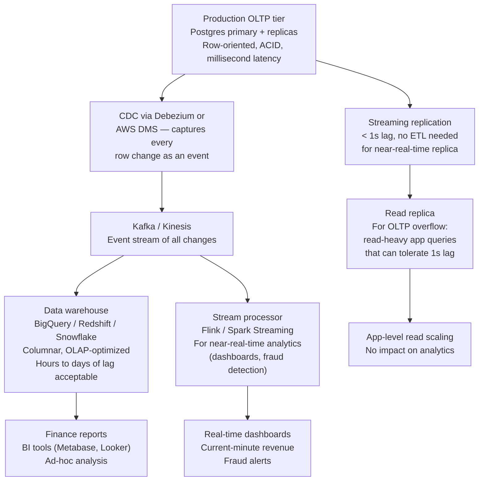
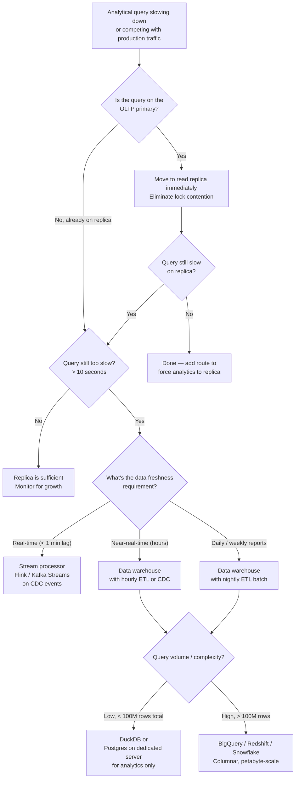

# OLTP vs OLAP

<!-- meta
level: senior
domain: data-storage
prereqs: []
readtime: 14
incident-type: lock contention
-->

## The Incident

> **Retailink (retail SaaS) · Q4 2023 · ~500k transactions/day, ~200 enterprise customers**

At 09:03 on a Monday morning, checkout latency for our entire platform spiked from P99 120ms to P99 8,200ms. Conversion dropped 44%. No deployment had happened since Friday. The on-call engineer checked the usual suspects: database CPU at 18% (normal), memory at 62% (normal), replication lag 0ms.

At 09:07, the DBA ran:

```sql
SELECT pid, wait_event_type, wait_event, state, query_start, query
FROM pg_stat_activity
WHERE state = 'active' AND wait_event IS NOT NULL
ORDER BY query_start ASC;
```

She found 53 checkout transactions in `Lock:relation` wait state, all queued behind a single query that had been running since 09:01:

```sql
SELECT
  DATE_TRUNC('month', o.created_at) AS month,
  p.category,
  SUM(oi.quantity * oi.unit_price) AS revenue,
  COUNT(DISTINCT o.customer_id) AS unique_customers,
  COUNT(*) AS total_orders
FROM orders o
JOIN order_items oi ON oi.order_id = o.id
JOIN products p ON p.id = oi.product_id
WHERE o.created_at >= '2023-01-01'
GROUP BY 1, 2
ORDER BY 1, 2;
```

This was the monthly revenue report. The finance team ran it manually every first Monday of the month at 9am. It scanned 23 months × ~500k orders = 11.5 million rows, joining across three tables, with a GROUP BY that required materializing the entire result set. It held shared locks on `orders`, `order_items`, and `products` for the duration.

The checkout service wrote to those same tables. The report's shared locks blocked the checkout writes. 53 checkouts queued. The queue grew faster than the report completed. By 09:15, the checkout service began timing out entirely.

The report finished at 09:43. The queue cleared by 09:51. Total impact: 48 minutes of severely degraded checkout for 200 enterprise customers.

## Why Smart Engineers Get This Wrong

The mistake is thinking "read queries don't block writes." In many databases, this is true at the row level — a row being read doesn't block a write to a different row. But analytical queries that scan entire tables, or queries inside transactions that hold shared locks during long aggregations, can block writes to any row in the table.

The deeper mistake is conflating two fundamentally different access patterns and assuming the same database serves both well. OLTP (Online Transaction Processing) means many small, fast, indexed reads and writes — milliseconds per operation, high concurrency. OLAP (Online Analytical Processing) means large aggregations over entire tables — scanning millions of rows to answer "what were our revenues by month and category for the past two years?" These two patterns have opposing requirements: OLTP needs low latency per operation; OLAP needs high throughput over large scans. A row-oriented database optimized for OLTP (Postgres, MySQL) is a poor choice for OLAP at scale.

| What engineers assume | What actually happens |
|---|---|
| Read queries don't affect write performance | A shared lock on a table held during a long aggregation can queue all concurrent writes to any row in that table |
| The production database handles both workloads | OLTP databases use row-oriented storage optimized for point reads; OLAP queries scan entire columns — the storage format is wrong for analytics |
| Running the report on a read replica is sufficient | Read replicas replicate the same row-oriented data; they eliminate lock contention on primary but still perform poorly on analytical queries at scale |

## The Investigation Playbook

### 1. Find blocking queries in real time

```sql
-- Find what's blocking and what's being blocked
SELECT
  blocked.pid AS blocked_pid,
  blocked.query AS blocked_query,
  blocking.pid AS blocking_pid,
  blocking.query AS blocking_query,
  now() - blocking.query_start AS blocking_duration
FROM pg_stat_activity AS blocked
JOIN pg_stat_activity AS blocking
  ON blocking.pid = ANY(pg_blocking_pids(blocked.pid))
WHERE blocked.cardinality(pg_blocking_pids(blocked.pid)) > 0
ORDER BY blocking_duration DESC;
```

> **What you're looking for:** A long-running query (blocking_duration > 30s) that multiple other queries are waiting on. The blocking query is your root cause.

### 2. Identify OLAP queries running on OLTP tables

```sql
-- Find long-running queries with high row counts (analytical pattern)
SELECT
  pid,
  now() - query_start AS duration,
  rows_examined,
  query
FROM pg_stat_activity
WHERE state = 'active'
  AND now() - query_start > INTERVAL '10 seconds'
ORDER BY duration DESC;
```

```sql
-- Check for table-level lock holders
SELECT
  locktype, relation::regclass AS table, mode, granted, pid
FROM pg_locks
WHERE NOT granted OR mode IN ('ShareLock', 'ExclusiveLock', 'AccessExclusiveLock')
ORDER BY granted ASC, table;
```

> **What you're looking for:** A query holding `ShareLock` or `AccessShareLock` on a table that your OLTP writes also need. Duration > 10 seconds on an OLTP table is a red flag.

### 3. Characterize the query workload split

```sql
-- Identify which queries are OLAP-shaped (large scans) vs OLTP-shaped (indexed lookups)
SELECT
  query,
  calls,
  mean_exec_time,
  rows / calls AS avg_rows_returned,
  total_exec_time
FROM pg_stat_statements
WHERE rows / calls > 10000  -- Returning more than 10k rows per call = analytical
ORDER BY total_exec_time DESC
LIMIT 20;
```

> **What you're looking for:** Queries with `avg_rows_returned > 10,000` — these are analytical queries that should not be running against your OLTP primary.

### 4. Estimate lock contention impact

```sql
-- How many transactions were delayed by lock waits? (requires pg_stat_statements)
SELECT
  wait_event,
  count(*) AS waits,
  avg(query_time_ms) AS avg_wait_ms
FROM pg_wait_sampling_history  -- requires pg_wait_sampling extension
WHERE wait_event_type = 'Lock'
GROUP BY wait_event
ORDER BY waits DESC;
```

> **What you're looking for:** `Lock:relation` waits correlating with the time window of the analytical query. This quantifies the blast radius.

## The Fix at Three Altitudes

<!-- level:junior -->

### Junior: Understand It and Apply the Standard Fix

**OLTP** (Online Transaction Processing) is the workload of your production application: individual inserts, updates, and point reads. "Order #12345 placed by user #789." Fast, indexed, high-concurrency.

**OLAP** (Online Analytical Processing) is the workload of your analytics: aggregations across millions of rows. "Total revenue by category and month for the past 2 years." Slow scan, sequential, low-concurrency.

```
OLTP query: find one order by ID
  SELECT * FROM orders WHERE id = 12345;
  Uses index → reads 1 row → returns in 1ms

OLAP query: aggregate 11 million rows
  SELECT month, category, SUM(revenue) FROM orders
  JOIN ... GROUP BY ...;
  Full scan → reads 11M rows → locks table for 40 minutes
```

**The standard fix: move analytical queries to a read replica**

```python
# Before: all queries on the same connection
db = create_engine(PRODUCTION_DB_URL)

# After: separate connections for OLTP and OLAP
oltp_db = create_engine(PRODUCTION_DB_PRIMARY_URL)     # Writes + fast reads
olap_db = create_engine(PRODUCTION_DB_REPLICA_URL)     # Analytical queries only

# Revenue report goes to replica — doesn't lock primary
def generate_monthly_revenue_report() -> pd.DataFrame:
    return pd.read_sql("""
        SELECT DATE_TRUNC('month', o.created_at) AS month,
               p.category, SUM(oi.quantity * oi.unit_price) AS revenue
        FROM orders o
        JOIN order_items oi ON oi.order_id = o.id
        JOIN products p ON p.id = oi.product_id
        WHERE o.created_at >= '2023-01-01'
        GROUP BY 1, 2 ORDER BY 1, 2
    """, con=olap_db)

# Checkout goes to primary
def create_order(customer_id: str, items: list) -> Order:
    with oltp_db.begin() as conn:
        # Insert, update inventory, etc.
```

This eliminates lock contention on the primary. The replica receives the same data via streaming replication with a delay of typically < 1 second.

**The limitation:** Read replicas use the same row-oriented storage format as the primary. Analytical queries still scan millions of rows — they're just no longer competing with OLTP writes. For fast analytics at scale, you need a different storage architecture (see Senior/Staff sections).

<!-- /level:junior -->

<!-- level:senior -->

### Senior: Tune It, Operate It, Know When It Fails

A read replica eliminates lock contention but doesn't solve the analytical query performance problem. A 40-minute report still takes 40 minutes on a replica. For reports that need to complete in seconds, the storage format matters.

**The two storage formats:**

```
Row-oriented (Postgres, MySQL) — OLTP optimized:
  Row 1: [order_id=1, customer=A, date=Jan1, amount=99.00, category=Electronics]
  Row 2: [order_id=2, customer=B, date=Jan1, amount=49.00, category=Clothing]
  
  Fast for: SELECT * WHERE id=1  (read one row → done)
  Slow for:  SELECT SUM(amount)  (must touch amount field in every row)

Column-oriented (BigQuery, Redshift, DuckDB, Parquet) — OLAP optimized:
  order_id column: [1, 2, 3, 4, ...]
  customer column: [A, B, C, D, ...]
  date column:     [Jan1, Jan1, Jan2, ...]
  amount column:   [99.00, 49.00, ...]  ← SUM reads only this column
  
  Fast for: SELECT SUM(amount)  (read only the amount column, compressed)
  Slow for: SELECT * WHERE id=1 (must assemble row from N column files)
```

**ETL pipeline to a data warehouse:**

```python
# Daily ETL: extract from Postgres, load to BigQuery
from google.cloud import bigquery
import pandas as pd
from sqlalchemy import create_engine

def daily_etl():
    pg = create_engine(POSTGRES_REPLICA_URL)
    bq = bigquery.Client()

    # Extract: pull yesterday's new records (incremental, not full scan)
    yesterday = pd.Timestamp.now() - pd.Timedelta(days=1)
    orders = pd.read_sql(f"""
        SELECT * FROM orders
        WHERE created_at >= '{yesterday.date()}'
          AND created_at < '{pd.Timestamp.now().date()}'
    """, con=pg)

    # Load to BigQuery (columnar, optimized for analytics)
    bq.load_table_from_dataframe(
        orders,
        destination="retailink-dw.analytics.orders",
        job_config=bigquery.LoadJobConfig(
            write_disposition="WRITE_APPEND",
            time_partitioning=bigquery.TimePartitioning(field="created_at"),
        )
    ).result()

# The monthly revenue report now queries BigQuery — no impact on Postgres at all
def generate_revenue_report():
    bq = bigquery.Client()
    result = bq.query("""
        SELECT DATE_TRUNC(created_at, MONTH) AS month, category,
               SUM(quantity * unit_price) AS revenue
        FROM `retailink-dw.analytics.orders` o
        JOIN `retailink-dw.analytics.order_items` oi USING (order_id)
        JOIN `retailink-dw.analytics.products` p USING (product_id)
        WHERE created_at >= '2023-01-01'
        GROUP BY 1, 2 ORDER BY 1, 2
    """).to_dataframe()
    return result
    # Same query that took 40 min in Postgres: runs in 4 seconds in BigQuery
```

**The three failure modes to instrument:**

1. **ETL lag** — analytics data is stale if ETL fails or falls behind. Monitor ETL job success and data freshness: alert if `MAX(created_at)` in the warehouse is > 48 hours behind the current time.

2. **Schema drift** — production Postgres schema changes without updating the ETL pipeline causes silent data gaps or type errors. Fix: schema validation step at the start of every ETL run.

3. **Data quality issues in the warehouse** — duplicates, missing records from failed ETL runs. Use incremental deduplication: `INSERT ... ON CONFLICT DO UPDATE` or BigQuery `MERGE` statements.

<!-- /level:senior -->

<!-- level:staff -->

### Staff: Design Systems That Don't Need This Fix

The Retailink incident was preventable at the architecture level. The system had no mechanism to prevent an analytical query from running on the OLTP primary, and no awareness that two fundamentally different workloads were competing for the same resource.

**The data platform architecture:**



**The organizational fix that matters more than the technical one:**

Technical solutions (read replica, data warehouse) eliminate the technical collision. But the incident will recur in a different form if the organization doesn't understand why OLTP and OLAP workloads must be separated. The fix is a policy:

> "Any query that scans more than 1 million rows is an analytical query. Analytical queries are not permitted on the production primary or its replicas without engineering review. Finance reports, dashboards, and ad-hoc data exploration go to the data warehouse, not to production Postgres."

**The self-serve analytics pattern that removes the bottleneck:**

When finance analysts can self-serve from the warehouse through a BI tool (Metabase, Looker, Tableau), they don't wait for engineers to run reports. This also removes the 9am Monday bottleneck: the analyst can run the report at 8am from the BI tool, and it queries the warehouse, not production.

> "Every time an analyst asks an engineer to 'pull some data from the database,' that's a sign we haven't given them the right self-serve tooling. A BI tool connected to the warehouse is the infrastructure investment that eliminates a class of production incidents — analytics queries on OLTP systems — and makes the data team independent. The cost of Metabase ($500/month) is less than the cost of one 48-minute checkout outage."

**Prerequisites for the architectural alternative:** A data warehouse (BigQuery, Redshift, Snowflake, or open-source alternatives like DuckDB for smaller scale). An ETL or CDC pipeline to keep it populated. A BI tool for analyst self-service. Organizational alignment that production databases are off-limits for analytical queries.

<!-- /level:staff -->

## The Decision Tree



## Interview Gauntlet

### Junior questions

**Q: What is the difference between OLTP and OLAP?**  
Expected: OLTP (Online Transaction Processing) handles many small, fast transactions: order placement, user logins, inventory updates. Each operation touches a few rows and completes in milliseconds. High concurrency, high write frequency. OLAP (Online Analytical Processing) handles large aggregations: revenue reports, trend analysis, user cohorts. Each operation may scan millions of rows and takes seconds to minutes. Low concurrency, read-heavy. The key conflict: OLAP scans the same tables OLTP writes to, causing lock contention.  
Follow-up that separates junior from senior: *"If I move the report to a read replica, does it solve the performance problem or just the lock contention problem?"*  
30-second one-liner: "OLTP: many fast writes and point reads — milliseconds per row. OLAP: few slow scans and aggregations — millions of rows per query. Same database serves both poorly."

**Q: A monthly report takes 40 minutes and blocks checkout. What's the immediate fix?**  
Expected: Move the report query to a read replica — this eliminates lock contention on the primary immediately. The report still takes 40 minutes, but it doesn't block writes anymore. For a faster report, you need a separate data warehouse with columnar storage. But for the immediate incident, read replica is the fastest fix.  
The trap: running the report at 2am instead of 9am. This reduces the user-facing impact but doesn't solve the architectural problem — any long-running table scan can still block writes.

### Senior questions

**Q: Why is a columnar database faster for analytics than a row-oriented database?**  
Expected: Row-oriented databases (Postgres, MySQL) store each row contiguously — all columns for row 1, then all columns for row 2. To compute `SUM(revenue)` across 11M rows, you read all columns of all 11M rows even though you only need `revenue`. Columnar databases store each column contiguously — all values of `revenue` together, then all values of `category`. To compute `SUM(revenue)`, you read only the `revenue` column — potentially 10-20× less I/O. Columnar databases also compress better because similar values are adjacent, and they can skip entire column chunks using min/max statistics (predicate pushdown).  
Follow-up: *"What queries perform worse in a columnar database than a row-oriented one?"*

**Q: Design an ETL pipeline that keeps a data warehouse in sync with a production Postgres database.**  
Expected: Two approaches: (1) Batch ETL: nightly job queries Postgres replica for records with `updated_at > last_run_timestamp`, transforms, and loads to warehouse. Simple, 24-hour lag, fragile if `updated_at` isn't reliably set on all tables. (2) CDC (Change Data Capture): Debezium or AWS DMS reads Postgres WAL (Write-Ahead Log) and emits every row change as an event to Kafka. A consumer writes to the warehouse. Lag is seconds to minutes, no polling, captures deletes that batch ETL misses. I'd recommend CDC for a production system: batch ETL has too many edge cases (soft deletes, backfills, schema changes) that produce silent data errors.  
The key tradeoff to name: CDC requires access to the Postgres WAL (replication slots), which adds replication slot overhead and can cause disk usage to grow if the consumer falls behind.

### Staff questions

**Q: Your company runs analytics directly on the production database. Engineering says "we'll add indexes and it'll be fine." Why is this wrong?**  
Expected: Indexes help OLTP queries (point reads on indexed columns) but hurt OLAP queries: an index scan on 11M rows is slower than a sequential scan because random I/O from the index is worse than sequential I/O from a full scan. Adding more indexes to support OLAP queries increases write overhead (every write must update all indexes). More fundamentally: the row-oriented storage format of Postgres is wrong for analytical queries regardless of indexing. You can't index your way from O(n) full-table scan to O(1) column aggregation — the storage format must change. The engineering time spent adding indexes for analytics is better spent building a proper data warehouse pipeline.  
The organizational point: "indexes will fix it" is a local optimization that delays the right architectural investment. The business case for a data warehouse is that it removes an entire class of production incidents and enables analyst self-service.

## Connections

**Before this:** [autovacuum-postgresql](/autovacuum-postgresql) — understanding Postgres internals helps with OLTP optimization  
**After this:** [sargable-query](/sargable-query) (query optimization within OLTP), [unlogged-table-postgresql](/unlogged-table-postgresql)  
**Related incidents:**
- *Retailink (this incident)* — monthly revenue report on production Postgres primary locked checkout for 48 minutes; 44% conversion drop
- *Etsy (2012, blog post)* — ran analytics against production MySQL; moved to Hadoop for analytics after repeated production impact
- *Pinterest (2015, engineering blog)* — MySQL could not handle both transactional and analytical workloads; migrated analytics to Redshift; cited as a canonical OLTP/OLAP separation story
