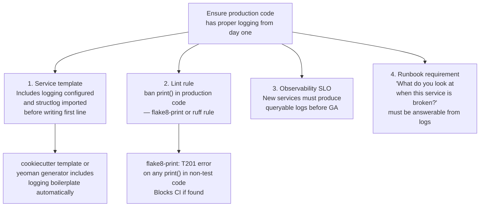
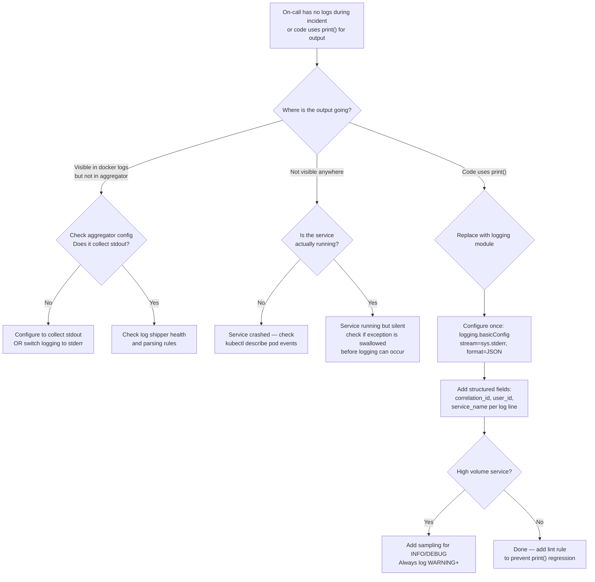

# print() vs Structured Logger

<!-- meta
level: junior
domain: reliability
prereqs: []
readtime: 10
incident-type: observability failure
-->

## The Incident

> **Watchdog (monitoring SaaS — ironically) · Q1 2024 · ~30k customers, internal Python microservice**

At 03:22 on a Tuesday, PagerDuty fired: our `/webhooks/ingest` endpoint had a 0% success rate. Every webhook from our customers was failing silently. No payload was being processed. No notification was being sent.

The on-call engineer went to Datadog immediately. The dashboard was dark — no logs from `webhook-processor` for the past 2 hours and 18 minutes. No errors. No stack traces. No request logs. Nothing. The service was running (health checks were green), processing traffic (the request counter was incrementing), but producing zero observable output.

We checked the Datadog log shipper first: healthy, ingesting 40 GB/hour from other services. We checked the container's log driver configuration: `json-file`, correct. We checked the Datadog agent on the host: running, connected. Every piece of log infrastructure was operating correctly.

At 04:55, 93 minutes into the incident, an engineer SSHed directly into the container:

```bash
docker logs webhook-processor --tail 50
```

The logs were there — hundreds of lines per second. But they were all on `stdout`. Our Datadog agent was configured to collect only `stderr`. The service had been printing to `stdout` using Python's `print()` for all logging, and every line was going silently to `/dev/null` from Datadog's perspective.

The root cause was one decision from 18 months earlier: a developer had bootstrapped the service quickly using `print()` statements for debugging and never replaced them with a proper logger. The service had grown from a 200-line prototype to a 4,000-line production service without ever getting a logging framework.

The outage itself was a separate bug (a malformed payload validation regex). But finding and fixing that bug took 4 hours instead of the usual 20 minutes — entirely because the on-call had no logs.

## Why Smart Engineers Get This Wrong

The mistake is treating observability as something you add after the code works. `print()` gives immediate, visible feedback during development — you run the code, you see the output. It feels like logging. It produces text that looks like logs. Developers who are focused on getting the feature right postpone "proper logging" as a polish task that never happens.

The second mistake is not understanding that `print()` is not a logging primitive. `print()` is a display function — it writes to `stdout`, synchronously, with no metadata (no timestamp, no severity, no context), and with no way to filter, sample, or route output. A logger is infrastructure — it attaches metadata, routes to the right destination, and respects severity levels so you can dial up or down the noise without code changes.

| What engineers assume | What actually happens |
|---|---|
| print() and logging are functionally equivalent for observability | print() goes to stdout; your log aggregator may collect only stderr; print() output disappears silently |
| You can replace print() with a logger later | The service grows; the "later" never comes; production incidents happen first |
| stdout is always captured | Container log drivers, sidecar collectors, and log shippers have configurable capture behavior; stdout is not guaranteed |

## The Investigation Playbook

### 1. Confirm where output is going

```bash
# Check what the running container is actually outputting
docker logs <container-id> --tail 100

# Check if your log collector is configured for stdout, stderr, or both
kubectl describe pod <pod-name> | grep -A 10 "Log"

# For Datadog: check which streams are being tailed
cat /etc/datadog-agent/conf.d/python.d/conf.yaml | grep "source"
```

> **What you're looking for:** Logs appearing in `docker logs` but not in your log aggregator = miscollection. No output in `docker logs` at all = the service is truly not logging.

### 2. Find all print() calls in your service

```bash
# Find print() calls that should be logger calls
grep -rn "^\s*print(" --include="*.py" . \
  | grep -v "test_\|\.test\.\|_test.py"  # Exclude test files

# Count them
grep -rn "^\s*print(" --include="*.py" . | wc -l
```

> **What you're looking for:** Any `print()` call in production code (outside tests). Each one is a log line that may be going to the wrong stream.

### 3. Check your log aggregator configuration

```bash
# Docker: what logging driver is configured?
docker inspect <container-id> | jq '.[].HostConfig.LogConfig'

# Check if stdout AND stderr are both forwarded
# For Fluentd:
cat /etc/fluent/fluent.conf | grep -A 5 "source"
# For Filebeat:
cat /etc/filebeat/filebeat.yml | grep -A 10 "docker"
```

> **What you're looking for:** Log configuration that collects only `stderr` and ignores `stdout` — this is the silent log disappearance scenario.

### 4. Verify structured log output is parseable

```bash
# Send a test log and confirm it appears in your aggregator with correct fields
python3 -c "
import logging, json, sys
logging.basicConfig(stream=sys.stderr, level=logging.DEBUG,
  format='{\"time\": \"%(asctime)s\", \"level\": \"%(levelname)s\", \"msg\": \"%(message)s\"}')
logging.info('test log entry')
"

# Then immediately check your log aggregator for this entry
```

> **What you're looking for:** The test entry appearing in your aggregator within 10 seconds with the correct fields parsed. If it doesn't appear, your log pipeline is broken — fix that before the next incident.

## The Fix at Three Altitudes

<!-- level:junior -->

### Junior: Understand It and Apply the Standard Fix

Replace `print()` with Python's `logging` module. The key difference: a logger has a **level** (DEBUG, INFO, WARNING, ERROR, CRITICAL), a **destination** (stdout, stderr, file, network), and **metadata** (timestamp, module, line number) — all configurable without changing code.

```python
# BEFORE: print() — unstructured, goes to stdout, no metadata
def process_webhook(payload: dict) -> None:
    print(f"Processing webhook: {payload['event_type']}")
    result = handle_event(payload)
    print(f"Done: {result}")

# AFTER: logging module — structured, configurable destination, searchable
import logging

logger = logging.getLogger(__name__)  # Logger named after module

def process_webhook(payload: dict) -> None:
    logger.info("Processing webhook", extra={"event_type": payload["event_type"]})
    result = handle_event(payload)
    logger.info("Webhook processed", extra={"event_type": payload["event_type"], "result": result})
```

**Setup: configure logging once at application startup, not in every module:**

```python
# main.py or app/__init__.py — configure once
import logging
import sys

logging.basicConfig(
    level=logging.INFO,      # Show INFO and above; DEBUG is suppressed in production
    stream=sys.stderr,       # stderr — collected by all log shippers by default
    format="%(asctime)s %(levelname)s %(name)s %(message)s"
)

# Or for structured JSON logging (parseable by Datadog, Splunk, etc.):
import json, time

class JSONFormatter(logging.Formatter):
    def format(self, record: logging.LogRecord) -> str:
        return json.dumps({
            "time": time.strftime("%Y-%m-%dT%H:%M:%SZ", time.gmtime(record.created)),
            "level": record.levelname,
            "logger": record.name,
            "msg": record.getMessage(),
            **(record.__dict__.get("extra_fields", {}))
        })

handler = logging.StreamHandler(sys.stderr)
handler.setFormatter(JSONFormatter())
logging.root.addHandler(handler)
logging.root.setLevel(logging.INFO)
```

**Use the right level for each message:**

```python
logger.debug("Detailed trace info — disabled in production")
logger.info("Normal operational events: request received, job completed")
logger.warning("Unexpected but handled: retry #3, using fallback")
logger.error("Operation failed: exception, bad payload, downstream down")
logger.critical("System unusable: can't connect to DB, out of disk")
```

**Context matters — include IDs that let you trace a request:**

```python
# Without context (useless in production):
logger.error("Failed to process webhook")

# With context (debuggable in production):
logger.error("Failed to process webhook",
             extra={"webhook_id": webhook.id,
                    "customer_id": webhook.customer_id,
                    "event_type": webhook.event_type,
                    "error": str(e)})
```

<!-- /level:junior -->

<!-- level:senior -->

### Senior: Tune It, Operate It, Know When It Fails

In production, logging is infrastructure — it needs to be configured for performance, reliability, and queryability, not just correctness.

**Structured logging with structlog (Python):**

```python
import structlog

# Configure once at startup
structlog.configure(
    processors=[
        structlog.stdlib.filter_by_level,
        structlog.stdlib.add_logger_name,
        structlog.stdlib.add_log_level,
        structlog.processors.TimeStamper(fmt="iso"),
        structlog.processors.StackInfoRenderer(),
        structlog.processors.format_exc_info,
        structlog.processors.JSONRenderer(),  # Machine-parseable JSON
    ],
    wrapper_class=structlog.stdlib.BoundLogger,
    context_class=dict,
    logger_factory=structlog.stdlib.LoggerFactory(),
)

log = structlog.get_logger()

# Usage: bound context propagates automatically
def process_webhook(webhook_id: str, customer_id: str, event_type: str) -> None:
    bound_log = log.bind(webhook_id=webhook_id, customer_id=customer_id)
    bound_log.info("processing_started", event_type=event_type)
    try:
        result = handle_event(event_type)
        bound_log.info("processing_completed", result=result)
    except Exception as e:
        bound_log.error("processing_failed", error=str(e), exc_info=True)
        raise
```

**Log sampling for high-volume services:**

```python
import random

class SampledLogger:
    def __init__(self, logger, sample_rate: float = 0.01):
        self._logger = logger
        self._rate = sample_rate

    def debug(self, *args, **kwargs):
        if random.random() < self._rate:
            self._logger.debug(*args, **kwargs)

    def info(self, *args, **kwargs):
        if random.random() < self._rate:
            self._logger.info(*args, **kwargs)

    # Always log warnings and errors regardless of sample rate
    def warning(self, *args, **kwargs): self._logger.warning(*args, **kwargs)
    def error(self, *args, **kwargs): self._logger.error(*args, **kwargs)

# Use for high-frequency success paths; always log errors fully
sampled_log = SampledLogger(log, sample_rate=0.01)  # Log 1% of INFO
```

**The three failure modes to monitor:**

1. **Log volume causing OOM or disk exhaustion** — DEBUG logs in production can generate 100× more volume than INFO. Always set `LOG_LEVEL=INFO` in production. Alert if log ingestion rate > expected baseline × 2.

2. **Synchronous logging blocking the event loop** — Python's default `StreamHandler` is synchronous. In async code (FastAPI, asyncio), use `QueueHandler` to offload log writing to a background thread:
   ```python
   from logging.handlers import QueueHandler, QueueListener
   import queue
   
   log_queue = queue.Queue()
   queue_handler = QueueHandler(log_queue)
   stderr_handler = logging.StreamHandler(sys.stderr)
   listener = QueueListener(log_queue, stderr_handler)
   listener.start()
   logging.root.addHandler(queue_handler)
   ```

3. **Sensitive data in logs** — customer emails, payment card numbers, and passwords appearing in log messages. Fix: redaction middleware in the log formatter.
   ```python
   import re
   REDACT_PATTERNS = [
       (re.compile(r'\b\d{4}[\s-]?\d{4}[\s-]?\d{4}[\s-]?\d{4}\b'), '[CARD]'),
       (re.compile(r'[a-zA-Z0-9._%+-]+@[a-zA-Z0-9.-]+\.[a-zA-Z]{2,}'), '[EMAIL]'),
   ]
   ```

<!-- /level:senior -->

<!-- level:staff -->

### Staff: Design Systems That Don't Need This Fix

`print()` in production code is a symptom of two problems: logging is not part of the "definition of done" for the team, and there's no mechanism to enforce logging standards at the point where they matter — the initial code review.

**The systemic prevention approach:**



**Logging as a SLO gate:**

Before a service goes to production, it must satisfy:
- All ERROR logs include: service name, correlation ID, user/customer context, error message, stack trace
- INFO logs are machine-parseable JSON (queryable by Datadog, Splunk, etc.)
- DEBUG logs are suppressed in production (`LOG_LEVEL=INFO`)
- Log pipeline test: deploy to staging, inject a known error, confirm it appears in the log aggregator within 60 seconds

**The runbook test:** For every service, you should be able to answer "the service is throwing errors — what Datadog query do I run first?" If you can't answer that question before the service ships, the service isn't observable.

```python
# The service template that makes print() obsolete from line 1
# every new service starts with this, not with "hello world"

import structlog
import logging
import sys

def configure_logging():
    structlog.configure(
        processors=[
            structlog.processors.TimeStamper(fmt="iso"),
            structlog.stdlib.add_log_level,
            structlog.stdlib.add_logger_name,
            structlog.processors.JSONRenderer(),
        ],
        logger_factory=structlog.stdlib.LoggerFactory(),
    )
    logging.basicConfig(stream=sys.stderr, level=logging.INFO)

# Call at service startup
configure_logging()
log = structlog.get_logger()
```

> "We're shipping a service that handles production traffic. The question isn't 'does it work?' — it's 'when it breaks at 3am, can the on-call diagnose it without SSHing into the container?' If the answer is no, the service isn't production-ready, regardless of test coverage."

**Prerequisites for the architectural alternative:** Team agreement that logging is part of the definition of done. A linter rule (flake8-print or ruff `T201`) enforced in CI. A service template that includes structured logging by default. These are low-cost, high-value investments that pay off at the first incident.

<!-- /level:staff -->

## The Decision Tree



## Interview Gauntlet

### Junior questions

**Q: What is the difference between print() and a logging framework?**  
Expected: `print()` writes unstructured text to stdout with no metadata, no severity level, no routing control, and no way to filter. A logging framework (Python's `logging`, Go's `log/slog`, Java's SLF4J) adds: severity levels (DEBUG/INFO/WARNING/ERROR/CRITICAL), configurable destination (stdout, stderr, file, network), structured fields for machine parsing, timestamps, and the ability to change verbosity at runtime without code changes. In production, logs need to be machine-parseable (for Datadog/Splunk queries), routed to the right destination, and filterable by severity — none of which print() provides.  
Follow-up that separates junior from senior: *"Why should production logging go to stderr rather than stdout?"*  
30-second one-liner: "print() is display — unstructured, fixed destination, no severity. A logger is infrastructure — structured, configurable, queryable."

**Q: Why should you avoid print() in production code?**  
Expected: Three reasons: (1) Destination: print() goes to stdout; most log shippers are configured for stderr; output may be silently lost. (2) Structure: print() produces unstructured strings that can't be queried or filtered by log aggregators. (3) Control: you can't turn off print() output without code changes; loggers support log levels so you can suppress debug output in production via config.  
The concrete scenario: a container crash at 3am with only print() logs means the on-call has to SSH into the container to see output — which may no longer exist if the container has restarted.

### Senior questions

**Q: A service produces 50GB of logs per day. How do you manage this?**  
Expected: (1) Set `LOG_LEVEL=INFO` in production — DEBUG logs typically produce 10-100× more volume and are almost never needed at steady-state. (2) Sample high-frequency INFO paths — for a service processing 10k RPS, logging every successful request at INFO produces 864M entries per day; sample 1% and you get 8.6M entries, still more than enough for analysis. (3) Always log WARNING and above fully — never sample errors. (4) Use log aggregator features: Datadog exclusion filters to drop known-noisy log patterns at ingestion time. (5) Alert on log volume anomalies — a spike in INFO volume often precedes a spike in ERROR volume.  
The trap: reducing log volume by removing error logs or making errors conditional — these are the logs you'll desperately need at 3am.

**Q: How do you add request correlation IDs to logs so you can trace a single request across multiple log lines?**  
Expected: Use context variables (Python contextvars, Go context.Context, Java MDC) to store a correlation ID at request entry and include it in every log line within that request's scope.
```python
from contextvars import ContextVar
import uuid
import structlog

request_id_var: ContextVar[str] = ContextVar('request_id', default='')

def add_request_id(logger, method, event_dict):
    event_dict['request_id'] = request_id_var.get()
    return event_dict

structlog.configure(processors=[add_request_id, ...])

# In request middleware:
def middleware(request):
    token = request_id_var.set(request.headers.get('X-Request-ID', str(uuid.uuid4())))
    try:
        return next_handler(request)
    finally:
        request_id_var.reset(token)
```
Every log line within the request now automatically includes the `request_id`. Searching Datadog for `request_id:abc123` shows all logs for that specific request across all services.

### Staff questions

**Q: How do you enforce logging standards across a team of 30 engineers shipping 15 services?**  
Expected: Three mechanisms: (1) Cookiecutter/template: every new service starts from a template that includes structured logging configured correctly — developers never start from scratch. (2) Lint rule: `flake8-print` or ruff `T201` blocks CI on any `print()` call in non-test code. (3) Observability review: in the launch checklist for any new service, there's a required step "trigger a known error in staging and confirm it appears in Datadog within 60 seconds with correct fields." This makes observability a launch gate, not an afterthought. The meta-point: you can't code-review your way to logging standards across 30 engineers — you need to make the correct behavior the path of least resistance (template) and make the incorrect behavior a CI blocker (lint).

## Connections

**Before this:** No prerequisites — this is foundational operational hygiene  
**After this:** [autovacuum-postgresql](/autovacuum-postgresql) (observability-driven diagnosis), distributed-tracing (the evolution of structured logging for multi-service requests)  
**Related incidents:**
- *Watchdog (this incident)* — print() sent all logs to stdout; Datadog collected only stderr; on-call had zero visibility for 93 minutes; 4-hour outage instead of 20-minute fix
- *GitHub (2012)* — widely cited case where inadequate logging made a complex incident nearly impossible to diagnose; prompted internal investment in structured logging infrastructure
- *Knight Capital (2012)* — inadequate logging was cited as a contributing factor in the $440M trading loss; engineers couldn't reconstruct what happened in real-time without proper audit logs
