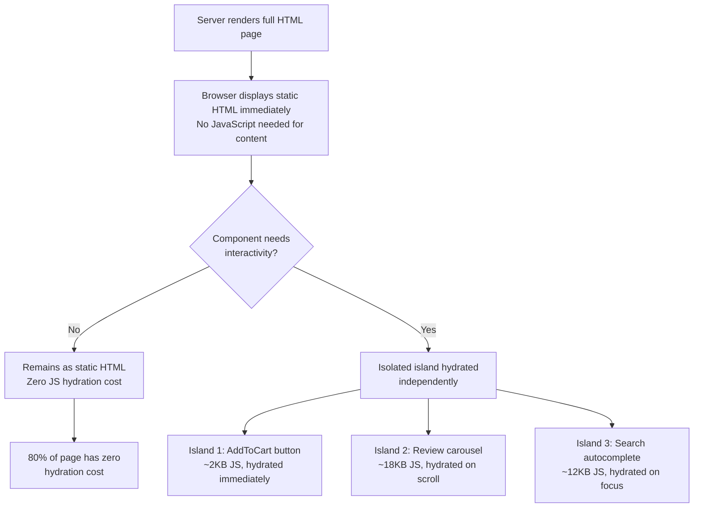
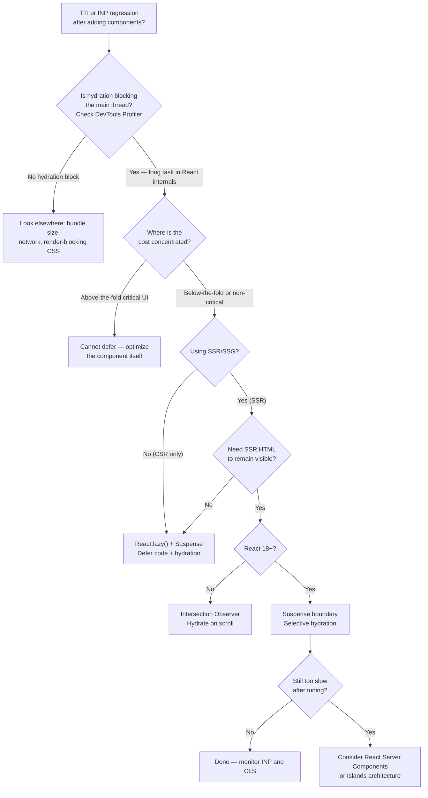

# Progressive Hydration

<!-- meta
level: senior
domain: architecture-patterns
prereqs: []
readtime: 13
incident-type: Core Web Vitals regression
-->

## The Incident

> **Luminar (e-commerce platform) · Q4 2023 · ~400k DAU, 18k RPS peak on sale days**

We shipped the Black Friday update at 22:00 Thursday — a React 18 migration we'd been planning for three months. By 02:14 Friday, our Core Web Vitals dashboard showed TTI (Time to Interactive) had climbed from 2.1s to 8.9s. Conversion had dropped 31%.

The on-call team checked everything in the obvious order. Server response times: P99 at 180ms, unchanged. CDN cache hit rate: 94%, unchanged. Network waterfall in DevTools: HTML arrived in 210ms, JavaScript bundle in 340ms — both fine. Every metric on the server side was green.

At 03:40, a frontend engineer opened Chrome DevTools Performance tab and recorded a page load. That's when we saw it: a 6.2-second block labeled **"Hydration"** — the browser was frozen while React reconciled the server-rendered HTML with the JavaScript component tree. The entire 340KB component tree, including the footer, the cookie banner, and the recommendations sidebar below the fold, was hydrating simultaneously before the user could interact with anything.

The moment of realization was a single line in the profiler flame chart: `performConcurrentWorkOnRoot` holding the main thread for 6,189ms. All of it happening before the first interactive event could fire.

## Why Smart Engineers Get This Wrong

The mistake is treating hydration as a binary operation: "the page is either hydrated or not." Engineers who understand SSR think of hydration as a performance win — server renders HTML fast, client attaches event handlers. The implicit assumption is that hydration is cheap. It's not — for large React trees, hydration is essentially a full component render of the entire page, just without the DOM creation step.

When React 18 introduced streaming SSR and concurrent hydration, teams migrated for the correct reasons (better streaming, Suspense support) but carried over the old mental model: hydrate the whole app from the root. React 18's `hydrateRoot()` behaves just like React 17's — it hydrates everything eagerly, blocking the main thread.

The second mistake: judging hydration cost in development, where the component tree is small and HMR is running. Production apps have 3–5× more components than dev, often with deeply nested provider trees.

| What engineers assume | What actually happens |
|---|---|
| Hydration is cheap because the DOM nodes already exist | React still builds a full virtual DOM tree and reconciles against the DOM — cost is O(component count), not O(changed nodes) |
| React 18 concurrent mode makes hydration non-blocking | `hydrateRoot()` is still synchronous for the initial pass; concurrency helps with updates, not initial hydration |
| What matters is JavaScript download time | JS parse + hydration can dwarf download time; a 340KB bundle can take 6s to hydrate on a mid-range phone |

## The Investigation Playbook

### 1. Measure actual hydration cost

Open Chrome DevTools → Performance tab → Record page load. Look for:

```
performConcurrentWorkOnRoot (React internals)
├── renderRootSync / renderRootConcurrent
│   └── workLoopSync (the reconciliation loop)
└── commitRoot (DOM updates)
```

> **What you're looking for:** Any `workLoopSync` block longer than 50ms — that's a long task that blocks user interaction. Sum all React-attributed blocks to get total hydration cost.

### 2. Identify below-the-fold components

```javascript
// Quick audit: which rendered components are outside the viewport?
document.querySelectorAll('[data-component]').forEach(el => {
  const rect = el.getBoundingClientRect();
  if (rect.top > window.innerHeight) {
    console.log('Below fold:', el.dataset.component, `(${Math.round(rect.top)}px)`);
  }
});
```

> **What you're looking for:** Complex components (recommendation carousels, rich footers, comment sections) that are not visible on initial load and could be deferred.

### 3. Measure per-subtree hydration time

```javascript
// Add timing marks around suspected heavy subtrees
performance.mark('hydrate-recommendations-start');
// (React hydrates synchronously; measure after render completes)
performance.mark('hydrate-recommendations-end');
performance.measure('hydrate-recommendations',
  'hydrate-recommendations-start', 'hydrate-recommendations-end');
console.log(performance.getEntriesByName('hydrate-recommendations')[0].duration + 'ms');
```

> **What you're looking for:** Subtrees that consume > 20% of total hydration time but sit below the fold or are not immediately interactive.

### 4. Check bundle for deferrable code

```bash
# Analyze what's in your JavaScript bundle
npx vite-bundle-visualizer
# or: npx webpack-bundle-analyzer stats.json
```

> **What you're looking for:** Large libraries (chart.js, rich text editors, video players) included in the main bundle but only used by below-the-fold components.

## The Fix at Three Altitudes

<!-- level:junior -->

### Junior: Understand It and Apply the Standard Fix

**Hydration** is when React runs on the client and attaches event handlers to server-rendered HTML. The browser has the HTML (from SSR) but it's inert — no JavaScript events. React hydrates by rendering the component tree and reconciling against the existing DOM.

The problem: React hydrates the **entire tree at once** before anything is interactive.

```
Server sends HTML: <header> <main> <footer>   ← visible immediately

React hydrates (BLOCKS main thread for 6s):
  header ────────────────────────────────────
  main   ────────────────────────────────────
  footer ────────────────────────────────────
                              ↑ 0 interactions work until here
```

**The standard fix: lazy-load below-the-fold components**

```tsx
import { lazy, Suspense } from 'react';

// Before: imports everything eagerly
import RecommendationSidebar from './RecommendationSidebar';
import Footer from './Footer';
import CookieBanner from './CookieBanner';

// After: lazy imports — code-split and deferred
const RecommendationSidebar = lazy(() => import('./RecommendationSidebar'));
const Footer = lazy(() => import('./Footer'));
const CookieBanner = lazy(() => import('./CookieBanner'));

function Page() {
  return (
    <>
      <Header />          {/* Hydrated immediately */}
      <ProductGrid />     {/* Hydrated immediately — above the fold */}

      <Suspense fallback={<FooterSkeleton />}>
        <Footer />        {/* Hydrated lazily — below the fold */}
      </Suspense>

      <Suspense fallback={null}>
        <CookieBanner />  {/* Hydrated lazily — not critical path */}
      </Suspense>
    </>
  );
}
```

`lazy()` + `Suspense` does two things: (1) splits the bundle so the component's JS isn't downloaded until needed, (2) defers hydration of that subtree until the chunk loads.

**Key property:** `lazy()` requires the component to be rendered inside a `<Suspense>` boundary, otherwise React throws. The `fallback` prop controls what shows while loading.

<!-- /level:junior -->

<!-- level:senior -->

### Senior: Tune It, Operate It, Know When It Fails

`lazy()` defers hydration but has a UX cost on SSR pages: React replaces the server-rendered HTML with the `Suspense` fallback during hydration until the chunk loads — causing a flash of skeleton content. For content that's already visible in the HTML, you want the HTML to remain while hydration is deferred — that's **selective hydration**, not just lazy loading.

**React 18 selective hydration with `<Suspense>` boundaries:**

```tsx
// With React 18, each Suspense boundary creates a hydration boundary.
// React prioritizes hydrating what the user interacts with first.

function App() {
  return (
    <Layout>
      <Suspense fallback={<NavSkeleton />}>
        <Navigation />         {/* High priority — user clicks nav */}
      </Suspense>

      <Suspense fallback={<HeroSkeleton />}>
        <HeroSection />        {/* High priority — above the fold */}
      </Suspense>

      <Suspense fallback={<GridSkeleton />}>
        <ProductGrid />        {/* Medium priority — main content */}
      </Suspense>

      <Suspense fallback={null}>
        <RecommendationSidebar /> {/* Low priority — below fold */}
      </Suspense>
    </Layout>
  );
}
```

React 18 hydrates in order, but if the user clicks a `Navigation` element before it's hydrated, React **bumps that boundary to the front of the hydration queue** and replays the click event after hydration. This is interaction-driven priority.

**Intersection Observer hydration (defer until component scrolls into view):**

```tsx
import { useState, useEffect, useRef } from 'react';

function LazyHydrate({
  children,
  fallback = null,
}: {
  children: React.ReactNode;
  fallback?: React.ReactNode;
}) {
  const ref = useRef<HTMLDivElement>(null);
  const [hydrated, setHydrated] = useState(false);

  useEffect(() => {
    const observer = new IntersectionObserver(
      ([entry]) => {
        if (entry.isIntersecting) {
          setHydrated(true);
          observer.disconnect();
        }
      },
      { rootMargin: '200px' } // Start hydrating 200px before entering viewport
    );
    if (ref.current) observer.observe(ref.current);
    return () => observer.disconnect();
  }, []);

  return <div ref={ref}>{hydrated ? children : fallback}</div>;
}

// Usage
<LazyHydrate fallback={<RecommendationsSkeleton />}>
  <ProductRecommendations />
</LazyHydrate>
```

**The three failure modes to instrument:**

1. **CLS (Cumulative Layout Shift) from skeleton swaps** — if the skeleton has different dimensions than the real component, the page shifts on hydration. Target CLS < 0.1. Measure with `web-vitals` library.

2. **Hydration mismatch errors** — when SSR HTML doesn't match client render, React logs warnings and refills the DOM, doubling the DOM work. Watch for "Hydration failed because the initial UI does not match" in console.

3. **Below-the-fold content not crawled** — Googlebot runs JavaScript but may not scroll infinitely. If content is behind Intersection Observer, verify it appears in Google Search Console.

**Monitoring setup:**

```javascript
import { onINP, onLCP, onCLS } from 'web-vitals';

onINP(metric => analytics.track('inp', { value: metric.value }));
onLCP(metric => analytics.track('lcp', { value: metric.value }));
onCLS(metric => analytics.track('cls', { value: metric.value }));
// Alert threshold: INP > 200ms (Google's "needs improvement"), LCP > 2.5s
```

<!-- /level:senior -->

<!-- level:staff -->

### Staff: Design Systems That Don't Need This Fix

Progressive hydration is a mitigation for a deeper architectural decision: **running a monolithic client-side framework on a document-oriented web page.**

The staff reframe: if we need complex hydration priority management, we're fighting the browser's natural model. The browser is very good at loading and rendering HTML progressively. React's hydration fights this by requiring the entire JavaScript tree to reconcile before interaction.

**The Islands Architecture:**



With React, you approximate islands via React Server Components (RSC):

```tsx
// This component runs ONLY on the server — no JS shipped to client at all
// app/products/[id]/page.tsx (Next.js App Router)
async function ProductPage({ params }) {
  const product = await db.products.findOne(params.id);
  const reviews = await db.reviews.find({ productId: params.id });

  return (
    <div>
      {/* Server components — rendered to HTML, zero JS hydration */}
      <ProductDescription product={product} />
      <ReviewList reviews={reviews} />

      {/* 'use client' — only this component ships JS and hydrates */}
      <AddToCartButton productId={product.id} price={product.price} />
    </div>
  );
}
```

`ProductDescription` and `ReviewList` are never shipped as JavaScript. Only `AddToCartButton` hydrates — and it's the only component that needs to be interactive.

> "Before we add another Suspense boundary, I want to ask: which parts of this page actually need to be a React component on the client? If it's just rendering data the server already has, that's a Server Component. We should be shrinking the hydration surface, not managing its priority."

**Prerequisites for the architectural alternative:** RSC requires a framework that supports them (Next.js 13+ App Router, Remix with RSC) and rethinking data fetching from client-side hooks to server-side awaits. Not appropriate for purely client-side apps or when real-time client state is shared across the entire component tree.

<!-- /level:staff -->

## The Decision Tree



## Interview Gauntlet

### Junior questions

**Q: What is hydration and why does it take time?**  
Expected: Hydration is when React runs on the client and attaches event handlers to server-rendered HTML. It takes time because React builds a full virtual DOM of every component and reconciles it against the existing DOM — cost scales with component count, not just visible DOM nodes.  
Follow-up that separates junior from senior: *"If the server already sent the HTML, why does React need to re-render the components?"*  
30-second one-liner: "Hydration is React claiming the server-rendered HTML — it re-runs every component to build the virtual DOM and match it against the real DOM before events can fire."

**Q: What does React.lazy() do and what does it require?**  
Expected: `React.lazy()` enables code splitting — the component's JavaScript isn't downloaded or executed until it's first rendered. It requires wrapping the lazy component in a `<Suspense>` boundary with a fallback. Combined, they defer both the download and hydration of non-critical components.  
The trap: `lazy()` alone doesn't defer hydration on SSR pages without `Suspense` — React will throw a runtime error if there's no `Suspense` ancestor.

### Senior questions

**Q: What is the difference between code splitting and progressive hydration?**  
Expected: Code splitting reduces the JavaScript sent on first load; progressive hydration controls when and which components are hydrated. Code splitting is a prerequisite — you can't progressively hydrate a component whose code is already in the main bundle. On SSR pages, code-splitting a component also defers its hydration until the split chunk loads, coupling the two effects.  
Follow-up: *"If you code-split a component above the fold, what happens to your LCP?"*

**Q: How does React 18 decide which Suspense boundary to hydrate first?**  
Expected: React 18 hydrates boundaries in tree order by default. But user interaction interrupts the queue — if a user clicks on an unhydrated boundary, React immediately prioritizes that boundary, hydrates it synchronously, fires the event, then continues lower-priority boundaries. Discrete events (click, keydown) are replayed; scroll and pointer events are not.  
The subtle point: React won't replay events that fire during hydration of a sibling boundary — only the boundary the user directly interacted with gets the event replayed.

### Staff questions

**Q: When would you choose Islands architecture over React with progressive hydration?**  
Expected: Islands architecture is preferable for content-heavy pages with isolated interactive widgets (e-commerce PDPs, marketing pages, blogs). Progressive hydration within React is right when complex client state is shared across many components, or when migrating an existing app where a framework change isn't feasible. Islands eliminate the problem — no hydration overhead for static sections — but require Astro, Fresh, or RSC which have different programming models. The honest answer: most content-heavy pages should probably not be a React SPA at all.  
Follow-up: *"How would you handle a component that's static 95% of the time but interactive when a user is logged in?"*

## Connections

**Before this:** No prerequisites — but understanding React rendering lifecycle helps  
**After this:** [factory-pattern](/factory-pattern) (component architecture that scales), server-components (the evolution beyond progressive hydration)  
**Related incidents:**
- *Etsy 2020* — deferring non-critical JavaScript reduced TTI by 30%, attributed to significant conversion impact
- *Shopify Storefront (2022)* — island-by-island hydration was a key cited decision in their storefront architecture migration
- *Google Web Vitals research (2023)* — INP replaced FID as a Core Web Vital specifically because hydration-driven input delays were widespread across React SPAs
