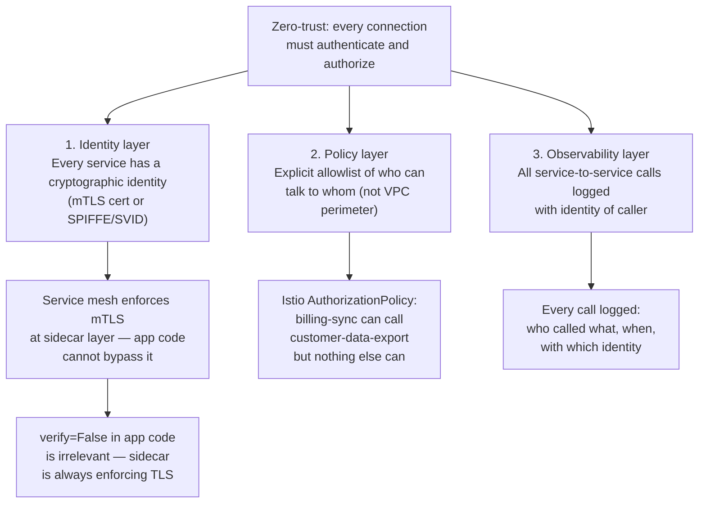
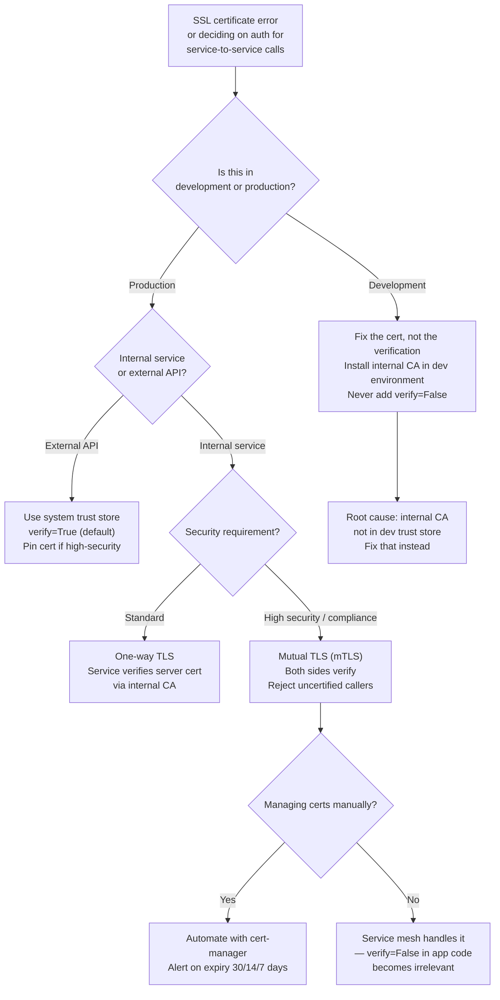

# Public Key Cryptography

<!-- meta
level: senior
domain: distributed-systems
prereqs: []
readtime: 15
incident-type: security incident
-->

## The Incident

> **Chainmesh (B2B data pipeline platform) · Q2 2023 · ~500 enterprise customers, internal microservices handling PII and payment data**

At 14:30 on a Wednesday, our security team flagged unusual activity during a routine audit: two of our internal microservices — `billing-sync` and `customer-data-export` — were receiving requests from an IP address that wasn't in our VPC. The services were supposed to be internal-only, communicating over HTTPS with mutual TLS.

The on-call engineer pulled the code for `billing-sync`. Six weeks earlier, during a microservices migration, a developer had added `verify_ssl=False` to the internal HTTP client in a single-line PR:

```python
# Added to fix "SSL: CERTIFICATE_VERIFY_FAILED" error during local dev
response = requests.get(
    f"http://internal-api.chainmesh.svc/v1/customers/{customer_id}",
    verify=False  # TODO: fix cert issue properly
)
```

The TODO was never addressed. The PR was approved in 3 minutes with the comment "quick fix, will address properly later." It shipped to production that Friday.

For 6 hours, an attacker with temporary access to a compromised EC2 instance in our subnet had been performing a man-in-the-middle attack on the `billing-sync` → `customer-data-export` traffic. They intercepted 847 billing sync requests, each containing customer ID, email, and the last four digits of payment methods. The `verify=False` flag meant our service accepted the attacker's self-signed certificate as legitimate.

The moment of realization: an engineer ran `grep -r "verify=False" --include="*.py" .` across the entire codebase. It returned 14 files.

## Why Smart Engineers Get This Wrong

The mistake is treating SSL certificate verification as an operational nuisance rather than the core security mechanism. When you get `SSL: CERTIFICATE_VERIFY_FAILED` during development, it feels like a local environment problem — your dev cert is self-signed, the internal CA isn't trusted, whatever. The immediate fix is to disable verification, and the code ships before anyone goes back to fix it properly.

The second mistake is thinking that internal services don't need TLS because they're "behind the firewall." The VPC perimeter model — "external traffic is untrusted, internal traffic is trusted" — fails in three common scenarios: a compromised EC2 instance in the VPC, a developer laptop on the corporate VPN, or lateral movement after an initial compromise. Modern zero-trust architecture treats internal traffic with the same suspicion as external traffic.

| What engineers assume | What actually happens |
|---|---|
| `verify=False` is safe in a private VPC | Any host in the VPC (or on VPN) can perform MITM; the firewall only prevents external entry, not internal interception |
| SSL errors in dev mean "environment problem, fix later" | `verify=False` ships to production and removes the authentication that TLS provides to the client |
| HTTPS means encrypted, therefore secure | HTTPS with `verify=False` encrypts traffic to whoever presents a certificate — including an attacker. Encryption without verification provides false security. |

## The Investigation Playbook

### 1. Find all disabled certificate verification

```bash
# Python
grep -rn "verify=False" --include="*.py" . 
grep -rn "ssl._create_unverified_context\|ssl.CERT_NONE" --include="*.py" .

# Node.js
grep -rn "rejectUnauthorized: false\|NODE_TLS_REJECT_UNAUTHORIZED" --include="*.js" --include="*.ts" .

# Go
grep -rn "InsecureSkipVerify: true" --include="*.go" .

# Java
grep -rn "TrustAllCerts\|ALLOW_ALL_HOSTNAME_VERIFIER\|NullHostnameVerifier" --include="*.java" .
```

> **What you're looking for:** Any instance of disabled certificate verification. Even one in a low-traffic service is a critical finding. Treat `verify=False` as equivalent to "no encryption at all" for security purposes.

### 2. Identify what traffic was interceptable

```sql
-- Check which requests went through the vulnerable service
SELECT
  request_id, customer_id, endpoint, timestamp, source_ip, destination_ip
FROM audit_log
WHERE service = 'billing-sync'
  AND timestamp BETWEEN '2023-06-14 08:30:00' AND '2023-06-14 14:30:00'
  AND destination_ip NOT IN (SELECT ip FROM internal_services)
ORDER BY timestamp;
```

> **What you're looking for:** Requests where the destination IP is not a known internal service — these are requests that may have been intercepted and proxied.

### 3. Check certificate validation configuration in all services

```bash
# List TLS configuration across all running containers
kubectl get configmaps,secrets -A -o json | jq '.items[] | select(.metadata.name | contains("tls"))'

# Check what cert each service is presenting
for svc in billing-sync customer-data-export auth-service; do
  echo "=== $svc ==="
  openssl s_client -connect "${svc}.internal:443" -showcerts 2>/dev/null \
    | openssl x509 -noout -subject -issuer -dates
done
```

> **What you're looking for:** Services presenting self-signed certificates (issuer = subject) or certificates not signed by your internal CA. These services can be impersonated with any cert.

### 4. Trace what data was in the intercepted requests

```bash
# Parse your request logs for the affected time window
grep "billing-sync" /var/log/app/requests.log \
  | awk -F'\t' '$2 >= "2023-06-14T08:30" && $2 <= "2023-06-14T14:30"' \
  | jq -r '[.customer_id, .endpoint, .timestamp] | @csv'
```

> **What you're looking for:** Which customers, which data fields, and which endpoints were accessed during the attack window. This is your breach notification scope.

## The Fix at Three Altitudes

<!-- level:junior -->

### Junior: Understand It and Apply the Standard Fix

**Public key cryptography** is built on a key pair: a **public key** you share freely and a **private key** you keep secret. Data encrypted with the public key can only be decrypted with the private key, and vice versa. This solves two problems at once:

1. **Confidentiality**: only the holder of the private key can read messages encrypted to their public key
2. **Authentication**: only the holder of the private key can produce a signature that verifies against the public key

TLS uses this for the **handshake**: when your service connects to another service, the server presents a **certificate** — essentially "here is my public key, signed by a Certificate Authority (CA) that we both trust." Your client verifies that signature. If the certificate is signed by a CA you trust, you can be sure you're talking to the right server.

```
Without verify=False (correct):
  Client → Server: "Hello, who are you?"
  Server → Client: "I am billing-api.internal. Here's my cert, signed by our CA."
  Client → CA: "Did you sign this cert?"  [CA's public key is bundled in the client]
  CA verification: PASSES — cert is legitimate
  Client: "OK, I'll use your public key to establish an encrypted session."

With verify=False (broken):
  Client → Attacker: "Hello, who are you?"
  Attacker → Client: "I am billing-api.internal. Here's my self-signed cert."
  Client: [does not check who signed it]
  Client: "OK, I'll use your public key to establish an encrypted session."
  Attacker: [has the private key, decrypts all traffic]
```

**The immediate fix:**

```python
# Remove verify=False entirely — this is the fix
response = requests.get(
    "https://internal-api.chainmesh.svc/v1/customers/{customer_id}",
    verify="/etc/ssl/certs/chainmesh-internal-ca.crt"  # path to internal CA cert bundle
)

# Or, if using the system trust store (which should include your CA):
response = requests.get(url)  # verify=True is the default — just remove the flag
```

**To fix the internal CA cert issue (why verify=False was added):**

```bash
# Add your internal CA certificate to the system trust store in your Docker image
COPY internal-ca.crt /usr/local/share/ca-certificates/chainmesh-internal-ca.crt
RUN update-ca-certificates
```

<!-- /level:junior -->

<!-- level:senior -->

### Senior: Tune It, Operate It, Know When It Fails

One-way TLS (server presents a cert, client verifies it) stops passive eavesdropping and impersonation. But for internal service-to-service communication, you often want **mutual TLS (mTLS)** — both sides present certificates, both sides verify. This proves "I am Service A talking to Service B, and Service B has confirmed it is Service B talking to Service A."

**mTLS implementation:**

```python
import requests

# Both client and server present certificates
response = requests.get(
    "https://billing-sync.internal.chainmesh.com/v1/sync",
    cert=(
        "/etc/ssl/certs/billing-sync-client.crt",   # Client's certificate
        "/etc/ssl/private/billing-sync-client.key",  # Client's private key
    ),
    verify="/etc/ssl/certs/chainmesh-internal-ca.crt"  # Server cert must be signed by this CA
)
```

```python
# Server side (FastAPI/uvicorn example)
import ssl

ssl_context = ssl.create_default_context(ssl.Purpose.CLIENT_AUTH)
ssl_context.verify_mode = ssl.CERT_REQUIRED  # Reject clients without valid cert
ssl_context.load_verify_locations("/etc/ssl/certs/chainmesh-internal-ca.crt")
ssl_context.load_cert_chain(
    certfile="/etc/ssl/certs/billing-sync-server.crt",
    keyfile="/etc/ssl/private/billing-sync-server.key"
)

# In the service: reject requests without a valid client cert
if not request.headers.get("X-Client-Cert-Subject"):
    raise HTTPException(status_code=401, detail="Client certificate required")
```

**Certificate lifecycle — the three failure modes:**

1. **Certificate expiry** — TLS certs have an expiry date. If a cert expires, the service becomes unreachable with "certificate expired" errors. Fix: automate renewal with cert-manager (Kubernetes) or AWS Certificate Manager. Alert at 30, 14, and 7 days before expiry.
   ```bash
   # Check cert expiry dates across all services
   for svc in $(kubectl get services -n internal -o name); do
     openssl s_client -connect "${svc##*/}.internal:443" 2>/dev/null \
       | openssl x509 -noout -enddate
   done
   ```

2. **Private key compromise** — if the private key leaks, an attacker can impersonate the service. Fix: revoke the certificate immediately via your CA's CRL (Certificate Revocation List) or OCSP. Rotate the cert. Check audit logs for misuse during the exposure window.

3. **CA compromise** — if your internal CA's private key leaks, all certificates signed by it are untrustworthy. Fix: rotate the CA, reissue all leaf certs. This is the nuclear scenario — design your CA key handling with hardware security modules (HSMs) and offline root CAs.

**Service mesh for automatic mTLS:**

```yaml
# Istio: enable strict mTLS for the entire mesh
# No code changes needed — the sidecar proxy handles all TLS
apiVersion: security.istio.io/v1beta1
kind: PeerAuthentication
metadata:
  name: default
  namespace: internal
spec:
  mtls:
    mode: STRICT  # Reject any plaintext or unverified traffic
```

With a service mesh, `verify=False` in application code becomes moot — the sidecar proxy enforces TLS at the network level regardless of what the application does.

<!-- /level:senior -->

<!-- level:staff -->

### Staff: Design Systems That Don't Need This Fix

The `verify=False` incident happened because a developer hit a local dev problem, applied a quick fix, and the system had no mechanism to catch it before production. The architectural question: why did one line of application code have the power to disable the security of an entire service's communications?

**Zero-trust network architecture (the right model):**



**Why the VPC perimeter model fails:**

The traditional model is "trust everything inside the VPC, distrust everything outside." This fails when:
- A build server, CI runner, or developer laptop is on the VPN
- A single compromised container gains lateral movement capability
- A supply chain attack executes in a trusted internal service

Zero-trust replaces "is this traffic internal?" with "can this specific identity make this specific call?" — and cryptographically verifies the identity every time.

**The policy-as-code approach to prevent verify=False:**

```yaml
# OPA policy: block deployments with verify=False
package deployments

deny[msg] {
  input.kind == "Deployment"
  container := input.spec.template.spec.containers[_]
  env := container.env[_]
  env.name == "PYTHONHTTPSVERIFY"
  env.value == "0"
  msg := sprintf("Container %v disables SSL verification", [container.name])
}
```

```bash
# CI step: scan for verify=False before any merge
grep -rn "verify=False\|rejectUnauthorized.*false\|InsecureSkipVerify.*true" \
  --include="*.py" --include="*.js" --include="*.ts" --include="*.go" . \
  && echo "FAIL: Disabled SSL verification found" && exit 1 \
  || echo "PASS: No disabled SSL verification"
```

> "The question we should have asked before the incident is: what would an engineer do when they hit a cert error in local dev? If the answer is 'add verify=False,' we've designed a trap. The right answer is: your local dev environment should have the same internal CA cert installed as production. Make the correct path the easy path."

**Prerequisites for the architectural alternative:** Service mesh (Istio, Linkerd) or cloud-native mTLS (AWS App Mesh, GCP Traffic Director). SPIFFE/SPIRE for workload identity. OPA or Kyverno for policy enforcement in CI/CD. These are non-trivial investments — appropriate for platforms handling PII, financial data, or compliance-scoped workloads.

<!-- /level:staff -->

## The Decision Tree



## Interview Gauntlet

### Junior questions

**Q: What is the difference between encryption and authentication in TLS?**  
Expected: Encryption hides the content of the communication — even if intercepted, it's unreadable. Authentication proves who you're talking to — the server's certificate, signed by a CA, proves the server is who it claims to be. TLS provides both, but `verify=False` disables authentication while keeping encryption. This means traffic is encrypted but you don't know who you're encrypting it to — which is exactly the MITM vulnerability.  
Follow-up that separates junior from senior: *"If the traffic is encrypted with verify=False, what exactly can an attacker do?"*  
30-second one-liner: "Encryption scrambles the data; authentication proves who you're sending it to. verify=False keeps scrambling but lets anyone pretend to be the server."

**Q: What is a Certificate Authority and why does TLS depend on it?**  
Expected: A CA is a trusted third party that signs (certifies) public keys with its own private key, creating a certificate. When your client sees a server's certificate, it checks: "Is this signed by a CA I trust?" The client ships with a list of trusted CAs (the trust store). This is a chain of trust: you trust the CA, the CA vouches for the server's identity, therefore you trust the server's public key. If you bypass this check (`verify=False`), you accept any certificate regardless of who signed it.  
The trap: confusing the CA with the server itself. The CA only vouches for the binding between identity and public key; it doesn't run the server.

### Senior questions

**Q: What is mutual TLS and when do you need it versus one-way TLS?**  
Expected: In one-way TLS, only the server presents a certificate — the client verifies the server's identity but the server doesn't verify the client's. In mTLS, both parties present certificates — the server also verifies the client's identity. One-way TLS is sufficient for public APIs (you don't need to know which browser is calling you). mTLS is required for internal service-to-service communication where you want to enforce "only the billing service can call the payment service" — not just encryption, but authorization based on cryptographic identity.  
The nuance: mTLS adds certificate lifecycle management overhead for every service. Service meshes (Istio, Linkerd) automate certificate issuance and rotation, making mTLS practical at scale.

**Q: A service-to-service call fails with "certificate expired." Walk me through diagnosing and fixing it without downtime.**  
Expected: First, check expiry: `openssl s_client -connect service.internal:443 2>/dev/null | openssl x509 -noout -enddate`. If expired, check if cert-manager or your rotation automation failed: `kubectl describe certificaterequest -n namespace`. Issue a new cert manually: `kubectl cert-manager renew cert-name`. Deploy the new cert to the service (either via secret rotation or by restarting the pod to pick up the new secret). Then fix the automation that missed the renewal. To prevent recurrence: add expiry monitoring at 30/14/7 days with PagerDuty integration.  
The key: cert rotation should require zero downtime — services should pick up new certs without restart via file watch or secret mount refresh.

### Staff questions

**Q: Your security team mandates zero-trust between all internal services. You have 50 microservices currently using internal HTTP with no auth. What's your migration plan?**  
Expected: Phase 1 (visibility): deploy a service mesh in permissive mode — log all traffic, enforce nothing. Use the logs to map service-to-service communication patterns. This is 2 weeks. Phase 2 (encryption only): enable mTLS in permissive mode — encrypt traffic but don't reject unencrypted calls yet. Services get certs automatically. Phase 3 (enforcement): switch to strict mode for verified service pairs. Use the communication map from Phase 1 to write AuthorizationPolicies. Migrate teams in order of risk (high-PII services first). Phase 4 (audit): review policy coverage, instrument cert rotation, add expiry alerting. The migration preserves availability at every phase and avoids a flag-day cutover.  
The key anti-pattern to call out: a "big bang" mTLS migration that enables strict mode on all 50 services simultaneously. Always migrate incrementally with rollback capability.

## Connections

**Before this:** No prerequisites — but understanding TCP/IP and HTTP basics helps  
**After this:** [jwt-vs-session](/jwt-vs-session) (authentication tokens use asymmetric signing), zero-trust-networking, certificate-management  
**Related incidents:**
- *Chainmesh (this incident)* — verify=False shipped to production; MITM intercepted 847 internal billing requests over 6 hours
- *DigiNotar (2011)* — fraudulent certificate authority; attacker issued valid-looking certs for Google.com; intercepted Iranian Gmail users' traffic for months
- *Cloudflare (2023)* — Thanksgiving incident partially traced to certificate handling edge cases; illustrates how critical cert infrastructure is to distributed systems
