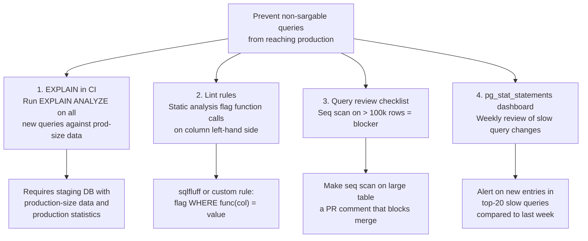
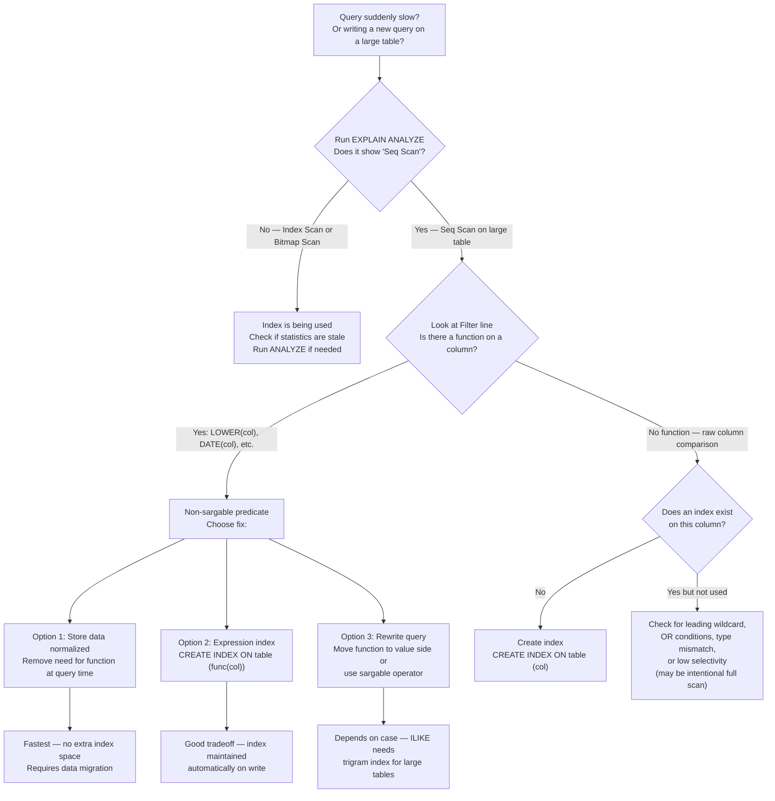

# Sargable Queries and Index Usage

<!-- meta
level: senior
domain: data-storage
prereqs: []
readtime: 12
incident-type: latency spike
-->

## The Incident

> **Archival (document management SaaS) · Q3 2023 · ~80k DAU, 4.2M documents indexed**

Our user search went from P99 50ms to P99 12,000ms overnight. No deployments in 48 hours. No schema changes. No spike in traffic. The on-call team checked everything that had changed: autovacuum stats showed nothing unusual, replication lag was 0ms, connection pool was at 30% capacity. The indexes existed. The query planner had been working fine yesterday.

We ran `VACUUM ANALYZE users` just in case. No change. We restarted the read replica the search queries were hitting. No change. We added more connections to the pool. No change. P99 sat at 12 seconds.

At 03:10, a DBA ran `EXPLAIN ANALYZE` on the slow query directly:

```
Seq Scan on users  (cost=0.00..284317.33 rows=4200000 width=312) 
                   (actual time=0.022..11847.293 rows=4 loops=1)
  Filter: (lower((email)::text) = 'alice@example.com')
  Rows Removed by Filter: 4199996
```

A sequential scan on 4.2 million rows. The filter was `lower((email)::text)` — calling the `lower()` function on every row. The index on `email` was being completely ignored.

The actual query, added by a developer three days earlier as part of a "case-insensitive search" feature:

```sql
SELECT * FROM users WHERE LOWER(email) = LOWER($1)
```

The index was on `email` (the raw column). The query was filtering on `LOWER(email)` (a function of the column). These are different things to the Postgres query planner.

## Why Smart Engineers Get This Wrong

The mistake is treating indexes as column references when they are actually **expressions**. Engineers who know "there's an index on the email column" assume any query against `email` will use that index. But an index on `email` contains sorted values of `email`. A query filtering on `LOWER(email)` needs sorted values of `LOWER(email)` — which is a different sorted set, and doesn't exist unless you created an index on the expression explicitly.

The second mistake is conflating "the index exists" with "the index is usable." `\d users` shows the index is there. `EXPLAIN` shows the planner isn't using it. Developers who skip `EXPLAIN` before deploying query changes will only discover non-sargable queries in production, when the table has millions of rows.

**Sargable** stands for "Search ARGument ABLE" — a predicate is sargable if the query planner can use an index to satisfy it. Function calls on the left-hand side of a comparison make predicates non-sargable by default.

| What engineers assume | What actually happens |
|---|---|
| An index on `email` makes any query on `email` fast | Only queries that compare the raw `email` value use the index; `LOWER(email)` is a different expression |
| Wrapping a column in a function is a minor change | It changes the predicate from sargable (index-seekable) to non-sargable (full scan) |
| The query planner is smart enough to figure it out | Postgres cannot apply a B-tree index on `email` to a predicate on `LOWER(email)` — different sort orders |

## The Investigation Playbook

### 1. Identify slow queries

```sql
-- Find queries taking > 1 second from the last 24 hours
SELECT
  query,
  calls,
  mean_exec_time,
  total_exec_time,
  rows
FROM pg_stat_statements
WHERE mean_exec_time > 1000  -- milliseconds
ORDER BY mean_exec_time DESC
LIMIT 20;
```

> **What you're looking for:** A query with high `mean_exec_time` and high `calls`. Note the exact query text — copy it for `EXPLAIN ANALYZE` in the next step.

### 2. Run EXPLAIN ANALYZE on the slow query

```sql
EXPLAIN (ANALYZE, BUFFERS, FORMAT TEXT)
SELECT * FROM users WHERE LOWER(email) = LOWER('alice@example.com');
```

> **What you're looking for:** "Seq Scan" in the plan output. A sequential scan on a large table is almost always wrong. Also look for "Rows Removed by Filter: N" where N is in the millions — that's the scan cost.

### 3. Identify the non-sargable predicate

Look at the `Filter:` line in `EXPLAIN` output:

```
Filter: (lower((email)::text) = 'alice@example.com')
```

Any of these patterns in the Filter line indicate a non-sargable predicate:

```sql
-- Non-sargable (full scan):
WHERE LOWER(email) = $1
WHERE DATE(created_at) = '2023-01-01'
WHERE EXTRACT(YEAR FROM created_at) = 2023
WHERE email::text LIKE '%@example.com'
WHERE LENGTH(name) > 10

-- Sargable (uses index):
WHERE email = $1                            -- raw column comparison
WHERE created_at >= '2023-01-01'
  AND created_at < '2023-02-01'             -- range on raw column
WHERE email ILIKE 'alice@%'                 -- with pg_trgm index on email
```

> **What you're looking for:** A function call wrapping a column name in the Filter clause. That function call is why the index isn't being used.

### 4. Check existing indexes

```sql
SELECT
  indexname,
  indexdef
FROM pg_indexes
WHERE tablename = 'users';
```

```
indexname        | indexdef
-----------------|-----------------------------------------
users_pkey       | CREATE UNIQUE INDEX users_pkey ON users USING btree (id)
users_email_idx  | CREATE INDEX users_email_idx ON users USING btree (email)
```

> **What you're looking for:** An index on the raw column but not on the expression used in the query. If you need `LOWER(email)` to be fast, you need `CREATE INDEX ON users (LOWER(email))` — an expression index.

## The Fix at Three Altitudes

<!-- level:junior -->

### Junior: Understand It and Apply the Standard Fix

A **B-tree index** works like a sorted phonebook. To find "alice@example.com", Postgres binary-searches the sorted list — O(log n). But if you ask for `LOWER(email) = 'alice@example.com'`, Postgres can't binary-search the email phonebook for lowercase values — the phonebook is sorted by raw email, not lowercase email. It has to check every row.

**Three ways to fix a non-sargable predicate:**

**Option 1: Store data in the right format (best)**

```sql
-- Store emails already in lowercase at write time
-- Then the query needs no function call at all
ALTER TABLE users ADD CONSTRAINT users_email_lowercase
  CHECK (email = LOWER(email));

-- Application layer: normalize before insert
const normalizedEmail = email.toLowerCase();
await db.users.insert({ email: normalizedEmail, ... });

-- Query: no LOWER() needed
SELECT * FROM users WHERE email = $1;  -- Uses existing index
```

**Option 2: Expression index (good)**

```sql
-- Create an index on the expression itself
CREATE INDEX users_email_lower_idx ON users (LOWER(email));

-- Now this query uses the index
SELECT * FROM users WHERE LOWER(email) = LOWER($1);
-- EXPLAIN shows: Index Scan using users_email_lower_idx
```

**Option 3: Rewrite the query (situational)**

```sql
-- Instead of LOWER(email) = $1, use a case-insensitive operator
-- ILIKE is sargable with a pg_trgm index
SELECT * FROM users WHERE email ILIKE $1;

-- Or use citext extension (case-insensitive text type)
ALTER TABLE users ALTER COLUMN email TYPE citext;
-- citext index handles case-insensitivity transparently
```

**Always run EXPLAIN before deploying a query change:**

```sql
-- Do this BEFORE deploying, on a production-size dataset
EXPLAIN (ANALYZE, BUFFERS) SELECT * FROM users WHERE LOWER(email) = 'test@example.com';
-- If you see "Seq Scan" on a large table, the query is non-sargable — fix before deploying
```

<!-- /level:junior -->

<!-- level:senior -->

### Senior: Tune It, Operate It, Know When It Fails

Non-sargable predicates are one of several index avoidance patterns. Production query tuning requires knowing all of them.

**The complete non-sargable pattern catalog:**

```sql
-- 1. Function on the left-hand side (most common)
WHERE LOWER(email) = $1              -- Non-sargable
WHERE email = LOWER($1)             -- Sargable (function on value, not column)

-- 2. Implicit type cast
WHERE int_column = '42'::text        -- Cast causes non-sargable on some DBs
WHERE int_column = 42               -- Sargable

-- 3. Leading wildcard in LIKE
WHERE email LIKE '%@example.com'    -- Non-sargable (B-tree can't search suffix)
WHERE email LIKE 'alice@%'          -- Sargable (B-tree searches prefix)

-- 4. OR across indexed columns (unless each has its own index + UNION)
WHERE email = $1 OR username = $2   -- May not use index efficiently
-- Fix: two separate index scans + UNION
(SELECT * FROM users WHERE email = $1)
UNION ALL
(SELECT * FROM users WHERE username = $2)

-- 5. NOT IN with subquery (can disable index on some planners)
WHERE id NOT IN (SELECT user_id FROM blocked_users)
-- Fix: LEFT JOIN ... WHERE blocked_users.user_id IS NULL
```

**Partial indexes — index only the rows you query:**

```sql
-- If 90% of queries are for active users, index only active users
CREATE INDEX users_active_email_idx ON users (email)
WHERE status = 'active';

-- Query must include the partial index condition to use it
SELECT * FROM users WHERE email = $1 AND status = 'active';  -- Uses partial index
SELECT * FROM users WHERE email = $1;                         -- Cannot use partial index
```

**Composite indexes and column order:**

```sql
-- Index column order matters: most selective first, then range/sort columns
CREATE INDEX orders_user_created_idx ON orders (user_id, created_at);

-- Can use this index:
WHERE user_id = $1 AND created_at > $2      -- Full index use
WHERE user_id = $1                           -- Prefix use (first column only)

-- Cannot use this index efficiently:
WHERE created_at > $2                        -- Skips first column — seq scan
```

**Production monitoring for non-sargable queries:**

```sql
-- Find new sequential scans on large tables (run daily, alert on new entries)
SELECT
  schemaname,
  relname AS tablename,
  seq_scan,
  seq_tup_read,
  idx_scan,
  idx_tup_fetch,
  ROUND(seq_scan::numeric / NULLIF(seq_scan + idx_scan, 0) * 100, 1) AS seq_scan_pct
FROM pg_stat_user_tables
WHERE n_live_tup > 100000   -- Only large tables
  AND seq_scan > 100         -- Only tables with significant seq scans
ORDER BY seq_tup_read DESC;
```

> Alert when `seq_scan_pct > 50` for a table with > 1M rows — that's a sign queries are doing full scans instead of index lookups.

<!-- /level:senior -->

<!-- level:staff -->

### Staff: Design Systems That Don't Need This Fix

Non-sargable queries are a symptom of two systemic gaps: no EXPLAIN check before deploying queries, and no visibility into sequential scans until they cause an incident.

**The systemic prevention approach:**



**The testing gap that enables this class of incident:** Developers test queries on local databases with small datasets. `LOWER(email) = $1` against 100 rows takes 0.1ms regardless of sargability — the planner may even skip the index because a full scan is cheaper than an index lookup for tiny tables. The query ships. It reaches production's 4.2M row table. The planner switches to a full scan because there's no expression index. The developer never sees this until the PagerDuty alert fires.

**The fix at the development workflow level:**

```bash
# Developer workflow: always run EXPLAIN against a production-scale clone before PR
# Run this in your PR pipeline against a sanitized prod-size database:
psql "$STAGING_DB_URL" <<'SQL'
  -- Set statistics target high for accurate estimates
  EXPLAIN (ANALYZE, BUFFERS, FORMAT JSON)
  SELECT * FROM users WHERE LOWER(email) = 'test@example.com';
SQL
```

**Then fail the CI step if the plan contains a Seq Scan on a large table:**

```python
import json, subprocess, sys

result = subprocess.run(
    ["psql", "$STAGING_DB_URL", "-c",
     "EXPLAIN (FORMAT JSON) SELECT * FROM users WHERE LOWER(email) = 'test'"],
    capture_output=True, text=True
)
plan = json.loads(result.stdout)[0]["Plan"]

def find_seq_scans(node, table_sizes):
    if node.get("Node Type") == "Seq Scan":
        table = node.get("Relation Name")
        if table_sizes.get(table, 0) > 100_000:
            return [f"Seq Scan on {table} ({table_sizes[table]:,} rows)"]
    return [finding
            for child in node.get("Plans", [])
            for finding in find_seq_scans(child, table_sizes)]

findings = find_seq_scans(plan, get_table_sizes())
if findings:
    print("FAIL:", "\n".join(findings))
    sys.exit(1)
```

> "The question to ask in query code review is: 'Run EXPLAIN on this against production-scale data. Show me the plan.' If the plan has a Seq Scan on a table with more than 100k rows, it's not ready to merge. This is the same standard we apply to any other code that would add O(n) work to a hot path."

**Prerequisites for the architectural alternative:** Staging database with production-scale data (anonymized). CI pipeline step that runs EXPLAIN and parses the plan. Willingness to block merges on sequential scan findings — this requires team buy-in and often political capital.

<!-- /level:staff -->

## The Decision Tree



## Interview Gauntlet

### Junior questions

**Q: What makes a query "sargable"?**  
Expected: A predicate is sargable (Search ARGument ABLE) if the query planner can use an index to satisfy it. The key rule: the column being compared must appear alone on the left-hand side, with no function calls wrapping it. `WHERE email = $1` is sargable; `WHERE LOWER(email) = $1` is non-sargable because the planner can't look up `LOWER(email)` in an index built on raw `email` values.  
Follow-up that separates junior from senior: *"How do you fix LOWER(email) = $1 without changing the query?"*  
30-second one-liner: "Sargable means the index can serve the predicate. Functions on columns break sargability — the index has raw values, not function output."

**Q: An index exists on the email column, but EXPLAIN shows a sequential scan. What's likely wrong?**  
Expected: Several possibilities: (1) the query uses a function on the column like `LOWER(email)` — non-sargable, no expression index; (2) the query has a leading wildcard like `LIKE '%@example.com'` — B-tree can't suffix-search; (3) the planner's statistics are stale and it underestimates row count — run `ANALYZE`; (4) the table is so small that a seq scan is faster than an index lookup (< ~1000 rows). Check `EXPLAIN (ANALYZE, BUFFERS)` to see which case it is.

### Senior questions

**Q: You need to search users by email case-insensitively at 10M rows. Compare three approaches.**  
Expected: (1) Store emails lowercase — normalize on write, query without functions. Fastest at read time, requires data migration, prevents storing original casing. (2) Expression index on `LOWER(email)` — no data migration, one extra index (< 10% overhead), query must match the expression exactly. (3) `citext` extension — transparent case-insensitivity, existing queries work, requires altering column type. My recommendation: store lowercase (Option 1) for new tables, expression index (Option 2) for existing tables where migration risk is high. `citext` is good when you need to preserve original casing but query case-insensitively.  
Follow-up: *"If you choose the expression index, what happens to insert performance?"*

**Q: A query uses `WHERE DATE(created_at) = '2023-01-01'`. Rewrite it to be sargable.**  
Expected:
```sql
-- Non-sargable (function on column)
WHERE DATE(created_at) = '2023-01-01'

-- Sargable rewrite: range on the raw timestamp column
WHERE created_at >= '2023-01-01'
  AND created_at < '2023-01-02'
```
The rewrite uses the existing index on `created_at` by expressing the date range as two inequalities on the raw value. An alternative is an expression index on `DATE(created_at)`, but the range rewrite is always preferable because it uses an existing index without maintenance overhead.

### Staff questions

**Q: How do you systematically prevent non-sargable queries from reaching production in a team of 20 engineers?**  
Expected: Three-layer defense: (1) Lint: use sqlfluff or a custom AST check to flag function calls on column left-hand sides in WHERE clauses — catches at write time. (2) CI: run EXPLAIN against a staging database with production-scale data and anonymized rows for every new query; fail the pipeline if a Seq Scan appears on a table with > 100k rows. (3) Runtime monitoring: weekly review of pg_stat_statements for new entries in top-20 slow queries; alert on tables where seq_scan_pct > 50. Layer 2 (CI EXPLAIN) is the highest-value intervention — it catches the problem before it reaches production and teaches developers through immediate feedback.  
The honest constraint: CI EXPLAIN requires a staging database that matches production schema, statistics, and approximate data volume. If you don't have that, the CI check will produce false negatives on small staging tables.

## Connections

**Before this:** [autovacuum-postgresql](/autovacuum-postgresql) — outdated statistics cause the planner to choose bad plans even for sargable queries  
**After this:** [oltp-vs-olap](/oltp-vs-olap) (the broader context of query planning in transactional vs analytical workloads), [unlogged-table-postgresql](/unlogged-table-postgresql)  
**Related incidents:**
- *Archival (this incident)* — LOWER(email) bypassed index on 4.2M row table; P99 latency spiked from 50ms to 12,000ms overnight
- *Stack Overflow (published postmortem, 2016)* — a non-sargable query on a hot table caused cascading latency; documented in Nick Craver's blog series on SO's SQL Server tuning
- *Shopify (2019, engineer blog post)* — case-insensitive search on a growing table was a recurring pattern they solved with expression indexes and citext at scale
