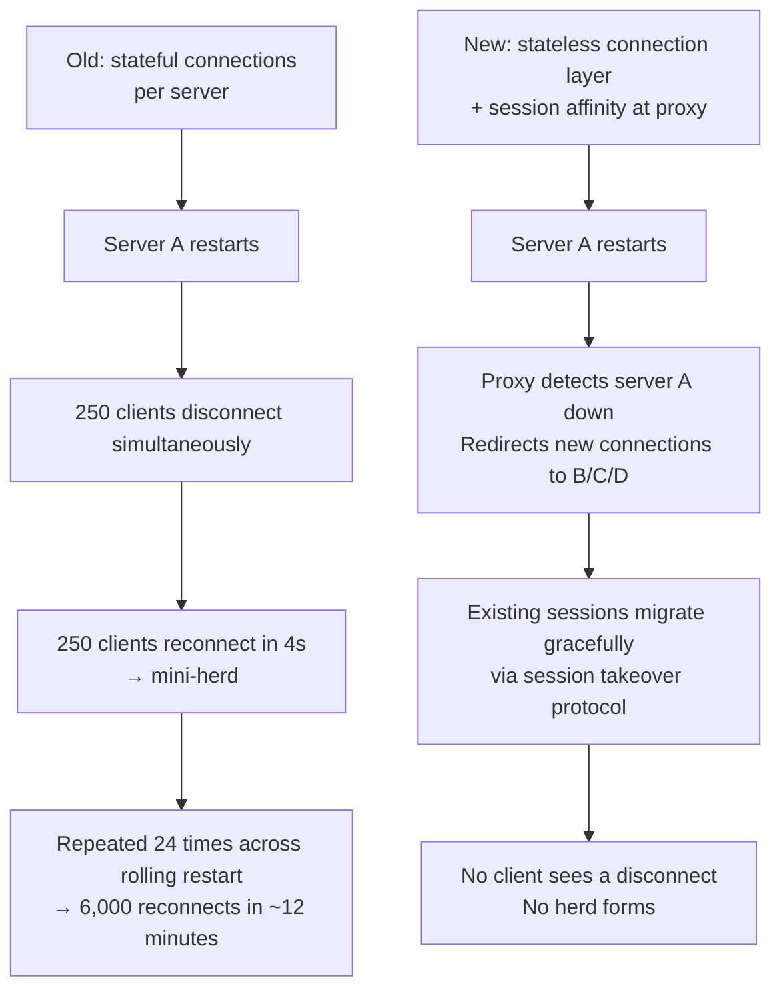
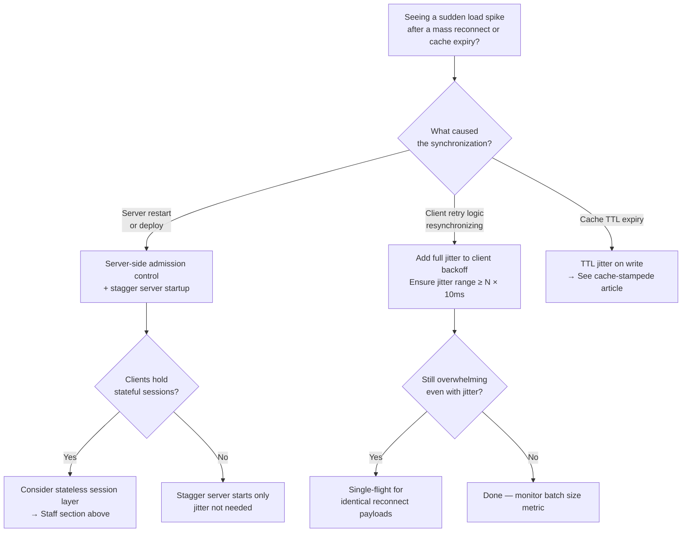

# Thundering Herd

<!-- meta
level: junior
domain: reliability
prereqs: [cache-stampede]
readtime: 14
incident-type: cascading failure
-->

## The Incident

> **Meshwork (B2B SaaS, real-time collaboration) · Q3 2023 · ~180k active users, 6,000 persistent WebSocket connections**

Our infrastructure team deployed a critical security patch on a Friday at 17:30. The deploy required a rolling restart of our 24 WebSocket gateway servers. Standard procedure — we'd done it dozens of times. Each server restarted in sequence, transferring its ~250 connections to remaining servers during the transition.

PagerDuty fired at 17:47: CPU on every database server at 100%. P99 API latency: 18 seconds. Error rate: 61%.

What happened: as each gateway server restarted and came back online, every client that had been disconnected tried to reconnect immediately. All 6,000 clients reconnected within a 4-second window — not gradually, but in a synchronized burst driven by their default reconnect logic (`socket.reconnect()`). On reconnect, each client authenticated, fetched the current workspace state, and loaded the last 50 messages for every open channel — an average of 12 database queries per reconnect.

6,000 clients × 12 queries = 72,000 database queries in 4 seconds. Our databases handled 3,000 queries/second under normal load. We had just sent them 18,000 queries/second.

The secondary effect: the reconnect storm caused authentication service timeouts. Timed-out auth calls triggered client-side retries — each retry another 12 queries. The herd had spawned a second herd.

## Why Smart Engineers Get This Wrong

The mistake is thinking about reconnect logic at the individual client level. Each client's reconnect behavior is perfectly reasonable: "I lost connection; I'll reconnect immediately." The failure is **emergent** — it only appears when thousands of individually-sensible decisions happen simultaneously.

Engineers see this and add exponential backoff: "wait 2s, then 4s, then 8s." But they often miss the second half: **jitter**. Pure exponential backoff without jitter means all disconnected clients follow the same schedule — they all retry at 2s, then all retry at 4s, then all at 8s. The herd reassembles at each interval, synchronized perfectly.

The third mistake: designing reconnect logic only for the client-crashed case (one client disconnects), not for the infrastructure-restart case (all clients disconnect simultaneously). These require different fixes: individual reconnect uses backoff; mass reconnect requires server-side admission control.

| What engineers assume | What actually happens |
|---|---|
| Each client reconnects independently, so 6,000 clients is just 6,000 individual reconnects | All 6,000 clients disconnect at the same moment and reconnect in the same window — synchronized |
| Exponential backoff prevents thundering herd | Pure exponential backoff without jitter resynchronizes the herd at each retry interval |
| Rolling restart distributes reconnect load gradually | Clients reconnect to whichever server becomes available first — all at once, not spread over the rolling window |

## The Investigation Playbook

### 1. Confirm the synchronized spike in 60 seconds

```sql
-- Find authentication / session creation spikes in your DB
SELECT DATE_TRUNC('second', created_at) AS second, COUNT(*) AS logins
FROM sessions
WHERE created_at > NOW() - INTERVAL '10 minutes'
GROUP BY 1
ORDER BY 1;
```

> **What you're looking for:** A vertical spike — hundreds or thousands of records created in the same 1–5 second window, preceded by near-zero activity (the disconnect window).

### 2. Check if retries amplified the herd

```bash
# In your application logs, look for retry patterns
grep "reconnect_attempt" app.log | \
  awk '{print $1}' | \
  cut -d: -f1-2 | \  # extract HH:MM
  sort | uniq -c | sort -rn | head -20
```

> **What you're looking for:** Retry counts clustering at intervals that match your backoff sequence (2s, 4s, 8s) — the herd is reassembling.

### 3. Identify if downstream services amplified it

```bash
# Check your auth service latency during the event
grep "auth_service" slow_queries.log | \
  awk '$NF > 1000' | \  # requests taking > 1 second
  wc -l
```

> **What you're looking for:** Auth latency spiking above 1s means timed-out auth calls triggered more retries — the herd is self-amplifying.

### 4. Immediate mitigation during an active storm

```bash
# Rate limit reconnects at the load balancer (nginx rate limiting)
# Temporarily restrict new WebSocket connections to 100/second per server
# This sheds excess reconnects with 429 — clients retry later (ideally with backoff)
```

If you control the server side: reject excess reconnects with a `Retry-After` header so well-behaved clients know when to come back.

## The Fix at Three Altitudes

<!-- level:junior -->

### Junior: Understand It and Apply the Standard Fix

The thundering herd forms because all waiters act at the same instant. The fix: **break the synchronization** with exponential backoff plus random jitter.

**Exponential backoff without jitter (wrong — resynchronizes the herd):**

```javascript
// All disconnected clients follow the same schedule: 1s, 2s, 4s, 8s...
// They're still synchronized, just delayed
async function reconnect(attempt) {
  const delay = Math.min(30_000, Math.pow(2, attempt) * 1000);
  await sleep(delay);
  socket.connect();
}
```

**Exponential backoff with full jitter (correct — smears reconnects over time):**

```javascript
// Each client picks a random time within the exponential window
// Result: reconnects spread uniformly over [0, cap] — no synchronization
function jitteredDelay(attempt, capMs = 30_000) {
  const exponentialCap = Math.min(capMs, Math.pow(2, attempt) * 1000);
  return Math.random() * exponentialCap; // uniform random in [0, exponentialCap]
}

async function reconnect(attempt = 0) {
  const delay = jitteredDelay(attempt);
  await sleep(delay);

  try {
    await socket.connect();
  } catch {
    reconnect(attempt + 1); // next attempt backs off further
  }
}
```

**For cache TTL synchronization** (1,000 keys written at the same time with the same TTL all expire at the same time):

```javascript
const BASE_TTL = 300; // 5 minutes
// Spread expiry over [270, 330] seconds — no synchronized mass-expiry
const ttl = BASE_TTL + Math.floor(Math.random() * 60) - 30;
await redis.setex(key, ttl, value);
```

The core principle: **any time many actors wait on the same event, their reaction must be randomized**. Synchronized waiting → synchronized reaction → herd.

<!-- /level:junior -->

<!-- level:senior -->

### Senior: Tune It, Operate It, Know When It Fails

Client-side jitter is necessary but not sufficient. In the Meshwork incident, even well-jittered clients would have overwhelmed our servers — 6,000 reconnects over 30 seconds is still 200/second, and each reconnect triggers 12 database queries.

The senior fix: **server-side admission control** on reconnects, independent of client behavior.

```javascript
// Server-side: rate limit reconnects per cluster using a token bucket in Redis
const RECONNECT_RATE = 50;   // max 50 reconnects/second across all servers
const BUCKET_KEY = 'reconnect:tokens';

async function admitReconnect(clientId) {
  const tokens = await redis.decr(BUCKET_KEY);

  if (tokens < 0) {
    // Rate limit exceeded — tell client when to retry
    await redis.incr(BUCKET_KEY); // don't count rejected connection
    const retryAfterMs = 1000 + Math.random() * 2000;
    throw new TooManyRequestsError({ retryAfter: retryAfterMs });
  }

  // Refill bucket in background (50 tokens/second)
  scheduleRefill();
  return processReconnect(clientId);
}
```

**For the specific case of server restart storms**, stagger the startup: on `SIGTERM`, don't accept connections for `base_delay + jitter` seconds:

```javascript
// In your server startup
const START_DELAY_MS = process.env.SERVER_INDEX * 2000 + Math.random() * 1000;
await sleep(START_DELAY_MS);
server.listen();
```

**Single-flight for identical reconnect payloads:** If many clients reconnect and trigger the same expensive workspace-state query, collapse them:

```javascript
// Shared workspace state: many reconnecting clients need the same data
const inFlight = new Map();

async function getWorkspaceState(workspaceId) {
  if (inFlight.has(workspaceId)) return inFlight.get(workspaceId);

  const promise = db.fetchWorkspaceState(workspaceId)
    .finally(() => inFlight.delete(workspaceId));

  inFlight.set(workspaceId, promise);
  return promise;
}
```

**The three failure modes to instrument:**

1. **Jitter misconfiguration** — if jitter range is too small relative to your connection count, clients still cluster. Rule: jitter range ≥ reconnect_count × 10ms. For 6,000 clients, jitter range ≥ 60 seconds.
2. **Retry amplification** — timeouts during the herd trigger retries, spawning a second herd. Instrument: if retry rate > 2× normal within 60 seconds of a reconnect event, page on-call.
3. **Admission control too aggressive** — rate limiting reconnects too strictly means legitimate users stay disconnected for minutes. Set admission rate to handle the herd within 2 minutes: `reconnect_rate = total_connections / 120`.

```javascript
// Metrics to emit:
metrics.increment('websocket.reconnect', { triggered_by: 'client_disconnect' | 'server_restart' });
metrics.histogram('websocket.reconnect_batch_size');  // how many reconnected within 5s of each other
metrics.increment('websocket.reconnect_rejected');     // admission control rejections
```

Alert: if `reconnect_batch_size` p99 > 100 within a 5-second window, a herd is forming.

<!-- /level:senior -->

<!-- level:staff -->

### Staff: Design Systems That Don't Need This Fix

Client-side jitter and server-side rate limiting are correct reactive fixes. The staff-level question is: why did a rolling restart cause a synchronized disconnection in the first place?

**The root cause:** WebSocket connections are stateful and tied to a specific server. A server restart terminates all connections on that server simultaneously. The connections don't "roll" to the new server — they all drop and reconnect.



The architectural alternative: **stateless WebSocket gateways** where session state is stored in a shared layer (Redis Pub/Sub, Kafka), not in-process. A gateway restart is then invisible to clients — another gateway instance picks up the session immediately.

This requires: (1) externalizing all session state from the gateway process, (2) a session takeover protocol (client sends its last-received message ID; new gateway replays from there), (3) a connection-level proxy that can redirect clients without a full TCP tear-down (HAProxy with `PROXY` protocol or Envoy with `CONNECT` semantics).

**The conversation to have with your team:**

> "Every time we do a deploy or server restart, we're manufacturing a reconnect storm and then managing it with jitter and rate limiting. That's backwards — we're paying an operational tax because our sessions are coupled to server processes. I want to spend the next quarter making our WebSocket gateways stateless. The work is significant, but the payoff is: deploys become non-events for clients, our jitter logic disappears, and we stop having to choose between deploy speed and user experience."

**Prerequisites for the architectural alternative:** External session store (Redis, Memcached), message replay capability (so clients can catch up on missed messages after a gateway switch), and a connection proxy that supports transparent failover. Teams often reach for this at 50k+ persistent connections — below that, admission control and jitter are usually sufficient.

<!-- /level:staff -->

## The Decision Tree



## Interview Gauntlet

### Junior questions

**Q: What is a thundering herd and how is it different from a cache stampede?**  
Expected: Thundering herd = many processes/threads waiting on the same event all wake up simultaneously and compete for a scarce resource. Cache stampede is a *specific* thundering herd case where the event is a cache key expiry and the scarce resource is the database. The general problem applies anywhere — reconnects, lock releases, message arrivals, socket accepts.  
30-second one-liner: "Everyone wakes up at once for one resource — only one can have it, the rest wasted effort."

**Q: Why does adding exponential backoff sometimes fail to prevent the thundering herd?**  
Expected: Pure exponential backoff without jitter means all clients follow the same retry schedule. If all disconnected at the same moment, they all retry at 2s, then all at 4s, then all at 8s. The herd is delayed, not broken. Jitter breaks the synchronization by making each client's delay a random sample within the exponential window.

### Senior questions

**Q: 6,000 WebSocket clients reconnect after a server restart and overwhelm your database. Walk me through your response.**  
Expected: Immediate: rate limit new reconnects at the server (token bucket in Redis, ~50/s across the cluster). Identify if auth service timeouts are triggering a second herd of retries — if so, add a circuit breaker to stop cascading. In the next deploy: add server startup delay with jitter, so servers don't all come online simultaneously. Longer term: add full jitter to client reconnect logic.  
The trap: "tell clients to add backoff" — you don't control client deployments immediately, and even with backoff, 6,000 reconnects over 30 seconds is still 200/s.

**Q: What's the difference between exponential backoff with full jitter vs decorrelated jitter?**  
Expected: Full jitter: `delay = random(0, min(cap, base × 2^attempt))` — spreads retries uniformly within an exponentially growing window. Decorrelated jitter: `delay = random(base, prev_delay × 3)` — each retry is independent of the attempt number, tends to produce higher average delay but more varied per-client behavior. AWS recommends decorrelated jitter for production retry logic. Both are significantly better than no jitter.

### Staff questions

**Q: How do you design a WebSocket service so that deploys are invisible to clients?**  
Expected: Externalize all session state (last message ID, channel subscriptions, auth token) to a shared store like Redis. When a gateway server restarts, a replacement picks up the session from Redis. The client never sees a disconnect — from its perspective, it's still connected, just talking to a different process. The required protocol: client sends a `session_id` and `last_message_id` on every connect; server resumes from that offset. Requires message ordering guarantees from the underlying message bus (Kafka sequence numbers, Redis XREAD with IDs).  
The honest answer on when NOT to do this: "If you have fewer than 10k concurrent connections, stateless gateways are probably premature. The operational complexity of externalizing session state is real. Get good at admission control first."

## Connections

**Before this:** [cache-stampede](/cache-stampede) — the specific version of this pattern in caching systems  
**After this:** circuit-breaker (preventing cascading failures when the herd overwhelms a downstream), rate-limiting (admission control as a general pattern), backpressure (queueing as a herd suppression mechanism)  
**Related incidents:**
- *Meshwork (this incident)* — rolling restart caused synchronized reconnect storm; mitigated by server-side rate limiting
- *Slack 2015 outage* — mass reconnect after infrastructure hiccup; clients with non-jittered exponential backoff resynchronized the herd at each interval
- *AWS us-east-1 December 2021* — cascading service failures caused waves of retry storms; individual services had timeouts but retries amplified load on recovering dependencies
