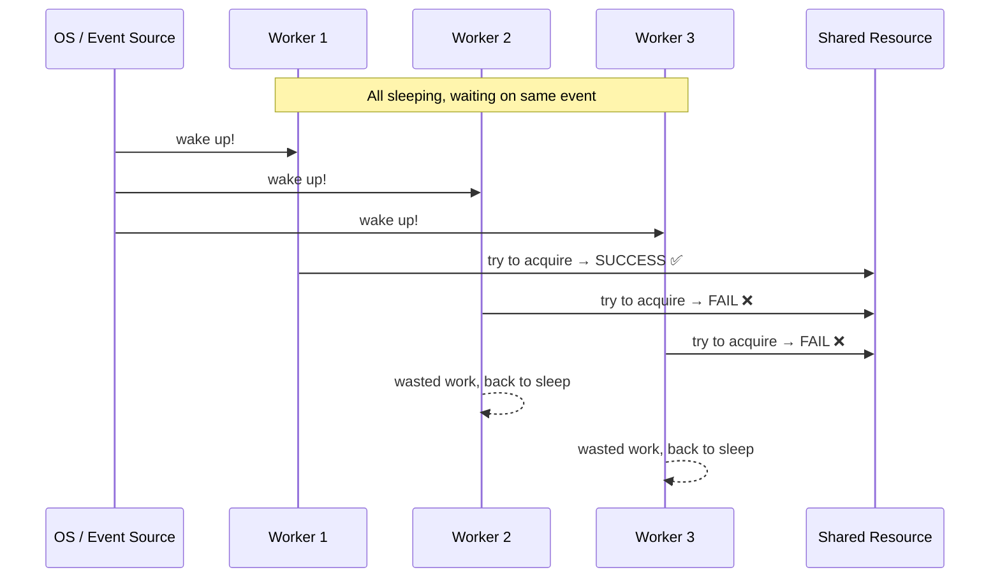
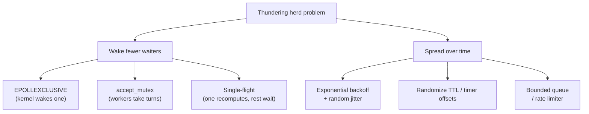

# Thundering Herd

## The core idea in plain English

Imagine 1,000 people all sleeping in a waiting room. A single donut arrives. An announcement wakes **everyone up at once**. They all sprint to the counter — but only one person can grab it. The other 999 wasted energy, created chaos, and went back to sleep. That's the thundering herd.

In software: many processes/threads wait on the same event. When it fires, they all wake up and fight for a resource only one (or few) can use. The losers go back to sleep after wasting CPU and causing contention.

## Problem statement

A large number of processes or threads are waiting on the same event. When that event fires, **all** of them wake up, contend for a resource that only one (or a few) can actually get, and most fail and go back to sleep — wasting CPU, causing lock contention, and creating a load spike.



### Classic real-world instances

- Many worker processes calling `accept()` on one shared socket — a single connection arrives and the OS wakes *all* of them.
- A cached value expires and thousands of requests all miss and hit the database simultaneously (this overlaps with **cache stampede**).
- Thousands of clients reconnect at the same moment after a server restart.

## Solution / approach

The fix is always one of: **wake fewer waiters** or **spread the load over time**.



### 1. Wake only one waiter

Have the kernel or runtime wake a single waiter instead of all.

- Linux added **`EPOLLEXCLUSIVE`** so only one `epoll` waiter is woken per event on a shared fd.
- The original `accept()` thundering herd was fixed in the Linux kernel by serializing wakeups.
- Nginx uses **`accept_mutex`** so workers take turns accepting connections.

### 2. Single-flight (leader election)

Elect *one* actor to do the expensive work; all others wait for its result and share it.

```javascript
// "single-flight": collapse concurrent calls for the same key into one
const inFlight = new Map();

async function getOrLoad(key, loader) {
  if (inFlight.has(key)) return inFlight.get(key);   // join the existing call
  const p = loader(key).finally(() => inFlight.delete(key));
  inFlight.set(key, p);
  return p;
}
```

All concurrent callers for `key` share one underlying load — no one duplicates the work.

### 3. Jitter and backoff

When the cause is synchronized timing (mass reconnects, simultaneous cache expiry), break that synchronization:

- **Exponential backoff with random jitter** on retries/reconnects.
- Randomize timer or TTL offsets so events don't all fire at the same instant.

```javascript
// Full jitter: spread retries randomly across [0, cap]
function sleep(attempt, cap = 30_000) {
  const delay = Math.min(cap, Math.pow(2, attempt) * 100);
  return new Promise(r => setTimeout(r, Math.random() * delay));
}
```

### 4. Queue / admission control

Put a bounded queue or rate limiter in front of the contended resource. Excess wakers are shed or throttled rather than all hitting it at once.

## Interview gotchas

- **Thundering herd vs cache stampede**: cache stampede is a *specific* thundering-herd case around an expiring cache key. The general problem is "everyone wakes at once for any reason."
- The two solution families are: **wake fewer** (EPOLLEXCLUSIVE, accept_mutex, single-flight) and **spread over time** (jitter, backoff, queueing).
- Waking all waiters isn't *always* wrong — if every waiter can make progress (e.g. a broadcast to consumers), it's intentional. It's only a "herd" when they contend for something scarce.
