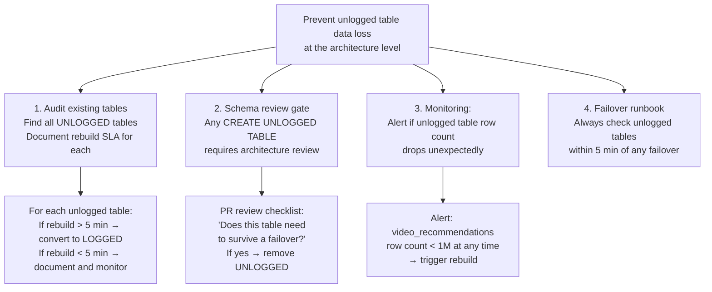
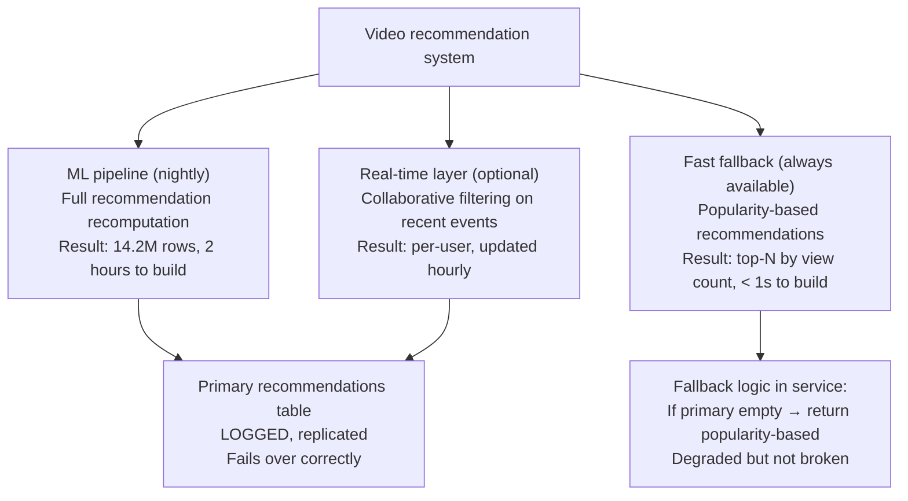
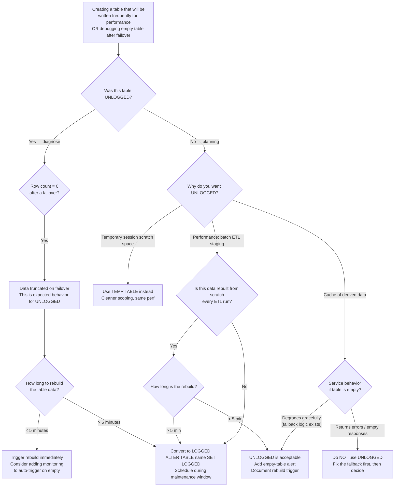

# Unlogged Tables in PostgreSQL

<!-- meta
level: senior
domain: data-storage
prereqs: []
readtime: 11
incident-type: data loss
-->

## The Incident

> **Streamcast (video streaming platform) · Q1 2024 · ~300k DAU, 8M video catalog**

At 14:30 on a Tuesday, our DBA performed a planned primary-to-replica failover for a scheduled database maintenance window. Failover completed in 90 seconds — cleaner than expected, zero replication lag at cutover. The engineering team watched the metrics: all services reconnected within 2 minutes, latency returned to baseline.

At 14:32, PagerDuty fired: the `/recommendations` endpoint error rate jumped from 0.1% to 98%. The recommendation service was returning empty arrays for every user.

The on-call checked the application logs: "no recommendations found for user {id}" — but no database errors, no connection failures. The service was connecting to the database successfully. She ran `\d video_recommendations` — the table existed, schema was intact. She ran:

```sql
SELECT COUNT(*) FROM video_recommendations;
-- Returns: 0
```

The table was there, but it was empty. The recommendation service populates `video_recommendations` with precomputed scores (user_id, video_id, score) — the result of a nightly ML model run. 14.2 million rows. All gone.

She ran:

```sql
SELECT relname, relpersistence
FROM pg_class
WHERE relname = 'video_recommendations';
```

```
relname               | relpersistence
----------------------|----------------
video_recommendations | u
```

`u` means UNLOGGED. Unlogged tables are not written to the Write-Ahead Log (WAL). On failover, PostgreSQL truncates all unlogged tables on the new primary because their contents may be inconsistent — they were never replicated to the replica.

The table had been created 18 months earlier with a comment in the migration file: "UNLOGGED for performance — this is just a cache, rebuilt nightly anyway." The engineer who wrote it had left the company. The "rebuilt nightly" assumption was wrong: the ML model ran nightly, but only populated the table if it produced results different from the previous run. After 6 months of stable results, the last rebuild was 5 months ago. On failover, PostgreSQL correctly truncated it. 300k users had no recommendations for 2 hours until the ML team manually triggered a rebuild.

## Why Smart Engineers Get This Wrong

The mistake is using "cache" to mean "data we can lose." A cache is data that is derived from a source of truth and can be rebuilt. But there's a hidden assumption: "can be rebuilt quickly." When the rebuild takes 2 hours (an ML pipeline), the cache's loss is an outage, not an inconvenience.

The second mistake is not understanding what "unlogged" means in PostgreSQL's durability model. WAL is PostgreSQL's mechanism for crash recovery and replication. Every change to a logged table is written to WAL before being applied — this is how replicas stay in sync and how the database recovers after a crash. Unlogged tables bypass WAL entirely. They are faster to write (no WAL overhead) but they are: (1) not replicated to standbys, (2) truncated on crash or unclean shutdown, and (3) truncated on failover to any standby that promoted to primary.

| What engineers assume | What actually happens |
|---|---|
| "UNLOGGED for performance" is a small optimization | Unlogged tables are invisible to streaming replication and truncated on failover — not a small optimization but a different durability class |
| A planned failover is "clean" and preserves all data | PostgreSQL truncates unlogged tables on ANY promotion of a standby, planned or unplanned |
| The "cache rebuilt nightly" mitigation is reliable | Nightly rebuilds are unreliable if they're conditional — a stable ML model may not rebuild for weeks |

## The Investigation Playbook

### 1. Identify all unlogged tables in your cluster

```sql
-- Find all unlogged tables
SELECT
  schemaname,
  tablename,
  pg_size_pretty(pg_total_relation_size(schemaname||'.'||tablename)) AS total_size,
  pg_stat_user_tables.n_live_tup AS row_count,
  obj_description(pg_class.oid, 'pg_class') AS comment
FROM pg_tables
JOIN pg_class ON pg_class.relname = pg_tables.tablename
JOIN pg_stat_user_tables USING (relname)
WHERE pg_class.relpersistence = 'u'
ORDER BY pg_total_relation_size(schemaname||'.'||tablename) DESC;
```

> **What you're looking for:** Any unlogged table with significant row counts or size. These will be EMPTY after your next failover. For each one, document: how long would a rebuild take? Is that loss acceptable?

### 2. Check if data loss occurred (after a failover)

```sql
-- After a failover, count rows in previously-populated tables
SELECT
  relname,
  relpersistence,
  pg_stat_user_tables.n_live_tup AS current_rows
FROM pg_class
JOIN pg_stat_user_tables ON pg_class.relname = pg_stat_user_tables.relname
WHERE relpersistence = 'u'
ORDER BY current_rows DESC;
```

> **What you're looking for:** Tables with `relpersistence = 'u'` that now have 0 rows after a failover. Compare against expected row counts from before the failover (from monitoring).

### 3. Check when the table was last populated

```sql
-- Find when the unlogged table was last written to (if you have a created_at column)
SELECT
  MIN(created_at) AS oldest_row,
  MAX(created_at) AS newest_row,
  COUNT(*) AS row_count
FROM video_recommendations;

-- Also check if your monitoring tracks row count over time
-- This tells you when the last rebuild was
```

> **What you're looking for:** If the last row was written weeks ago, the "rebuilt nightly" assumption has failed. This table should have been flagged much earlier.

### 4. Estimate impact scope

```sql
-- How many users have no recommendations?
SELECT COUNT(DISTINCT user_id) AS users_with_recs FROM video_recommendations;
-- vs.
SELECT COUNT(*) AS total_active_users FROM users
WHERE last_seen_at > NOW() - INTERVAL '30 days';
```

> **What you're looking for:** The number of users with no recommendations divided by total active users = the percentage of your DAU experiencing degraded service.

## The Fix at Three Altitudes

<!-- level:junior -->

### Junior: Understand It and Apply the Standard Fix

PostgreSQL has three persistence levels for tables:

```sql
CREATE TABLE logged_table (...);    -- default: relpersistence = 'p' (permanent)
CREATE UNLOGGED TABLE fast_table (...);  -- relpersistence = 'u' (unlogged)
CREATE TEMP TABLE session_table (...);   -- relpersistence = 't' (temporary, session-scoped)
```

**What "unlogged" means:**
- **Not written to WAL** — changes bypass the Write-Ahead Log, making writes ~3–5× faster
- **Not replicated** — replicas/standbys never receive the data
- **Truncated on crash** — if the server crashes uncleanly, the table is truncated on restart
- **Truncated on promotion** — when any standby becomes primary (planned failover or automatic failover), it truncates all unlogged tables

**The immediate fix: convert unlogged to logged**

```sql
-- Convert in place — no data migration, just changes the WAL behavior going forward
ALTER TABLE video_recommendations SET LOGGED;
```

After this, the table participates in WAL and replication. The next failover will not truncate it.

**Note on timing:** `ALTER TABLE ... SET LOGGED` rewrites the entire table (reads all rows, writes to WAL-enabled files). For a 14.2M row table, this may take several minutes and is a full table lock. Do this during a maintenance window.

```sql
-- Check how long it will take (estimate based on table size)
SELECT pg_size_pretty(pg_total_relation_size('video_recommendations'));
-- For a 2GB table on modern storage: expect 2–5 minutes of exclusive lock
```

**When is UNLOGGED actually appropriate?**

| Use case | UNLOGGED OK? | Why |
|---|---|---|
| Session-level scratch work (single process, drops after) | Yes — use TEMP TABLE instead | Not replicated, cleared on session end anyway |
| Truly temporary computation within a batch job | Yes, if data is rebuilt from scratch every run | Loss is acceptable if rebuild is fast (< 1 minute) |
| Cache of derived data rebuilt nightly by ML pipeline | **No** | Rebuild takes 2 hours; loss is an outage |
| Primary application data | **No** | Loss on failover = data loss incident |
| Rate limiting counters (approximate, non-critical) | Maybe | Losing a few seconds of rate limit history is acceptable |

<!-- /level:junior -->

<!-- level:senior -->

### Senior: Tune It, Operate It, Know When It Fails

Converting to logged is the correct fix, but understanding the performance tradeoff matters for cases where UNLOGGED was justified.

**The WAL overhead breakdown:**

```sql
-- Measure WAL generated by an INSERT workload
SELECT pg_current_wal_lsn();  -- Save this before your test
-- ... run your INSERT workload ...
SELECT pg_wal_lsn_diff(pg_current_wal_lsn(), '<saved LSN>') AS wal_bytes_written;
```

For write-heavy tables, WAL overhead is typically 2–4× the size of the actual data written. A table that writes 1GB of recommendation scores per day generates 2–4GB of WAL. On replicas with limited WAL bandwidth, this matters.

**Alternative to UNLOGGED: explicit cache invalidation pattern**

Instead of betting on "it gets rebuilt nightly," make the rebuild a condition of the cache being valid:

```sql
-- Add a version/generation column
ALTER TABLE video_recommendations ADD COLUMN generation INTEGER NOT NULL DEFAULT 0;
CREATE INDEX ON video_recommendations (generation);

-- After failover: check if current generation matches expected
SELECT MAX(generation) FROM video_recommendations;
-- If 0 (empty after failover) or stale: trigger rebuild immediately
```

```python
# Service startup check
async def startup_check():
    current_gen = await db.scalar("SELECT COALESCE(MAX(generation), 0) FROM video_recommendations")
    expected_gen = await redis.get("recs:current_generation")
    
    if current_gen != int(expected_gen or 0):
        logger.warning("Recommendation table is stale or empty after failover",
                       current_gen=current_gen, expected_gen=expected_gen)
        # Trigger immediate rebuild instead of serving empty results
        await trigger_recommendation_rebuild()
```

**Operational runbook for failover — add unlogged table check:**

```bash
#!/bin/bash
# Post-failover runbook: run within 5 minutes of every failover

echo "=== Checking unlogged tables ==="
psql "$DB_URL" -c "
  SELECT relname, n_live_tup AS rows
  FROM pg_class
  JOIN pg_stat_user_tables USING (relname)
  WHERE relpersistence = 'u'
  ORDER BY rows DESC;
"

echo "=== Checking for empty tables that should have data ==="
psql "$DB_URL" -c "
  SELECT relname, n_live_tup AS rows
  FROM pg_class
  JOIN pg_stat_user_tables USING (relname)
  WHERE relpersistence = 'u' AND n_live_tup = 0;
"
# If any appear: trigger rebuild pipelines before traffic resumes
```

**The three failure modes to monitor:**

1. **Unlogged table grows without cleanup** — UNLOGGED tables bypass autovacuum by design. If you write to one without deleting, it grows forever and holds onto disk space. Monitor with: `SELECT pg_size_pretty(pg_total_relation_size('table_name'))` — alert if > expected_size × 2.

2. **Crash without a planned failover** — postgres restarts after an OOM kill or kernel panic also truncate unlogged tables. If your monitoring only checks for planned failover, you'll miss this.

3. **Replica promotion after network partition** — in a HA setup with automatic failover (Patroni, pg_auto_failover), a replica may promote without engineering involvement. Unlogged tables are truncated. If your alerting only covers planned failovers, this is a silent data loss.

<!-- /level:senior -->

<!-- level:staff -->

### Staff: Design Systems That Don't Need This Fix

The UNLOGGED table pattern is a performance optimization that trades durability for write speed. The Streamcast incident shows the hidden cost of this tradeoff: the team accepted the durability risk without fully understanding the failure mode, and they had no mechanism to detect when the mitigation (nightly rebuild) had silently stopped working.

**The systemic prevention approach:**



**The architecture question about cache placement:**

The deeper issue at Streamcast wasn't UNLOGGED tables — it was that a nightly ML pipeline was the only source of truth for recommendation data, with no fast-rebuild fallback. The right architecture:



The `video_recommendations` table should be LOGGED (correct). But the service should have a fallback: if the table is empty or stale, return popularity-based recommendations (top-N by view count) while the rebuild runs. An empty recommendation service is much worse than a generic "popular videos" fallback.

> "Before marking a table UNLOGGED, answer two questions: (1) How long does it take to rebuild the data? (2) What does your service do while it's rebuilding? If the answer to (2) is 'errors out entirely,' UNLOGGED is the wrong choice regardless of rebuild time. Design the service to degrade gracefully on stale or missing cache data before deciding where the cache lives."

**Schema migration to convert existing unlogged tables:**

```sql
-- Audit script: find unlogged tables and their risk level
SELECT
  schemaname || '.' || tablename AS full_name,
  pg_size_pretty(pg_total_relation_size(schemaname||'.'||tablename)) AS size,
  n_live_tup AS rows,
  relpersistence,
  CASE
    WHEN n_live_tup = 0 THEN 'EMPTY - already affected by failover?'
    WHEN n_live_tup < 1000 THEN 'LOW RISK - fast rebuild likely'
    WHEN n_live_tup < 1000000 THEN 'MEDIUM RISK - evaluate rebuild time'
    ELSE 'HIGH RISK - convert to LOGGED or add fast fallback'
  END AS risk_level
FROM pg_tables
JOIN pg_class ON relname = tablename AND relpersistence = 'u'
JOIN pg_stat_user_tables USING (relname)
ORDER BY n_live_tup DESC;
```

**Prerequisites for the architectural alternative:** Requires either converting tables to LOGGED (simple, slight performance cost) or implementing a fast-rebuild fallback path in the service (more work but enables continued use of UNLOGGED for performance). For any table where UNLOGGED is retained, add row-count monitoring with automated rebuild triggers.

<!-- /level:staff -->

## The Decision Tree



## Interview Gauntlet

### Junior questions

**Q: What is an unlogged table in PostgreSQL and what happens to it after a failover?**  
Expected: An unlogged table is a PostgreSQL table that does not write to the Write-Ahead Log (WAL). This makes writes faster (no WAL overhead) but means: (1) the table is not replicated to any standby, (2) PostgreSQL truncates it on any unclean shutdown or crash recovery, and (3) PostgreSQL truncates it whenever a standby is promoted to primary — which happens on any failover, planned or unplanned. After a failover, an unlogged table is always empty on the new primary.  
Follow-up that separates junior from senior: *"If the table is truncated on failover, why would anyone use UNLOGGED?"*  
30-second one-liner: "UNLOGGED skips the WAL — 3-5× faster writes, but the data is gone after any failover or crash. Never use it for data you can't rebuild quickly."

**Q: You created a recommendations table as UNLOGGED six months ago. It now has 14 million rows and the nightly rebuild stopped working. What do you do right now?**  
Expected: Immediate: trigger the ML pipeline rebuild manually to restore recommendations. Simultaneously: convert the table to LOGGED with `ALTER TABLE video_recommendations SET LOGGED` to prevent the next failover from truncating it again. Short-term: add row-count monitoring that alerts if the table drops below the expected row count, and add a post-failover runbook step to check unlogged tables. Long-term: add a fallback in the recommendation service so that an empty table causes degraded (popularity-based) recommendations rather than empty responses.

### Senior questions

**Q: What is the WAL and why do unlogged tables bypass it?**  
Expected: The Write-Ahead Log (WAL) is PostgreSQL's durability mechanism. Before any data change is applied, the change is written to the WAL — a sequential append-only log on disk. This ensures that if the server crashes after a write but before the data page is flushed to disk, the WAL can replay the change during recovery. WAL is also the mechanism for streaming replication: the replica applies WAL records from the primary to stay in sync. Unlogged tables bypass WAL entirely — their changes are written directly to data files without WAL records. This is faster (no WAL write, no WAL flush, no WAL replication) but means the replica never has the data, and crash recovery cannot restore it — hence the truncation.  
The nuance: PostgreSQL truncates (not drops) the table on recovery — the schema survives, only the data is gone. This is why it's subtle: `\d table_name` succeeds, but `SELECT COUNT(*)` returns 0.

**Q: Under what circumstances would you use an unlogged table in production?**  
Expected: Legitimate uses are narrow: (1) ETL staging tables where data is loaded from scratch each run and the run time is short (< 5 minutes to rebuild if lost); (2) session-level scratch tables for intermediate computation (better as TEMP TABLEs); (3) true caches where the service has a functioning fallback and empty data causes degraded-but-not-broken behavior. The key tests: (a) if this table is truncated, can the service serve requests at all? If no → not appropriate for UNLOGGED. (b) how long to rebuild? If > 10 minutes → the rebuild SLA is too long for UNLOGGED. In most cases, the write performance gain (3-5×) doesn't justify the operational risk. Use LOGGED tables and optimize writes with async commits or batch inserts instead.

### Staff questions

**Q: You're doing a HA review of a system before a failover test. How do you assess the risk of unlogged tables?**  
Expected: Run the audit query: `SELECT relname, n_live_tup, pg_size_pretty(pg_total_relation_size(relname::regclass)) FROM pg_class JOIN pg_stat_user_tables USING (relname) WHERE relpersistence = 'u'`. For each table found: (1) What is the service behavior if this table is empty? Test by truncating in staging. (2) How long does the rebuild take? Measure in staging. (3) Is the rebuild triggered automatically (monitoring + auto-trigger), manually (runbook step), or never (the Streamcast scenario)? Risk matrix: UNLOGGED + service breaks on empty + rebuild takes hours = convert to LOGGED before the failover. UNLOGGED + service degrades gracefully + rebuild takes < 5 min = accept the risk with monitoring. I'd fail the HA review for any table in the first category.  
The organizational meta-point: the schema audit and service-behavior test should be part of every HA runbook and every planned failover checklist — not a one-time exercise.

## Connections

**Before this:** [autovacuum-postgresql](/autovacuum-postgresql) — related PostgreSQL internals: WAL, table storage, and the planner  
**After this:** [oltp-vs-olap](/oltp-vs-olap) (storage decisions for different workload types), [sargable-query](/sargable-query)  
**Related incidents:**
- *Streamcast (this incident)* — UNLOGGED recommendation table truncated on planned failover; 300k users with no recommendations for 2 hours
- *Various Postgres users (documented in mailing list)* — UNLOGGED tables being empty after a replica promotion is one of the most common "but it worked yesterday" surprises in Postgres HA setups
- *Patroni documentation (2022)* — explicitly warns that UNLOGGED tables will be truncated on promotion; added to the "gotchas" section after multiple user incidents
